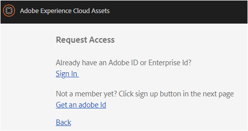
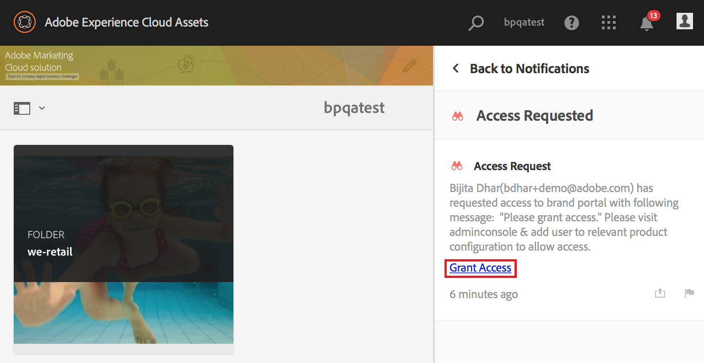

# Panoramica di AEM Assets Brand Portal {#overview-of-aem-assets-brand-portal}

In qualità di esperto di marketing, a volte devi collaborare con partner di canale e utenti interni per creare, gestire e fornire rapidamente contenuti digitali rilevanti ai clienti. La distribuzione tempestiva dei contenuti pertinenti nell'intero percorso del cliente è fondamentale per promuovere una maggiore domanda, conversione, coinvolgimento e fedeltà dei clienti.

Tuttavia, è difficile sviluppare soluzioni che supportano una condivisione efficiente e sicura di logo, linee guida, risorse di campagna o scatti di prodotti approvati con team interni, partner e rivenditori estesi.

**[!DNL Adobe Experience Manager (AEM) Assets Brand Portal]** può essere utile per acquisire, controllare e distribuire in modo sicuro le risorse creative approvate a soggetti esterni e a utenti interni per diversi dispositivi. Consente di migliorare l'efficienza della condivisione delle risorse, accelerare il time-to-market per le risorse e ridurre il rischio di accessi non autorizzati e non autorizzati.

L'ambiente portale basato su browser consente di caricare, sfogliare, cercare, visualizzare in anteprima ed esportare le risorse nei formati approvati.

## Personalizzazione dell'utente in Brand Portal {#Personas}

[!DNL Brand Portal] supporta i seguenti ruoli utente:

* Utente ospite
* Visualizzatore
* Editor
* Amministratore

Nella tabella seguente sono elencate le attività che gli utenti di questi ruoli possono eseguire:

|  | **Sfoglia** | **Ricerca** | **Scarica** | **Condividere le cartelle** | **Condividere una raccolta** | **Condividere le risorse come collegamento** | **Accesso agli strumenti di amministrazione** |
|--- |--- |--- |--- |--- |--- |--- |--- |
| **Utente ospite** | ✓* | ✓* | ✓* | x | x | x | x |
| **Visualizzatore** | ✓ | ✓ | ✓ | x | x | x | x |
| **Editor** | ✓ | ✓ | ✓ | ✓ | ✓ | ✓ | x |
| **Amministratore** | ✓ | ✓ | ✓ | ✓ | ✓ | ✓ | ✓ |

* Gli utenti ospiti possono sfogliare, accedere e cercare risorse solo in cartelle pubbliche e raccolte.

### Guest user {#guest-user}

Qualsiasi utente con accesso limitato alle risorse attivato [!DNL Brand Portal] senza autenticazione è un utente ospite. La sessione ospite consente agli utenti di accedere a cartelle pubbliche e raccolte. In qualità di utente ospite, potete sfogliare i dettagli delle risorse e disporre della visualizzazione completa delle risorse dei membri di cartelle e raccolte pubbliche. Puoi cercare, scaricare e aggiungere risorse pubbliche alla [!UICONTROL raccolta Lightbox].

Tuttavia, la sessione ospite vi limita a creare raccolte e ricerche salvate e a condividerle ulteriormente. Gli utenti in una sessione ospite non possono accedere alle impostazioni delle cartelle e delle raccolte e non possono condividere le risorse come collegamento. Elenco delle attività eseguite da un utente ospite:

[Sfogliare e accedere alle risorse pubbliche](browse-assets-brand-portal.md)

[Ricerca di risorse pubbliche](brand-portal-searching.md)

[Download delle risorse pubbliche](brand-portal-download-users.md)

[Aggiungete risorse a [! UICONTROL lightbox]](brand-portal-light-box.md#add-assets-to-lightbox)

### Visualizzatore {#viewer}

Un utente standard in [!DNL Brand Portal] genere è un utente con il ruolo del visualizzatore. Un utente con questo ruolo può accedere a cartelle, raccolte e risorse autorizzate. L'utente può inoltre sfogliare, visualizzare in anteprima, scaricare ed esportare le risorse (rappresentazioni originali o specifiche), configurare le impostazioni dell'account e cercare le risorse. Elenco delle attività eseguite da un visualizzatore:

[Sfogliare le risorse](browse-assets-brand-portal.md)

[Cercare risorse](brand-portal-searching.md)

[Scaricare le risorse](brand-portal-download-users.md)

### Editor {#editor}

Un utente con il ruolo di Editor può eseguire tutte le attività eseguite da un visualizzatore. Inoltre, l'Editor può visualizzare i file e le cartelle condivisi da un amministratore. L'utente con il ruolo di un editor può anche condividere contenuto (file, cartelle, raccolte) con altri.

Oltre alle attività eseguibili da un visualizzatore, un editor può eseguire le seguenti attività aggiuntive:

[Condividere le cartelle](brand-portal-sharing-folders.md)

[Condividere una raccolta](brand-portal-share-collection.md)

[Condividere le risorse come collegamento](brand-portal-link-share.md)

### Amministratore {#administrator}

Un amministratore include un utente contrassegnato come amministratore di sistema o [!DNL Brand Portal] amministratore di prodotto in [!UICONTROL Admin Console]. Un amministratore può aggiungere e rimuovere amministratori di sistema e utenti, definire i predefiniti, inviare e-mail agli utenti e visualizzare i rapporti sull'uso e sull'archiviazione del portale.

Un amministratore può eseguire tutte le attività eseguite da un editor e le seguenti attività aggiuntive:

[Gestione di utenti, gruppi e ruoli utente](brand-portal-adding-users.md)

[Personalizzare lo sfondo, le intestazioni pagina e le e-mail](brand-portal-branding.md)

[Utilizzare facet di ricerca personalizzati](brand-portal-search-facets.md)

[Utilizzare il modulo schema metadati](brand-portal-metadata-schemas.md)

[Applicare predefiniti per immagini o rappresentazioni dinamiche](brand-portal-image-presets.md)

[Utilizzo dei rapporti](brand-portal-reports.md)

Oltre alle attività riportate di seguito, un autore può [!DNL AEM Assets] eseguire le attività seguenti:

[Configura [! Integrazione di DNL AEM Assets con [! DNL Brand Portal]](https://helpx.adobe.com/experience-manager/6-5/assets/using/brand-portal-configuring-integration.html)

[Pubblicate le cartelle su [! DNL Brand Portal]](https://helpx.adobe.com/experience-manager/6-5/assets/using/brand-portal-publish-folder.html)

[Pubblicate le raccolte su [! DNL Brand Portal]](https://helpx.adobe.com/experience-manager/6-5/assets/using/brand-portal-publish-collection.html)

## Alias alternativo per l'URL del portale brand {#tenant-alias-for-portal-url}

[!DNL Brand Portal] 6.4.3 a partire da, le organizzazioni possono avere un URL alternativo (alias) per l'URL esistente del [!DNL Brand Portal] tenant. L'URL alias può essere creato con un prefisso alternativo nell'URL.\
È possibile personalizzare solo il prefisso dell [!DNL Brand Portal] 'URL e non l'intero URL. Ad esempio, un'organizzazione con il dominio esistente **[!UICONTROL geomettrix.brand-portal.adobe.com]** può ottenere **[!UICONTROL geomettrixinc.brand-portal.adobe.com]** creato su richiesta.

Tuttavia, l[!DNL AEM] 'istanza** Author può essere [configurata](https://helpx.adobe.com/experience-manager/6-5/assets/using/brand-portal-configuring-integration.html) solo con l'URL tenant tenant e non con l'URL del tenant (alternativo).

>[!NOTE]
>
>Per ottenere un alias per il nome tenant nell'URL del portale esistente, le organizzazioni devono contattare**[!DNL Adobe support] con una nuova richiesta di creazione alias tenant. Questa richiesta viene elaborata verificando la disponibilità dell'alias e quindi la creazione dell'alias.
>
>Per sostituire la vecchia o eliminare l'alias precedente, è necessario seguire lo stesso processo.

## Richiesta di accesso a Brand Portal {#request-access-to-brand-portal}

Gli utenti possono richiedere l'accesso [!DNL Brand Portal] dalla schermata di accesso. Queste richieste vengono inviate agli [!DNL Brand Portal] amministratori che concedono l'accesso agli utenti tramite Adobe Admin Console. Dopo l'accesso, gli utenti ricevono un messaggio e-mail di notifica.

Per richiedere l'accesso, effettuate le seguenti operazioni:

1. Dalla pagina [!DNL Brand Portal] di accesso, selezionate Clic **qui** corrispondente per **Richiedere l'accesso?**. Tuttavia, per entrare nella sessione ospite, fate clic **qui** corrispondente a **Accesso ospiti?**.

   

   Viene aperta la **pagina Richiedi accesso** .

2. Per poter richiedere l'accesso a un'organizzazione [!DNL Brand Portal], devi disporre di un [!UICONTROL Adobe ID], [!UICONTROL Enterprise ID]o [!UICONTROL Federated ID valido].

   Nella pagina **Richiedi accesso** , accedi con il tuo ID (scenario 1) o crea un [!UICONTROL Adobe ID] (scenario 2):
   

   **Scenario 1**
   1. Se hai un [!UICONTROL Adobe ID], [!UICONTROL Enterprise ID]o [!UICONTROL Federated ID], fai clic su **Accedi**.
**Viene aperta** la pagina Accesso.
   2. Immetti le [!UICONTROL tue credenziali ID] Adobe e fai clic **su Accedi**.
      
   Verrai reindirizzato alla pagina **Richiedi accesso** .
   **Scenario 2**
   1. Se non disponete di un ID [!UICONTROL Adobe], per crearne uno, fate clic **su Ottieni un Adobe ID** dalla pagina **Richiedi accesso** .
**Viene aperta** la pagina Accesso.
   2. Click **Get an Adobe ID**.
**Viene aperta** la pagina Registrazione.
   3. Immettete il nome e il cognome, l'ID e-mail e la password. Fate clic **su Registrati**.
      
   Verrai reindirizzato alla pagina **Richiedi accesso** .

3. Nella pagina successiva sono visualizzati il nome e l'ID e-mail utilizzati per richiedere l'accesso. Lasciate un commento per l'amministratore e fate clic **su Invia**.

   

## Gli amministratori di prodotti concedono l'accesso {#grant-access-to-brand-portal}

[!DNL Brand Portal] gli amministratori di prodotto ricevono le richieste di accesso nell'area [!DNL Brand Portal] di notifica e attraverso le e-mail nella propria inbox.

Per concedere l'accesso, gli amministratori di prodotto devono fare clic sulla notifica interessata nell'area [!DNL Brand Portal] di notifica, quindi fare clic **su Concedi accesso**.
In alternativa, gli amministratori di prodotto possono seguire il collegamento fornito nel messaggio e-mail di richiesta di accesso per visitare [!DNL Adobe Admin Console] e aggiungere l'utente alla configurazione di prodotto pertinente.

Verrai reindirizzato a [[! DNL Adobe Admin Console]](https://adminconsole.adobe.com/enterprise/overview) home page. Utilizzate [!DNL Adobe Admin Console] per creare utenti e assegnarli a profili di prodotto (precedentemente noti come configurazioni di prodotto), che vengono visualizzati come gruppi. [!DNL Brand Portal] Per ulteriori informazioni sull'aggiunta di utenti, [!DNL Admin Console]consultate [Aggiungere un utente](brand-portal-adding-users.md#add-a-user) (seguite i passaggi 4-7 nella procedura per aggiungere un utente).

## Notifica di manutenzione Brand Portal {#brand-portal-maintenance-notification}

Prima [!DNL Brand Portal] che sia pianificato l'accesso a una manutenzione, una notifica viene visualizzata come banner dopo l'accesso [!DNL Brand Portal]. Una notifica di esempio:

Puoi ignorare questa notifica e continuare a utilizzarla [!DNL Brand Portal]. Questa notifica viene visualizzata in ogni nuova sessione.

## Informazioni sulla versione e sul sistema {#release-and-system-information}

<!--* [What's new](../using/whats-new.md)-->
* [Note sulla versione](brand-portal-release-notes.md)
* [Formati di file supportati](brand-portal-supported-formats.md)

## Related resources {#related-resources}

* [Assistenza clienti Adobe](https://helpx.adobe.com/marketing-cloud/contact-support.html)
* [Forum su AEM](https://www.adobe.com/go/aod_forums_en)