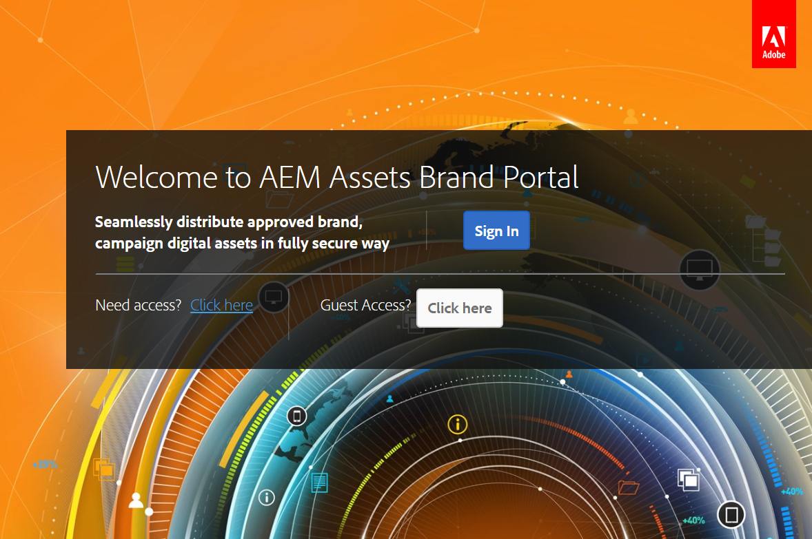
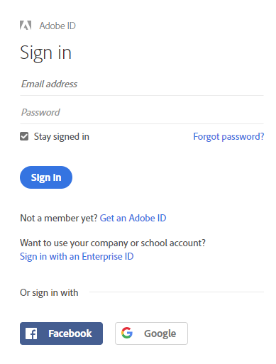
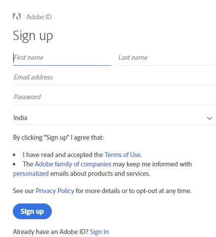
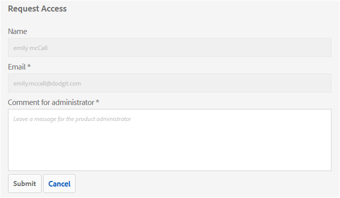
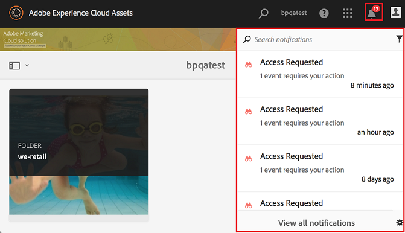
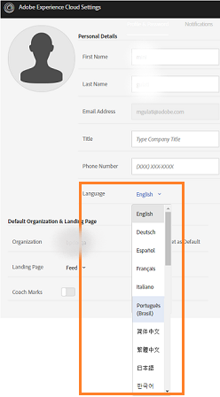
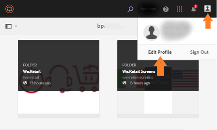
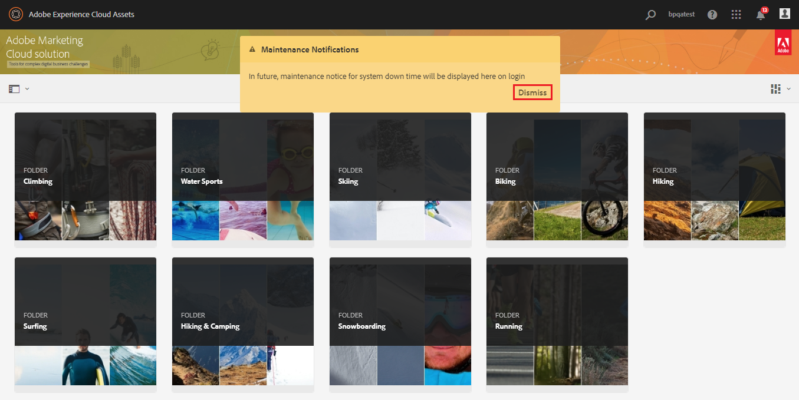

# Panoramica di AEM Assets Brand Portal {#overview-of-aem-assets-brand-portal}

In qualità di esperto di marketing, a volte devi collaborare con partner di canale e utenti aziendali interni per creare, gestire e fornire rapidamente contenuti digitali rilevanti ai clienti. La distribuzione tempestiva di contenuti rilevanti nell'intero percorso del cliente è fondamentale per stimolare una maggiore domanda, conversione, coinvolgimento e fidelizzazione dei clienti.

Tuttavia, è una sfida sviluppare soluzioni che supportano una condivisione efficiente e sicura dei logo del marchio, delle linee guida, delle risorse delle campagne o delle riprese di prodotti approvati con team, partner e rivenditori interni estesi.

**Risorse Adobe Experience Manager (AEM) Assets Brand Portal** si concentra sulla necessità dell’esperto di marketing di collaborare efficacemente con gli utenti del Brand Portal distribuiti a livello globale fornendo funzionalità di distribuzione delle risorse e contributi alle risorse.

La distribuzione delle risorse consente di acquisire, controllare e distribuire in modo sicuro le risorse creative approvate a soggetti esterni e utenti aziendali interni attraverso dispositivi diversi. Il contributo risorse consente invece agli utenti di Brand Portal di caricare le risorse in Brand Portal e di pubblicarle in AEM Assets, senza dover accedere all’ambiente di authoring. La funzione di contributo è denominata **Risorse sorgente in Brand Portal**. Inoltre, migliora l'esperienza complessiva del Brand Portal nella distribuzione delle risorse e nel contributo degli utenti del Brand Portal (agenzie/team esterni), accelera il time-to-market delle risorse e riduce il rischio di non conformità e di accesso non autorizzato.
Consultate [Asset Sourcing in Brand Portal](brand-portal-asset-sourcing.md).

L’ambiente portale basato su browser consente di caricare, sfogliare, cercare, visualizzare in anteprima ed esportare facilmente le risorse in formati approvati.

## Personalità utente in Brand Portal {#Personas}

Brand Portal supporta i seguenti ruoli utente:

* Utente ospite
* Visualizzatore
* Editor
* AmministratoreNella tabella seguente sono elencate le attività che gli utenti di questi ruoli possono eseguire:

|  | **Sfoglia** | **Ricerca** | **Scarica** | **Condividere le cartelle** | **Condividere una raccolta** | **Condividere le risorse come collegamento** | **Accesso ad Strumenti di amministrazione** |
|--- |--- |--- |--- |--- |--- |--- |--- |
| **Utente ospite** | ✓* | ✓* | ✓* | x | x | x | x |
| **Visualizzatore** | ✓ | ✓ | ✓ | x | x | x | x |
| **Editor** | ✓ | ✓ | ✓ | ✓ | ✓ | ✓ | x |
| **Administrator** | ✓ | ✓ | ✓ | ✓ | ✓ | ✓ | ✓ |

* Gli utenti ospiti possono sfogliare, accedere e cercare risorse solo nelle cartelle pubbliche e nelle raccolte.

### Guest user {#guest-user}

Ogni utente che dispone di un accesso limitato alle risorse su Brand Portal senza essere autenticato è un utente ospite. La sessione guest consente agli utenti di accedere alle cartelle e alle raccolte pubbliche. In qualità di utente ospite, potete sfogliare i dettagli delle risorse e avere una visualizzazione completa delle risorse dei membri delle cartelle pubbliche e delle raccolte. Potete cercare, scaricare e aggiungere risorse pubbliche alla raccolta [!UICONTROL Lightbox] .

Tuttavia, la sessione degli ospiti non consente di creare raccolte e ricerche salvate e di condividerle ulteriormente. Gli utenti di una sessione ospite non possono accedere alle impostazioni delle cartelle e delle raccolte e non possono condividere le risorse come collegamento. Elenco delle attività che un utente ospite può eseguire:

[Sfogliare e accedere alle risorse pubbliche](browse-assets-brand-portal.md)

[Ricerca di risorse pubbliche](brand-portal-searching.md)

[Scaricare risorse pubbliche](brand-portal-download-users.md)

[Aggiungere risorse a [!UICONTROL Lightbox]](brand-portal-light-box.md#add-assets-to-lightbox)

### Visualizzatore {#viewer}

Un utente standard in Brand Portal è in genere un utente con il ruolo di Visualizzatore. Un utente con questo ruolo può accedere a cartelle, raccolte e risorse consentite. L’utente può anche sfogliare, visualizzare in anteprima, scaricare ed esportare risorse (rappresentazioni originali o specifiche), configurare le impostazioni dell’account e cercare risorse. Elenco delle attività che un visualizzatore può eseguire:

[Sfogliare le risorse](browse-assets-brand-portal.md)

[Ricerca di risorse](brand-portal-searching.md)

[Scaricare le risorse](brand-portal-download-users.md)

### Editor {#editor}

Un utente con il ruolo di Editor può eseguire tutte le attività che un visualizzatore può eseguire. Inoltre, in Editor è possibile visualizzare i file e le cartelle condivisi da un amministratore. L’utente con il ruolo di Editor può anche condividere contenuti (file, cartelle, raccolte) con altri utenti.

Oltre alle attività che un visualizzatore può eseguire, un editor può eseguire le seguenti attività aggiuntive:

[Condividere le cartelle](brand-portal-sharing-folders.md)

[Condividere una raccolta](brand-portal-share-collection.md)

[Condividere le risorse come collegamento](brand-portal-link-share.md)

### Administrator {#administrator}

Un amministratore include un utente contrassegnato come amministratore di sistema o amministratore di prodotti Brand Portal in [!UICONTROL Admin Console]. Un amministratore può aggiungere e rimuovere amministratori di sistema e utenti, definire predefiniti, inviare e-mail agli utenti e visualizzare rapporti sull’uso e l’archiviazione del portale.

Un amministratore può eseguire tutte le attività che un utente con privilegi di editor può eseguire le seguenti attività aggiuntive:

[Gestire utenti, gruppi e ruoli utente](brand-portal-adding-users.md)

[Personalizzare sfondi, intestazioni di pagina ed e-mail](brand-portal-branding.md)

[Utilizzare i facet di ricerca personalizzati](brand-portal-search-facets.md)

[Utilizzare il modulo schema metadati](brand-portal-metadata-schemas.md)

[Applicare predefiniti immagine o rappresentazioni dinamiche](brand-portal-image-presets.md)

[Utilizzare i rapporti](brand-portal-reports.md)

Oltre alle attività descritte sopra, un autore in Risorse AEM può effettuare le seguenti operazioni:

[Configurare l’integrazione di AEM Assets con Brand Portal](https://helpx.adobe.com/experience-manager/6-5/assets/using/brand-portal-configuring-integration.html)

[Pubblicare le cartelle su Brand Portal](https://helpx.adobe.com/experience-manager/6-5/assets/using/brand-portal-publish-folder.html)

[Pubblicare raccolte in Brand Portal](https://helpx.adobe.com/experience-manager/6-5/assets/using/brand-portal-publish-collection.html)

## Alias alternativo per l’URL del Brand Portal {#tenant-alias-for-portal-url}

A partire da Brand Portal 6.4.3, le organizzazioni possono disporre di un URL alternativo (alias) per l’URL esistente del tenant del Brand Portal. L’URL alias può essere creato con un prefisso alternativo nell’URL.\
Tenete presente che è possibile personalizzare solo il prefisso dell’URL del Portale marchio e non l’intero URL. Ad esempio, un’organizzazione con un dominio esistente **[!UICONTROL geomettrix.brand-Portal.adobe.com]** può creare su richiesta **[!UICONTROL geomettrixinc.brand-Portal.adobe.com]** .

Tuttavia, l'istanza di AEM Author può essere [configurata](https://helpx.adobe.com/experience-manager/6-5/assets/using/brand-portal-configuring-integration.html) solo con l'URL dell'ID tenant e non con l'alias tenant (alternativo).

>[!NOTE]
>
>Per ottenere un alias per il nome del tenant nell'URL del portale esistente, le organizzazioni devono contattare il supporto Adobe con una nuova richiesta di creazione alias del tenant. Questa richiesta viene elaborata verificando prima se l'alias è disponibile e quindi creando l'alias.
>
>Per sostituire il vecchio alias o eliminarlo, è necessario seguire lo stesso processo.

## Request access to Brand Portal {#request-access-to-brand-portal}

Gli utenti possono richiedere l’accesso a Brand Portal dalla schermata di accesso. Queste richieste vengono inviate agli amministratori del Brand Portal che concedono l’accesso agli utenti tramite Adobe [!UICONTROL Admin Console]. Una volta concesso l’accesso, gli utenti ricevono un messaggio e-mail di notifica.

Per richiedere l’accesso, effettuate le seguenti operazioni:

1. Dalla pagina di accesso al Brand Portal, selezionate **[!UICONTROL Fate clic qui]** corrispondente a **[!UICONTROL Necessità di accesso?]**. Tuttavia, per entrare nella sessione ospite, selezionate il **[!UICONTROL Click here]** corrispondente a **[!UICONTROL Guest Access?]**.

   

   Viene visualizzata la pagina [!UICONTROL Richiedi accesso] .

1. Per richiedere l'accesso al Portale marchio di un'organizzazione, è necessario disporre di un [!UICONTROL Adobe ID], [!UICONTROL Enterprise ID]o [!UICONTROL Federated ID]valido.

   Nella pagina [!UICONTROL Richiedi accesso] , effettuate l’accesso con il vostro ID (scenario 1) o create un ID  Adobe (scenario 2): 
   ![[!UICONTROL Richiedi accesso]](assets/bplogin_request_access_2.png)

   **Scenario 1**
   1. Se disponete di un [!UICONTROL Adobe ID], [!UICONTROL Enterprise ID]o [!UICONTROL Federated ID], fate clic su **[!UICONTROL Accedi]**.
Viene visualizzata la pagina [!UICONTROL Accesso] .
   1. Immetti le credenziali [!UICONTROL Adobe ID] e fai clic su **[!UICONTROL Accedi]**. 
   

   Viene nuovamente visualizzata la pagina [!UICONTROL Richiedi accesso] . 
   **Scenario 2**
   1. Se non disponete di un ID Adobe, per crearne uno fate clic su **[!UICONTROL Ottieni un ID]** Adobe dalla pagina [!UICONTROL Richiedi accesso] .
Viene visualizzata la pagina [!UICONTROL Accesso] .
   1. Click **[!UICONTROL Get an Adobe ID]**.
Viene visualizzata la pagina [!UICONTROL Registrati] .
   1. Immettete il nome e il cognome, l’ID e-mail e la password.
   1. Selezionate **[!UICONTROL Iscrizione]**. 
   

   Viene nuovamente visualizzata la pagina [!UICONTROL Richiedi accesso] .

1. Nella pagina successiva vengono visualizzati il nome e l’ID e-mail utilizzati per richiedere l’accesso. Lasciate un commento all'amministratore e fate clic su **[!UICONTROL Invia]**. 

   

## Gli amministratori di prodotto concedono l'accesso {#grant-access-to-brand-portal}

Gli amministratori di prodotti Brand Portal ricevono richieste di accesso nell’area di notifica del Portale marchio e tramite e-mail nella propria inbox.

Per concedere l’accesso, gli amministratori di prodotto devono fare clic sulla notifica pertinente nell’area di notifica del Portale marchio, quindi fare clic su **[!UICONTROL Concedi accesso]**.
In alternativa, gli amministratori di prodotto possono seguire il collegamento fornito nel messaggio e-mail di richiesta di accesso per visitare Adobe [!UICONTROL Admin Console] e aggiungere l'utente alla configurazione di prodotto pertinente.

Verrai reindirizzato alla home page di [Adobe [!UICONTROL Admin Console]](https://adminconsole.adobe.com/enterprise/overview) . Utilizza Adobe [!UICONTROL Admin Console] per creare utenti e assegnarli ai profili di prodotto (precedentemente definiti configurazioni di prodotto), che vengono visualizzati come gruppi in Brand Portal. Per ulteriori informazioni sull’aggiunta di utenti in [!UICONTROL Admin Console], consulta [Aggiungere un utente](brand-portal-adding-users.md#add-a-user) (seguire i passaggi 4-7 della procedura per aggiungere un utente).

## Lingue Brand Portal {#brand-portal-language}

Puoi cambiare la lingua del Portale marchio dalle impostazioni [!UICONTROL di Adobe]Experience Cloud.

Per modificare la lingua:

1. Selezionate [!UICONTROL Utente] &gt; [!UICONTROL Modifica profilo] dal menu principale. 
   

1. Nella pagina Impostazioni [!UICONTROL di] Experience Cloud, seleziona una lingua dal menu a discesa [!UICONTROL Lingua] .

## Notifica di manutenzione del Brand Portal {#brand-portal-maintenance-notification}

Prima che Brand Portal venga pianificato per la manutenzione, una notifica viene visualizzata come banner dopo l’accesso al Brand Portal. Una notifica di esempio:

Potete ignorare questa notifica e continuare a utilizzare Brand Portal. Questa notifica viene visualizzata in ogni nuova sessione.

## Informazioni sulla versione e sul sistema {#release-and-system-information}

* [Novità](whats-new.md)
* [Note sulla versione](brand-portal-release-notes.md)
* [Formati di file supportati](brand-portal-supported-formats.md)

## Related resources {#related-resources}

* [Assistenza clienti Adobe](https://helpx.adobe.com/marketing-cloud/contact-support.html)
* [Forum su AEM](https://www.adobe.com/go/aod_forums_en)