# Sfoglia le risorse in Brand Portal {#browsing-assets-on-brand-portal}

Experience Manager Assets Brand Portal offre varie funzionalità ed elementi dell’interfaccia utente che facilitano la navigazione tra le risorse, l’attraversamento delle gerarchie di risorse e la ricerca delle risorse utilizzando diverse opzioni di visualizzazione.

Il logo di Experience Manager nella barra degli strumenti nella parte superiore facilita l’accesso degli utenti amministratori al pannello degli strumenti amministrativi.

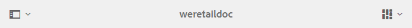

Selettore della barra in alto a sinistra negli elenchi a discesa di Brand Portal per esporre le opzioni per navigare nelle gerarchie delle risorse, semplificare la ricerca e visualizzare le risorse.

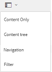

Puoi visualizzare, navigare e selezionare le risorse utilizzando una delle viste disponibili (Scheda, Colonna ed Elenco) nel selettore di visualizzazione in alto a destra in Brand Portal.

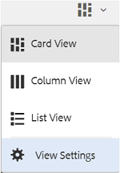

## Visualizzazione e selezione delle risorse {#viewing-and-selecting-resources}

In tutte le viste la visualizzazione, la navigazione e la selezione funzionano allo stesso modo, ma con lievi variazioni a seconda della vista attiva.

Puoi visualizzare, navigare e selezionare (per ulteriori azioni) le risorse in una delle visualizzazioni disponibili:

* Vista a colonne
* Vista a schede
* Vista a elenco 

### Vista a schede

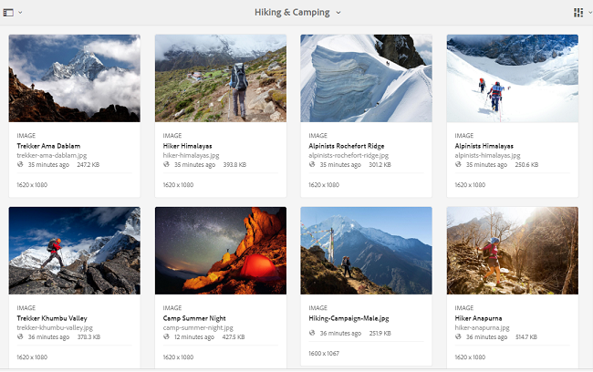

La vista a schede mostra schede informative per ogni elemento al livello corrente, Queste schede forniscono i seguenti dettagli:

* Una rappresentazione visiva della risorsa o della cartella.
* Tipo
* Titolo
* Nome
* Data e ora in cui la risorsa è stata pubblicata in Brand Portal da AEM
* Dimensione
* Dimensioni

Per spostarti verso il basso nella gerarchia, tocca o fai clic sulle schede (facendo attenzione a evitare le azioni rapide); per tornare verso l’alto utilizza le [breadcrumb nell’intestazione](https://experienceleague.adobe.com/docs/experience-manager-65/authoring/essentials/basic-handling.html).

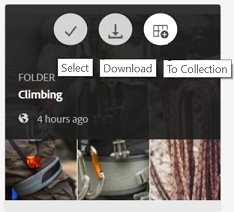

#### Vista a schede per utenti non amministratori

Schede di cartelle, in Vista a schede, visualizza informazioni sulla gerarchia delle cartelle per utenti non amministratori (Editor, Visualizzatore e Utente ospite). Questa funzionalità consente agli utenti di conoscere la posizione delle cartelle a cui accedono rispetto alla gerarchia padre.
Le informazioni sulla gerarchia delle cartelle sono particolarmente utili per differenziare le cartelle con nomi simili ad altre cartelle condivise da una gerarchia di cartelle diversa. Se gli utenti non amministratori non sono a conoscenza della struttura di cartelle delle risorse condivise con loro, le risorse/cartelle con nomi simili sembrano confuse.

* I percorsi mostrati sulle rispettive schede vengono troncati per adattarsi alle dimensioni delle schede. Tuttavia, gli utenti possono vedere il percorso completo come una descrizione del comando quando passano il mouse sul percorso troncato.

**Opzione Panoramica per visualizzare le proprietà della risorsa**

L’opzione Panoramica è disponibile per gli utenti non amministratori (editor, visualizzatori, utenti ospiti) per visualizzare le proprietà della risorsa delle risorse/cartelle selezionate. L’opzione Panoramica è visibile:

* nella barra degli strumenti nella parte superiore della selezione di una risorsa o di una cartella.
* nel menu a discesa selezionando il selettore della barra.

Selezionando l’opzione **[!UICONTROL Panoramica]** mentre è selezionata una risorsa/cartella, gli utenti possono vedere il titolo, il percorso e l’ora della creazione della risorsa. Nella pagina dei dettagli della risorsa, invece, l’opzione Panoramica consente agli utenti di visualizzare i metadati della risorsa.

#### Visualizzare le impostazioni nella vista a schede

**[!UICONTROL La finestra di dialogo]** Impostazioni vista viene visualizzata quando si seleziona  **[!UICONTROL Visualizza impostazioni]** dal selettore della vista. Consente di ridimensionare le miniature delle risorse nella vista Scheda. In questo modo, puoi personalizzare la visualizzazione e controllare il numero di miniature visualizzate.

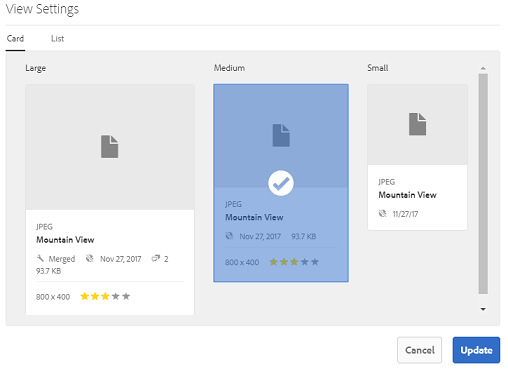

### Vista a elenco 

Nella vista a elenco sono visualizzate informazioni per ogni risorsa al livello corrente. La vista a elenco fornisce i seguenti dettagli:

* Immagine della miniatura delle risorse
* Nome
* Titolo
* Paese
* Tipo
* Dimension
* Dimensione
* Valutazione
* Percorso della cartella che mostra la gerarchia delle risorse
* Data di pubblicazione della risorsa in Brand Portal

La colonna Percorso consente di identificare facilmente la posizione della risorsa nella gerarchia delle cartelle. Per spostarti verso il basso nella gerarchia, tocca o fai clic sul nome della risorsa; per tornare verso l’alto utilizza le [breadcrumb nell’intestazione](https://experienceleague.adobe.com/docs/experience-manager-65/authoring/essentials/basic-handling.html).

<!--
Comment Type: draft lastmodifiedby="mgulati" lastmodifieddate="2018-08-17T03:12:05.096-0400" type="annotation">Removed:- "Selecting assets in list view To select all items in the list, use the checkbox at the upper left of the list. When all items in the list are selected, this check box appears checked. To deselect all, click or tap the checkbox. When only some items are selected, it appears with a minus sign. To select all, click or tap the checkbox. To deselect all, click or tap the checkbox again. You can change the order of items using the dotted vertical bar at the far right of each item in the list. Tap/click the vertical selection bar and drag the item to a new position in the list."
 -->

### Visualizzare le impostazioni nella vista a elenco

La vista a elenco mostra la risorsa **[!UICONTROL Nome]** come prima colonna per impostazione predefinita. Vengono visualizzate anche informazioni aggiuntive, come la risorsa **[!UICONTROL Titolo]**, **[!UICONTROL Impostazioni internazionali]**, **[!UICONTROL Tipo]**, **[!UICONTROL Dimension]**, **[!UICONTROL Dimensioni]**, **[!UICONTROL Valutazione]**, lo stato di pubblicazione. Tuttavia, è possibile selezionare le colonne da visualizzare utilizzando **[!UICONTROL Visualizza impostazioni]**.

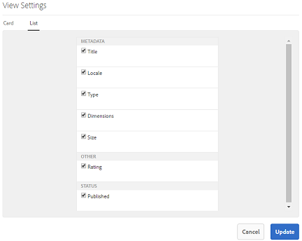

### Vista a colonne

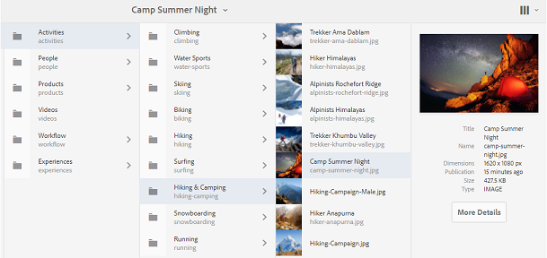

Utilizza la vista a colonne per navigare in una struttura di contenuto attraverso una serie di colonne a cascata. Questa visualizzazione consente di visualizzare e scorrere la gerarchia delle risorse.

Quando si seleziona una risorsa nella prima colonna (più a sinistra), vengono visualizzate le risorse secondarie nella seconda colonna a destra. Quando si seleziona una risorsa nella seconda colonna, vengono visualizzate le risorse secondarie nella terza colonna a destra e così via.

Per spostarti in alto o in basso nella struttura, tocca o fai clic sul nome della risorsa o sulla freccia a destra del nome della risorsa.

* Il nome della risorsa e la freccia vengono evidenziati quando tocchi o fai clic su di essi.
* Tocca o fai clic sulla miniatura per selezionare la risorsa.
* Quando questa opzione è selezionata, compare un segno di spunta sulla miniatura e il nome della risorsa viene evidenziato.
* I dettagli della risorsa selezionata sono visualizzati nella colonna finale.

Quando una risorsa viene selezionata nella vista a colonne, la rappresentazione visiva della risorsa viene visualizzata nella colonna finale con i seguenti dettagli:

* Titolo
* Nome
* Dimensioni
* Data e ora in cui la risorsa è stata pubblicata in Brand Portal da AEM
* Dimensione
* Tipo
* Opzione Maggiori dettagli per passare alla pagina dei dettagli della risorsa

<!--
Comment Type: draft

<h3>Selecting Resources</h3>
-->

<!--
Comment Type: draft

Selecting a specific resource depends on a combination of the view and the device:

-->

<!--
Comment Type: draft

<table border="1" cellpadding="1" cellspacing="0" width="100%">
<tbody>
<tr>
<td> </td>
<td>Select</td>
<td>Deselect</td>
</tr>
<tr>
<td>Column View  </td>
<td>
<ul>
<li>Desktop:  Mouseover, then use the check mark quick action</li>
<li>Mobile device:  Tap the thumbnail</li>
</ul> </td>
<td>
<ul>
<li>Desktop:  Click the thumbnail</li>
<li>Mobile device:  Tap the thumbnail</li>
</ul> </td>
</tr>
<tr>
<td>Card View  </td>
<td>
<ul>
<li>Desktop:  Mouseover, then use the check mark quick action</li>
<li>Mobile device:  Tap-and-hold the card</li>
</ul> </td>
<td>
<ul>
<li>Desktop:  Click the card</li>
<li>Mobile device:  Tap the card</li>
</ul> </td>
</tr>
<tr>
<td>List View</td>
<td>
<ul>
<li>Desktop:  Mouseover, then use the check mark quick action</li>
<li>Mobile device:  Tap the thumbnail</li>
</ul> </td>
<td>
<ul>
<li>Desktop:  Click the thumbnail</li>
<li>Mobile device:  Tap the thumbnail</li>
</ul> </td>
</tr>
</tbody>
</table>
-->

<!--
Comment Type: draft

Deselecting All
-->

<!--
Comment Type: draft

In all cases, as you select items the count of the items selected is displayed at the upper right of the toolbar.

You can deselect all items and exit selection mode by clicking or tapping the X next to the count.

-->

<!--
Comment Type: draft

In all views, all items can be deselected by tapping escape on the keyboard if you are using a desktop device.

-->

## Struttura contenuto {#content-tree}

Oltre a queste visualizzazioni, utilizza la vista ad albero per approfondire la gerarchia delle risorse mentre visualizzi e selezioni le risorse o le cartelle desiderate.

Per aprire la visualizzazione struttura, tocca o fai clic sul selettore della barra in alto a sinistra e seleziona la **[!UICONTROL Struttura contenuto]** dal menu.

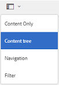

Dalla gerarchia dei contenuti, accedi alla risorsa desiderata.

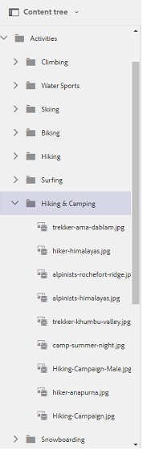

## Dettagli risorsa {#asset-details}

La pagina dei dettagli della risorsa consente di visualizzare una risorsa, scaricarla, condividere il collegamento della risorsa, spostarla in una raccolta o visualizzare la pagina delle relative proprietà. Consente inoltre di spostarsi nella pagina dei dettagli di altre risorse della stessa cartella in sequenza.

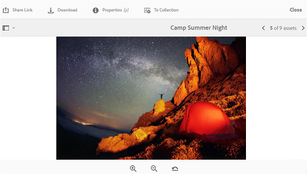

Per visualizzare i metadati della risorsa o le relative rappresentazioni, utilizza il selettore a barre nella pagina dei dettagli della risorsa.

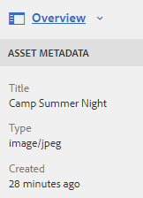

Puoi visualizzare tutti i rendering disponibili della risorsa nella pagina dei dettagli della risorsa e selezionare un rendering per visualizzarlo in anteprima.

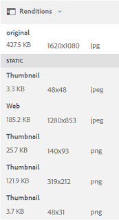

Per aprire la pagina delle proprietà della risorsa, utilizza l’opzione **[!UICONTROL Proprietà (p)]** nella barra superiore.

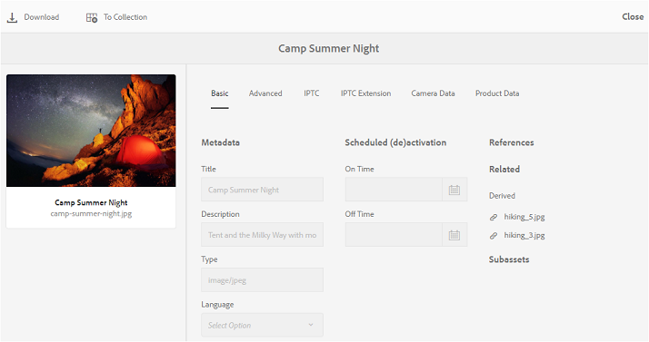

Puoi anche visualizzare un elenco di tutte le relative risorse correlate (risorse di origine o derivate in AEM) nella pagina delle proprietà di una risorsa, in quanto anche la relazione tra risorse viene pubblicata da AEM a Brand Portal.
