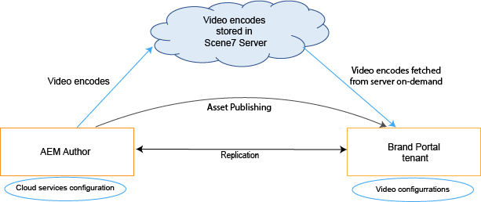
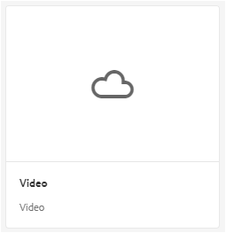
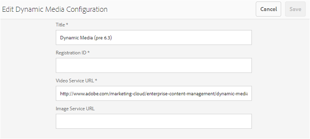
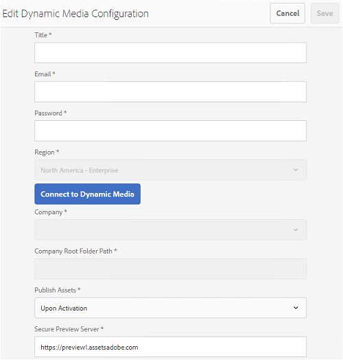

# Supporto di video dinamici in Brand Portal {#dynamic-video-support-on-brand-portal}

Visualizzate in anteprima e riproducete i video in modo adattivo su Brand Portal con il supporto per contenuti multimediali dinamici. Scaricate inoltre le rappresentazioni dinamiche dal portale e i collegamenti condivisi.
Gli utenti di Brand Portal possono:

* Visualizzate i video in anteprima nella pagina Dettagli risorsa, Visualizzazione a schede e Condivisione collegamento.
* Riproduci codifiche video nella pagina Dettagli risorsa.
* Visualizzare le rappresentazioni dinamiche nella scheda Rappresentazioni nella pagina Dettagli risorsa.
* Scaricate codifiche video e cartelle contenenti video.

>[!NOTE]
>
>Per lavorare con i video e pubblicarli su Brand Portal, accertatevi che l’istanza di AEM Author sia configurata in modalità Dynamic Media Hybrid o in modalità Dynamic Media **[!DNL Scene 7]** .

Per visualizzare in anteprima, riprodurre e scaricare i video, Brand Portal espone agli amministratori le due configurazioni seguenti:

* [Configurazione](#configure-dm-hybrid-settings)ibrida multimediale dinamica Se l&#39;istanza di AEM Author è in esecuzione in modalità ibrida multimediale dinamica.
* [Configurazione](#configure-dm-scene7-settings)elemento multimediale dinamico [!DNL Scene 7]**[!DNL Scene 7]** Se l’istanza di AEM Author è in esecuzione in modalità multimediale dinamica.
Imposta una di queste configurazioni in base alle configurazioni impostate nell&#39;istanza di AEM Author con cui viene replicato il tenant di Brand Portal.

>[!NOTE]
>
>I video dinamici non sono supportati sui tenant del Brand Portal configurati con AEM Author in esecuzione in modalità di esecuzione di **[!UICONTROL Scene7 Connect]** .

## Come vengono riprodotti i video dinamici? {#how-are-dynamic-videos-played}

Se in Brand Portal sono configurate configurazioni per contenuti multimediali dinamici ([Ibride](../using/dynamic-video-brand-portal.md#configure-dm-hybrid-settings) o [[!DNL Scene7]](../using/dynamic-video-brand-portal.md#configure-dm-scene7-settings) ), le rappresentazioni dinamiche vengono recuperate dal **[!DNL Scene 7]** server. Le codifiche video vengono quindi visualizzate in anteprima e riprodotte senza ritardi e con distorsione della qualità.

Poiché le codifiche video non sono memorizzate nell’archivio di Brand Portal e vengono recuperate dal **[!DNL Scene 7]** server, accertatevi che le configurazioni per i contenuti multimediali dinamici in AEM Author Instance e Brand Portal siano le stesse.

>[!NOTE]
>
>I visualizzatori video e i predefiniti per visualizzatori non sono supportati in Brand Portal. I video vengono visualizzati in anteprima e riprodotti sui visualizzatori predefiniti in Brand Portal.

## Prerequisiti {#prerequisites}

Per lavorare con video dinamici su Brand Portal, accertatevi di:

* **Avvia AEM Author in modalità** DM (Contenuti multimediali dinamici) Avvia l’istanza di AEM Author (con cui è configurato Brand Portal) in modalità [Ibrido file multimediali](https://helpx.adobe.com/experience-manager/6-5/assets/using/config-dynamic.html#EnablingDynamicMedia) dinamico o File multimediali [dinamici in modalità](https://helpx.adobe.com/experience-manager/6-5/assets/using/config-dms7.html#EnablingDynamicMediainScene7mode)[!DNL Scene7].
* **Configurare i servizi Dynamic Media Cloud su AEM Author** In base alla modalità Dynamic Media su cui è in esecuzione AEM Author, impostare i servizi [cloud](https://helpx.adobe.com/experience-manager/6-5/assets/using/config-dynamic.html#ConfiguringDynamicMediaCloudServices) Dynamic Media o [[!DNL Scene 7] sui servizi](https://helpx.adobe.com/experience-manager/6-5/assets/using/config-dms7.html#ConfiguringDynamicMediaCloudServices) cloud su AEM Author da **Strumenti** | Servizi **** cloud| **Contenuti multimediali** dinamici.
* **Configurare gli elementi multimediali dinamici su Brand Portal** In base alle configurazioni di Dynamic Media Cloud in AEM Author, configurare le impostazioni [per gli elementi multimediali](#configure-dm-hybrid-settings) dinamici o [[!DNL Scene 7] dagli strumenti amministrativi di Brand Portal](#configure-dm-scene7-settings) .
Accertatevi che i tenant [del Brand Portal siano](#separate-tenants) separati per le istanze di AEM Author configurate con le modalità Dynamic Media Hybrid e Dynamic Media **[!UICONTROL Scene7]** , se utilizzate le funzionalità di Dynamic Media Hybrid e Dynamic Media **[!UICONTROL S7]**.
* **Pubblicate cartelle con codifiche video applicate a Brand Portal** Applicate codifiche  video e pubblicate la cartella contenente risorse multimediali dall’istanza di AEM Author al Portale del marchio.
* **Se è abilitata** l’anteprima protetta per gli IP Egress in SPS se si utilizza l’anteprima per elementi multimediali dinamici **[!DNL Scene 7]** (con l’anteprima [protetta abilitata](https://docs.adobe.com/content/help/en/dynamic-media-classic/using/upload-publish/testing-assets-making-them-public.html) per una società), si consiglia all’amministratore **[!DNL Scene 7]** della società di [inserire in una whitelist gli IP](https://docs.adobe.com/content/help/en/dynamic-media-classic/using/upload-publish/testing-assets-making-them-public.html#testing-the-secure-testing-service) di pubblico dominio per le rispettive regioni mediante l’interfaccia utente Flash di SPS (**[!UICONTROL Scene 7]** Publishing System).
Gli IP Egress sono i seguenti:

| **Regione** | **IP Egress** |
|--- |--- |
| NA | 192.243.237.86 |
| EMEA | 185.34.189.4 |
| APAC | 63.140.44.54 |

Per inserire in una whitelist uno di questi IP di uscita, vedete [preparare l&#39;account per un servizio](https://docs.adobe.com/content/help/en/dynamic-media-classic/using/upload-publish/testing-assets-making-them-public.html#testing-the-secure-testing-service)di verifica protetto.

## Best practice  

Per garantire che le risorse video dinamiche siano visualizzate in anteprima, riprodotte e scaricate correttamente dal Portale marchio (e dai collegamenti condivisi), seguite le seguenti procedure:

### Affittuari separati per le modalità Dynamic Media Hybrid e Dynamic Media Scene 7 {#separate-tenants}

Se utilizzate sia le funzioni per contenuti multimediali dinamici che quelle per contenuti ibridi dinamici, per le istanze di AEM Author è consigliabile utilizzare locatari di Brand Portal diversi con le modalità Dynamic Media Hybrid e Dynamic Media **[!DNL Scene 7]** **[!DNL Scene 7]** . 

### Stessi dettagli di configurazione per l’istanza di AEM Author e il Brand Portal

Accertatevi che i dettagli di configurazione, come **[!UICONTROL Titolo]**, ID **** registrazione, URL **[!UICONTROL servizio]** video (in **[!UICONTROL Dynamic Media Hybrid]**) e **[!UICONTROL Titolo]****** ******** **[!DNL Scene 7]******, le credenziali (Email e Password), Regione, Societàvideo (in Dynamic Media), siano gli stessi nella configurazione di Brand Portal e AEM cloud.

### Whitelist public egress IPs for Dynamic Media Scene 7 mode

Se **[!UICONTROL Scene7]** per la visualizzazione in anteprima di contenuti multimediali dinamici è attivata [e viene utilizzato per distribuire risorse video a Brand Portal,](https://docs.adobe.com/content/help/en/dynamic-media-classic/using/upload-publish/testing-assets-making-them-public.html)Scene 7 **** stabilisce un server di immagini dedicato per gli ambienti di pubblicazione per pre-produzione o le applicazioni interne. Qualsiasi richiesta a questo server controlla l’indirizzo IP di origine. Se la richiesta in entrata non si trova nell&#39;elenco approvato di indirizzi IP, viene restituita una risposta di errore.
L’amministratore della società **[!UICONTROL Scene-7]** configura quindi un elenco approvato di indirizzi IP per l’ambiente di verifica **** protetta della propria azienda, tramite **[!UICONTROL SPS]** (Scene-7 Publishing System) e l’interfaccia utente Flash. Accertatevi che l’IP di uscita per la rispettiva area geografica (tra le seguenti) sia aggiunto a tale elenco approvato.
Per inserire in una whitelist uno di questi IP di uscita, vedete [preparare l&#39;account per un servizio](https://docs.adobe.com/content/help/en/dynamic-media-classic/using/upload-publish/testing-assets-making-them-public.html#testing-the-secure-testing-service)di verifica protetto.
Gli IP di uscita sono i seguenti:

| **Regione** | **IP Egress** |
|--- |--- |
| NA | 192.243.237.86 |
| EMEA | 185.34.189.4 |
| APAC | 63.140.44.54 |

## Configurare le impostazioni per elementi multimediali dinamici (ibrido) {#configure-dm-hybrid-settings}

Se l’istanza di AEM Author è in esecuzione in modalità ibrida per contenuti multimediali dinamici, usate la sezione **[!UICONTROL Video]** del pannello degli strumenti amministrativi per configurare le impostazioni del gateway per contenuti multimediali dinamici.
>[!NOTE]
>
>I profili [di codifica](https://helpx.adobe.com/experience-manager/6-5/assets/using/video-profiles.html) video non vengono pubblicati sul Portale marchio, ma vengono recuperati dal server **[!UICONTROL Scene7]** . Di conseguenza, affinché le codifiche video vengano riprodotte correttamente in Brand Portal, accertatevi che i dettagli di configurazione siano gli stessi della configurazione [[!UICONTROL cloud]](https://helpx.adobe.com/experience-manager/6-5/assets/using/config-dms7.html#ConfiguringDynamicMediaCloudServices) Scene7 nell’istanza di AEM Author.
Per impostare configurazioni per contenuti multimediali dinamici su tenant di Brand Portal:

1. Selezionate il logo AEM per accedere agli strumenti amministrativi dalla barra degli strumenti nella parte superiore del Portale marchio.

2. Dal pannello degli strumenti di amministrazione, selezionate la sezione **[!UICONTROL Video]** . 
   
   **[!UICONTROL Viene visualizzata la pagina Modifica configurazione]** elemento multimediale dinamico. 
   

3. Specificate l&#39;ID **** registrazione e l&#39;URL **[!UICONTROL del servizio]** video (URL gateway DM). Assicurati che questi dettagli siano identici a quelli disponibili in **[!UICONTROL Strumenti > Servizi]** cloud nell&#39;istanza di AEM Author.

4. Selezionate **Salva** per salvare la configurazione.

## Configurare le impostazioni di Dynamic Media Scene7 {#configure-dm-scene7-settings}

Se l’istanza di AEM Author è in esecuzione in modalità Contenuti multimediali dinamici - **[!UICONTROL Scene 7]** , usate la sezione Configurazione **[!UICONTROL file multimediali]** dinamici dal pannello degli strumenti amministrativi per configurare le impostazioni del server di **[!UICONTROL Scene 7]** .

Per configurare le configurazioni di Dynamic Media **[!UICONTROL Scene 7]** sugli tenant di Brand Portal:

1. Selezionate il logo AEM per accedere agli strumenti amministrativi dalla barra degli strumenti nella parte superiore del Portale marchio.

2. Dal pannello degli strumenti di amministrazione, selezionate la sezione Configurazione **[!UICONTROL file multimediali]** dinamica. 
   ![Configurazione DM [!UICONTROL Scene 7] su Brand Portal](assets/DMS7-Tile.png)
   **[!UICONTROL Viene visualizzata la pagina Modifica configurazione]** elemento multimediale dinamico. 
   

3. Fornisci:
   * **[!UICONTROL Titolo]**
   * Credenziali (ID **[!UICONTROL e-]** mail e **[!UICONTROL password]**) per accedere al server Scene7
   * **[!UICONTROL Regione]** Assicuratevi che questi valori siano identici a quelli dell&#39;istanza di AEM Author.

4. Select **[!UICONTROL Connect to Dynamic Media]**.

5. Immettete il nome **[!UICONTROL della]** società e **[!UICONTROL salvate]** la configurazione.
