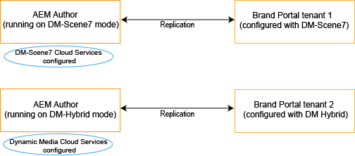

# Supporto di video dinamici in Brand Portal {#dynamic-video-support-on-brand-portal}

Anteprima e riproduzione di video in modo adattivo su Brand Portal con supporto Dynamic Media. Scarica anche le rappresentazioni dinamiche dal portale e i collegamenti condivisi.
Gli utenti Brand Portal possono:

* Visualizzare in anteprima i video nella pagina Dettagli risorsa, nella Vista a schede e nella pagina di anteprima della condivisione dei collegamenti.
* Riproduci le codifiche video nella pagina Dettagli risorsa .
* Visualizza rappresentazioni dinamiche nella scheda Rendering della pagina Dettagli risorsa.
* Scarica le codifiche video e le cartelle contenenti video.

>[!NOTE]
>
>Per lavorare con i video e pubblicarli in Brand Portal, accertati che l’istanza di authoring di Experience Manager sia configurata in modalità Dynamic Media Hybrid o Dynamic Media **[!DNL Scene7]** modalità.

Per visualizzare in anteprima, riprodurre e scaricare i video, Brand Portal espone le due configurazioni seguenti agli amministratori:

* [Configurazione ibrida Dynamic Media](#configure-dm-hybrid-settings)
Se l’istanza di authoring di Experience Manager è in esecuzione in modalità ibrida di contenuti multimediali dinamici.
* [Dynamic Media [!DNL Scene7] configurazione](#configure-dm-scene7-settings)
Se l&#39;istanza di authoring di Experience Manager è in esecuzione su dynamic media-**[!DNL Scene7]** modalità.
Imposta una di queste configurazioni in base alle configurazioni impostate nell’istanza di authoring di Experience Manager con cui viene replicato il tenant Brand Portal.

>[!NOTE]
>
>I video dinamici non sono supportati negli tenant Brand Portal configurati con Experience Manager Author in esecuzione su **[!UICONTROL Scene7Connect]** modalità di esecuzione.

## Come vengono riprodotti i video dinamici? {#how-are-dynamic-videos-played}

Se Dynamic Media Configurazioni ([Ibrido](../using/dynamic-video-brand-portal.md#configure-dm-hybrid-settings) o [[!DNL Scene7]](../using/dynamic-video-brand-portal.md#configure-dm-scene7-settings) configurazioni) sono impostate su Brand Portal, le rappresentazioni dinamiche vengono recuperate da **[!DNL Scene7]** server. Le codifiche video vengono quindi visualizzate in anteprima e riprodotte senza ritardi e con distorsione nella qualità.

Poiché le codifiche video non sono memorizzate nell’archivio Brand Portal e vengono recuperate da **[!DNL Scene7]** server, assicurati che le configurazioni di Dynamic Media su Adobe Experience Manager Author Instance e Brand Portal siano le stesse.

>[!NOTE]
>
>I visualizzatori video e i predefiniti per visualizzatori non sono supportati in Brand Portal. I video vengono visualizzati in anteprima e riprodotti sui visualizzatori predefiniti in Brand Portal.

## Prerequisiti {#prerequisites}

Per lavorare con i video dinamici su Brand Portal, assicurati di:

* **Avvia Experience Manager Author in modalità Dynamic Media**
Avvia l’istanza di authoring di Experience Manager (con cui è configurato Brand Portal) in [Dynamic Media - [!DNL Scene7] modalità](https://experienceleague.adobe.com/docs/experience-manager-65/assets/dynamic/config-dms7.html?lang=en#enabling-dynamic-media-in-scene-mode) o [Dynamic Media - Modalità ibrida](https://experienceleague.adobe.com/docs/experience-manager-65/assets/dynamic/config-dynamic.html) o
* **Configurare Cloud Services Dynamic Media su Experience Manager Author**
In base alla modalità Dynamic Media (modalità Scene7 o modalità ibrida) su cui è in esecuzione l’autore, imposta [Cloud Services Dynamic Media ([!DNL Scene7] modalità)](https://experienceleague.adobe.com/docs/experience-manager-65/assets/dynamic/config-dms7.html?lang=en#configuring-dynamic-media-cloud-services) o [Cloud Services Dynamic Media (modalità ibrida)](https://experienceleague.adobe.com/docs/experience-manager-65/assets/dynamic/config-dynamic.html?lang=en#configuring-dynamic-media-cloud-services) su Experience Manager Author da **Strumenti** | **Cloud Services** | **Dynamic Media**.
* **Configurare Dynamic Media su Brand Portal**
In base alle configurazioni cloud di Dynamic Media in Experience Manager Author, configura [Impostazioni Dynamic Media](#configure-dm-hybrid-settings) o [[!DNL Scene7] impostazioni](#configure-dm-scene7-settings) da strumenti di amministrazione Brand Portal.
Assicurati che [tenant Brand Portal separati](#separate-tenants) sono utilizzati per Experience Manager le istanze di authoring configurate in Dynamic Media - **[!UICONTROL Scene7]** modalità e Dynamic Media - Modalità ibrida. Soprattutto se utilizzi funzionalità di Dynamic Media **[!UICONTROL S7]** e Dynamic Media Hybrid.
* **Pubblicare cartelle con codifiche video applicate a Brand Portal**
Applica [codifiche video](https://experienceleague.adobe.com/docs/experience-manager-65/assets/dynamic/video-profiles.html) e pubblicare in Brand Portal la cartella contenente risorse rich media dall’istanza di authoring di Experience Manager.
* **Inserire nell&#39;elenco Consentiti gli IP Egress in SPS se l&#39;anteprima sicura è abilitata**
Se utilizzi Dynamic Media-**[!DNL Scene7]** (con [anteprima protetta abilitata](https://experienceleague.adobe.com/docs/dynamic-media-classic/using/upload-publish/testing-assets-making-them-public.html) per un&#39;azienda), allora si consiglia che **[!DNL Scene7]** amministratore aziendale [inserire nell&#39;elenco Consentiti gli IP in uscita pubblici](https://experienceleague.adobe.com/docs/dynamic-media-classic/using/upload-publish/testing-assets-making-them-public.html#testing-the-secure-testing-service) per le rispettive regioni che utilizzano SPS (**[!UICONTROL Scene7]** Interfaccia flash di Publishing System.
Gli IP Egress sono i seguenti:

| **Regione** | **IP avanzato** |
|--- |--- |
| ND | 130.248.160.68 del 20.94.203.130 |
| EMEA | 185.34.189.3, 51.132.146.75 |
| APAC | 63,140,44,54 |

Per inserire uno di questi IP in uscita, vedi [preparare il tuo account per un servizio di test sicuro](https://experienceleague.adobe.com/docs/dynamic-media-classic/using/upload-publish/testing-assets-making-them-public.html#testing-the-secure-testing-service).

## Best practice  

Per garantire che le risorse video dinamiche vengano visualizzate in anteprima, riprodotte e scaricate correttamente da Brand Portal (e dai collegamenti condivisi), segui queste procedure:

### Affittuari separati per Dynamic Media - Scene7 e Dynamic Media - Modalità ibrida {#separate-tenants}

Se utilizzi entrambi Dynamic Media - **[!DNL Scene7]** modalità e Dynamic Media - Funzioni in modalità ibrida, utilizza diversi tenant di Brand Portal per Experience Manager istanze di authoring configurate con Dynamic Media - **[!DNL Scene7]** e Dynamic Media - Modalità ibrida.

### Stessi dettagli di configurazione nell’istanza di authoring di Experience Manager e in Brand Portal

Assicurati che i dettagli di configurazione siano gli stessi in Brand Portal e **[!UICONTROL Configurazione Experience Manager Cloud]**. Gli stessi dettagli di configurazione includono quanto segue:

* **[!UICONTROL Titolo]**
* **[!UICONTROL ID registrazione]**
* **[!UICONTROL URL del servizio video]** in **[!UICONTROL Dynamic Media - Modalità ibrida]**
* **[!UICONTROL Titolo]**
* Credenziali (**[!UICONTROL E-mail]** e password)
* **[!UICONTROL Regione]**
* **[!UICONTROL Azienda]** in Dynamic Media - **[!DNL Scene7]** modalità

### Inserire nell&#39;elenco Consentiti gli IP in uscita pubblici per la modalità Dynamic Media Scene7

Se Dynamic Media **[!UICONTROL Scene7]**-avere [anteprima protetta abilitata](https://experienceleague.adobe.com/docs/dynamic-media-classic/using/upload-publish/testing-assets-making-them-public.html)- viene utilizzato per distribuire risorse video a Brand Portal, quindi **[!UICONTROL Scene7]** stabilisce un server di immagini dedicato per ambienti di staging o applicazioni interne. Qualsiasi richiesta a questo server controlla l&#39;indirizzo IP di origine. Se la richiesta in entrata non si trova nell’elenco di indirizzi IP approvato, viene restituita una risposta di errore.
La **[!UICONTROL Scene7]** L’amministratore dell’azienda configura pertanto un elenco approvato di indirizzi IP per la propria azienda **[!UICONTROL Test Secure]** ambiente, attraverso **[!UICONTROL SPS]** Interfaccia flash di Scene7 Publishing System. Accertati che l’IP in uscita per la tua rispettiva area geografica (da quanto segue) sia aggiunto a tale elenco approvato.
Per inserire uno di questi IP in uscita, vedi [preparare il tuo account per un servizio di test sicuro](https://experienceleague.adobe.com/docs/dynamic-media-classic/using/upload-publish/testing-assets-making-them-public.html#testing-the-secure-testing-service).
Gli IP in uscita sono i seguenti:

| **Regione** | **IP avanzato** |
|--- |--- |
| ND | 130.248.160.66, 52.151.32.108 |
| EMEA | 185.34.189.1 |
| APAC | 63,140,44,54 |

## Configurare le impostazioni Dynamic Media (ibrido) {#configure-dm-hybrid-settings}

Se l&#39;istanza di authoring di Experience Manager è in esecuzione in modalità ibrida di Dynamic Media, utilizza **[!UICONTROL Video]** dal pannello strumenti amministrativi per configurare le impostazioni del gateway Dynamic Media.

>[!NOTE]
>
>La [profili di codifica video](https://experienceleague.adobe.com/docs/experience-manager-65/assets/dynamic/video-profiles.html) non vengono pubblicati in Brand Portal, vengono invece recuperati dal **[!UICONTROL Scene7]** server. Pertanto, affinché le codifiche video siano riprodotte correttamente in Brand Portal, assicurati che i dettagli di configurazione siano gli stessi del [Cloud Services Dynamic Media ([!DNL Scene7] modalità)](https://experienceleague.adobe.com/docs/experience-manager-65/assets/dynamic/config-dms7.html?lang=en#configuring-dynamic-media-cloud-services) nell’istanza di authoring di Experience Manager.

Per configurare le configurazioni Dynamic Media sui tenant Brand Portal:

1. Seleziona il logo Experience Manager per accedere agli strumenti amministrativi dalla barra degli strumenti nella parte superiore, in Brand Portal.
1. Dal pannello strumenti amministrativi, seleziona la **[!UICONTROL Video]** piastrelle.

   

   **[!UICONTROL Modifica configurazione Dynamic Media]** viene visualizzata la pagina .

   

1. Specifica **[!UICONTROL ID registrazione]** e **[!UICONTROL URL del servizio video]** (URL DM-Gateway). Assicurati che questi dettagli siano gli stessi di quelli in **[!UICONTROL Strumenti > Cloud Services]** nell’istanza di authoring di Experience Manager.
1. Seleziona **Salva** per salvare la configurazione.

## Configurare le impostazioni Dynamic Media Scene7 {#configure-dm-scene7-settings}

Se l’istanza di authoring di Experience Manager è in esecuzione su Dynamic Media- **[!UICONTROL Scene7]** quindi utilizza **[!UICONTROL Configurazione Dynamic Media]** riquadro dal pannello strumenti amministrativi per configurare **[!UICONTROL Scene7]** impostazioni del server.

Configurazione di Dynamic Media **[!UICONTROL Scene7]** configurazioni su tenant Brand Portal:

1. Seleziona il logo Experience Manager per accedere agli strumenti amministrativi dalla barra degli strumenti nella parte superiore, in Brand Portal.

2. Dal pannello strumenti amministrativi, seleziona la **[!UICONTROL Configurazione Dynamic Media]** piastrelle.

   ![DM [!UICONTROL Scena 7] configurazione su Brand Portal](assets/DMS7-Tile.png)

   **[!UICONTROL Modifica configurazione Dynamic Media]** viene visualizzata la pagina .

   

3. Fornire:

   * **[!UICONTROL Titolo]**
   * Credenziali (**[!UICONTROL ID e-mail]** e **[!UICONTROL Password]**) per accedere al server Scene7
   * **[!UICONTROL Regione]**

   Assicurati che questi valori siano gli stessi presenti nell&#39;istanza di authoring di Experience Manager.

4. Seleziona **[!UICONTROL Connessione a Dynamic Media]**.

5. Fornisci **[!UICONTROL Nome dell&#39;azienda]** e **[!UICONTROL Salva]** la configurazione.
