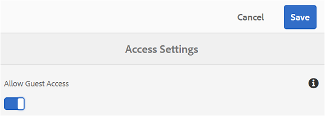
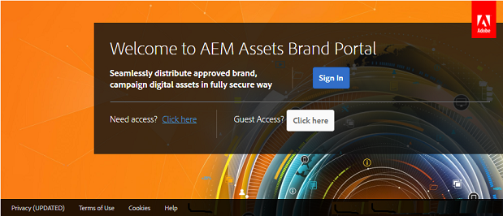
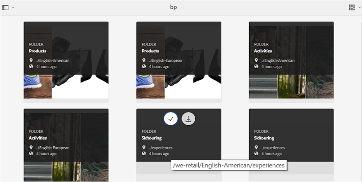
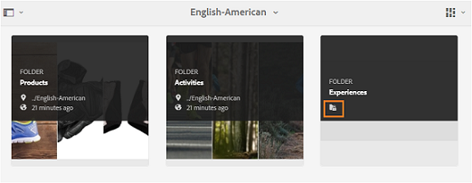
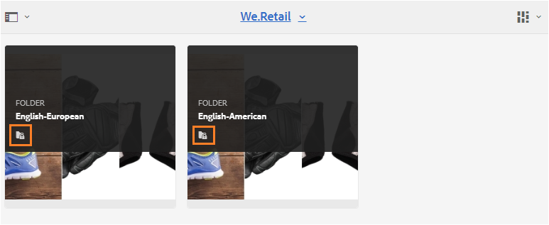
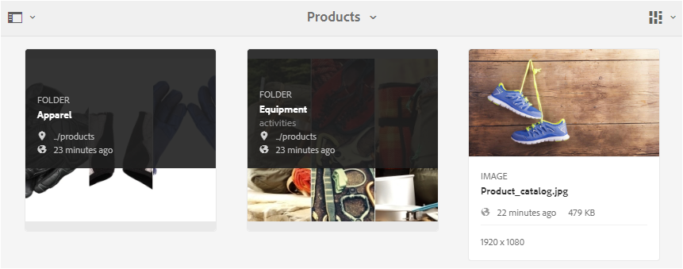
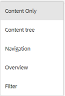
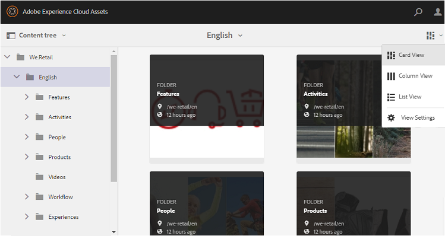
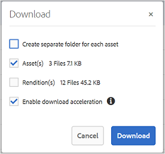
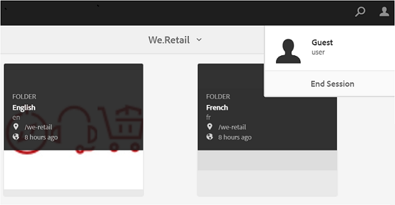

# Accesso a Brand Portal come ospite {#guest-access-to-brand-portal}

Experience Manager Assets Brand Portal consente l&#39;accesso come ospite al portale. Un utente guest non ha bisogno delle credenziali per accedere al portale e ha accesso alle risorse pubbliche (e alle raccolte) del portale. Gli utenti nella sessione ospite possono aggiungere risorse a lightbox (raccolta privata) e scaricarle finché la sessione non dura, ovvero 2 ore dall’inizio della sessione, a meno che l’utente ospite non scelga di [[!UICONTROL Fine sessione]](#exit-guest-session).

La funzionalità di accesso come ospite consente alle organizzazioni di: [condividere rapidamente le risorse approvate](../using/brand-portal-sharing-folders.md#how-to-share-folders) con il pubblico previsto su larga scala senza doverli integrare. A partire dalla versione 6.4.2 di Brand Portal, è in grado di servire più utenti guest simultanei, ovvero il 10% della quota totale di utenti per organizzazione. Consentendo l’accesso come ospite, si risparmia tempo per gestire e integrare punteggi di utenti con funzionalità limitate in Brand Portal.\
Le organizzazioni possono abilitare (o disabilitare) l’accesso come ospite sull’account Brand Portal dell’organizzazione utilizzando **[!UICONTROL Consenti accesso come ospite]** opzione da **[!UICONTROL Accesso]** nel pannello strumenti di amministrazione.

<!--
Comment Type: annotation
Last Modified By: mgulati
Last Modified Date: 2018-08-17T10:42:59.879-0400
Removed the first para: "AEM Assets Brand Portal allows public users to enter the portal anonymously and have restricted access to the allowed public resources as guests. Organization users with guest role need not seek access and authentication from administrators."
-->

## Inizio sessione ospite {#begin-guest-session}

Per accedere a Brand Portal in modo anonimo, seleziona **[!UICONTROL Fai clic qui]** corrispondente a **[!UICONTROL Accesso come ospite?]** nella schermata di benvenuto di Brand Portal. Immetti il controllo di sicurezza captcha per concedere l’accesso all’utilizzo di Brand Portal.

## Durata sessione ospite {#guest-session-duration}

Una sessione utente guest rimane attiva per 15 minuti.
Ciò significa che lo stato del **[!UICONTROL Lightbox]** viene conservato per 15 minuti dall’inizio della sessione, dopodiché la sessione ospite corrente viene riavviata in modo da perdere lo stato Lightbox.

Ad esempio, un utente guest accede a Brand Portal dopo 1500 ore e aggiunge risorse a **[!UICONTROL Lightbox]** per il download alle ore 15:05. Se l’utente non scarica il **[!UICONTROL Lightbox]** raccolta (o le relative risorse) prima delle ore 15:15 (entro 15 minuti dall’accesso), l’utente deve riavviare la sessione. Il **[!UICONTROL Lightbox]** è vuoto, significa che le risorse caricate non sono più disponibili se la sessione è stata persa.

## Sessioni guest simultanee consentite {#concurrent-guest-sessions-allowed}

Il numero di sessioni simultanee è limitato al 10% della quota totale di utenti per organizzazione. Ciò significa che per un’organizzazione con una quota di utenti di 200, un massimo di 20 utenti guest possono lavorare contemporaneamente. Al 21º utente viene negato l’accesso e può accedervi come ospite solo se termina la sessione di uno qualsiasi dei 20 utenti guest attivi.

>[!NOTE]
>
>Brand Portal non invia alcuna notifica se il numero di utenti con licenza supera il valore contrattuale (quota). Inoltre, non limita alcuna attività degli utenti autorizzati.

## Interazione dell’utente ospite con Brand Portal {#guest-user-interaction-with-brand-portal}

### Navigazione interfaccia utente ospite

Quando si accede a Brand Portal come ospite, gli utenti possono visualizzare tutti i [risorse e cartelle condivisi](../using/brand-portal-sharing-folders.md#sharefolders) pubblicamente o esclusivamente con utenti ospiti. Questa è la vista solo contenuto, che mostra le risorse nei layout a schede, a elenco o a colonna.

Tuttavia, gli utenti guest visualizzano la struttura delle cartelle (a partire dalla cartella principale) e le cartelle condivise disposte all’interno delle rispettive cartelle principali al momento dell’accesso a Brand Portal, se gli amministratori hanno abilitato [Abilita gerarchia cartelle](../using/brand-portal-general-configuration.md#main-pars-header-1621071021) configurazione.

Queste cartelle principali sono le cartelle virtuali e non è possibile eseguire alcuna azione su di esse. È possibile riconoscere queste cartelle virtuali con un&#39;icona di blocco.

Nessuna attività di azione visibile al passaggio del mouse o selezionando le attività **[!UICONTROL Vista a schede]**, a differenza delle cartelle condivise. **[!UICONTROL Panoramica]** quando si seleziona una cartella virtuale in **[!UICONTROL Vista a colonne]** e **[!UICONTROL Vista a elenco]**.

>[!NOTE]
>
>La miniatura predefinita delle cartelle virtuali è quella della prima cartella condivisa.

   

**[!UICONTROL Impostazioni vista]** consente agli utenti guest di regolare le dimensioni delle schede in **[!UICONTROL Vista a schede]** o colonne da visualizzare in **[!UICONTROL Vista a elenco]**.

Il **[!UICONTROL Struttura contenuto]** consente di spostarsi nella gerarchia delle risorse.

Brand Portal fornisce **[!UICONTROL Panoramica]** opzione per gli utenti guest da visualizzare **[!UICONTROL Proprietà risorsa]** di risorse/cartelle selezionate. Il **[!UICONTROL Panoramica]** l&#39;opzione è visibile:

* Nella barra degli strumenti in alto, seleziona una risorsa o una cartella.
* Nell’elenco a discesa selezionando il Selettore della barra.

Quando si seleziona **[!UICONTROL Panoramica]** mentre è selezionata una risorsa o una cartella, gli utenti possono visualizzare il titolo, il percorso e l’ora di creazione della risorsa. Nella pagina dei dettagli della risorsa, invece, selezionare **[!UICONTROL Panoramica]** consente agli utenti di visualizzare i metadati della risorsa.

**[!UICONTROL Navigazione]** L&#39;opzione nella barra a sinistra consente di passare dai file alle raccolte e di nuovo nella sessione guest, in modo che gli utenti possano sfogliare le risorse in file o raccolte.

**[!UICONTROL Filtro]** consente agli utenti guest di filtrare i file e le cartelle di risorse utilizzando i predicati di ricerca impostati dall’amministratore.

### Funzionalità degli utenti guest

Gli utenti ospiti possono accedere alle risorse pubbliche su Brand Portal e hanno anche poche restrizioni, come discusso ulteriormente.

**Gli utenti ospiti possono**:

* Accedi a tutte le cartelle pubbliche e alle raccolte destinate a tutti gli utenti di Brand Portal.
* Consente di sfogliare i membri, la pagina dei dettagli e la visualizzazione completa delle risorse dei membri di tutte le cartelle e raccolte pubbliche.
* Cerca le risorse nelle cartelle e raccolte pubbliche.
* Aggiungi risorse alla raccolta Lightbox. Queste modifiche alla raccolta persistono durante la sessione.
* Scarica le risorse direttamente o tramite la raccolta Lightbox.

**Gli utenti guest non possono**:

* Crea raccolte e ricerche salvate o condividile ulteriormente.
* Accedere alle impostazioni della cartella e delle raccolte.
* Condividere le risorse come collegamenti.

### Scaricare risorse nella sessione per gli ospiti

Gli utenti ospiti possono scaricare direttamente le risorse condivise pubblicamente o esclusivamente con gli utenti ospiti su Brand Portal. Gli utenti guest possono anche aggiungere risorse a **[!UICONTROL Lightbox]** (raccolta pubblica) e scarica il **[!UICONTROL Lightbox]** raccolta prima della scadenza della sessione.

Per scaricare risorse e raccolte, utilizza l’icona Scarica da:

* Miniature di azioni rapide, visualizzate al passaggio del mouse sulla risorsa o sulla raccolta
* La barra degli strumenti nella parte superiore, che viene visualizzata quando si seleziona la risorsa o la raccolta

Selezione **[!UICONTROL Abilita accelerazione di download]** il [!UICONTROL Scarica] consente di [migliorare le prestazioni di download](../using/accelerated-download.md).

## Esci dalla sessione guest {#exit-guest-session}

Per uscire da una sessione guest, utilizzare **[!UICONTROL Fine sessione]** dalle opzioni disponibili nell’intestazione. Tuttavia, se la scheda del browser utilizzata per la sessione ospite è inattiva, la sessione scade automaticamente dopo due ore di inattività.

## Monitoraggio delle attività degli utenti guest {#monitoring-guest-user-activities}

Gli amministratori possono monitorare l’interazione degli utenti guest con Brand Portal. I rapporti generati in Brand Portal possono fornire informazioni chiave sulle attività degli utenti guest. Ad esempio: **[!UICONTROL Scarica]** Questo rapporto può essere utilizzato per tenere traccia del numero di risorse scaricate dall’utente ospite. **[!UICONTROL Accessi utente]** Il report può indicare quando l&#39;utente guest ha eseguito l&#39;ultimo accesso al portale e la frequenza degli accessi in un periodo di tempo specificato.
