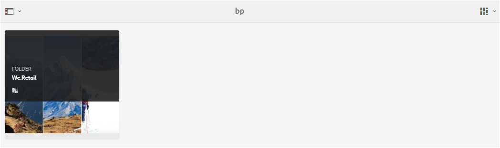

# Accesso degli ospiti al portale dei marchi {#guest-access-to-brand-portal}

Il portale AEM Brand consente agli ospiti di accedere al portale. Un utente ospite non ha bisogno di credenziali per entrare nel portale e ha accesso alle risorse pubbliche (e alle raccolte) del portale. Gli utenti della sessione ospite possono aggiungere risorse alla propria lightbox (raccolta privata) e scaricare la stessa fino alla durata della sessione, vale a dire 2 ore dall'inizio della sessione, a meno che l'utente ospiti non scelga [[!UICONTROL End Session]](#exit-guest-session).

La funzionalità di accesso degli ospiti consente alle organizzazioni di condividere [rapidamente le risorse](../using/brand-portal-sharing-folders.md#how-to-share-folders) approvate con il pubblico previsto su larga scala senza doverle imbarcare. A partire da Brand Portal 6.4.2 è disponibile per più utenti ospiti simultanei, pari al 10% della quota totale di utenti per organizzazione. Consentendo l’accesso degli ospiti potete risparmiare tempo per gestire e inserire punteggi di utenti che devono utilizzare funzionalità limitate sul Brand Portal.\
Le organizzazioni possono abilitare (o disabilitare) l'accesso degli ospiti sull'account Brand Portal dell'organizzazione tramite l'opzione **[!UICONTROL Consenti accesso]** ospiti dalle impostazioni **[!UICONTROL Accesso]** nel pannello degli strumenti amministrativi.

<!--
Comment Type: annotation
Last Modified By: mgulati
Last Modified Date: 2018-08-17T10:42:59.879-0400
Removed the first para: "AEM Assets Brand Portal allows public users to enter the portal anonymously and have restricted access to the allowed public resources as guests. Organization users with guest role need not seek access and authentication from administrators."
-->

## Inizia sessione ospite {#begin-guest-session}

Per accedere al Portale marchio in modo anonimo, selezionate **[!UICONTROL Fate clic qui]** corrispondente a Accesso **[!UICONTROL ospiti?]** nella schermata di benvenuto di Brand Portal. Gli utenti non devono cercare l’accesso e attendere che l’amministratore li autentici per concedere l’accesso all’utilizzo del Brand Portal.

## Durata sessione ospite {#guest-session-duration}

Una sessione utente ospite rimane attiva per 2 ore. Questo significa che lo stato di [!UICONTROL Lightbox] viene mantenuto fino a 1 ora dall’ora di inizio della sessione e, dopo 2 ore, la sessione ospite corrente viene riavviata in modo che lo stato Lightbox venga perso.\
Ad esempio, un utente ospite accede al Brand Portal a 1500 ore e aggiunge risorse a Lightbox per il download alle 16:50 ore. Se l'utente non scarica la raccolta [!UICONTROL Lightbox] (o le relative risorse) prima delle 17:00, [!UICONTROL Lightbox] diventerà vuota in quanto l'utente dovrà riavviare la sessione alla fine di 1 ora (ovvero 1700 ore).

## Sessioni ospiti simultanee consentite {#concurrent-guest-sessions-allowed}

Il numero di sessioni guest simultanee è limitato al 10% della quota utente totale per organizzazione. Ciò significa che per un'organizzazione con una quota di utenti di 200, al massimo 20 utenti ospiti possono lavorare contemporaneamente. Al 21° utente viene negato l’accesso e può accedervi come ospite solo se termina la sessione di uno dei 20 utenti ospiti attivi.

## Interazione degli utenti ospiti con Brand Portal {#guest-user-interaction-with-brand-portal}

### Navigazione interfaccia utente per gli ospiti

Entrando nel Brand Portal come ospite, gli utenti possono vedere tutte le [risorse e le cartelle condivise](../using/brand-portal-sharing-folders.md#sharefolders) pubblicamente o esclusivamente con gli utenti ospiti. Questa vista è l'unica vista del contenuto, che visualizza le risorse nei layout di schede, elenchi o colonne.

Tuttavia, gli utenti ospiti possono vedere la struttura delle cartelle (a partire dalla cartella principale) e le cartelle condivise disposte all’interno delle rispettive cartelle principali al momento dell’accesso al Portale marchio, se gli amministratori hanno attivato [Abilita configurazione gerarchia](../using/brand-portal-general-configuration.md#main-pars-header-1621071021) cartelle.

Queste cartelle principali sono le cartelle virtuali e non è possibile eseguire alcuna azione su di esse. È possibile riconoscere queste cartelle virtuali con un'icona a forma di lucchetto.

A differenza delle cartelle condivise, non è visibile alcuna attività di azione al passaggio del mouse o alla selezione in vista a schede. [!UICONTROL Il pulsante Panoramica] viene visualizzato quando si seleziona una cartella virtuale in Visualizzazione [!UICONTROL a] colonne e Visualizzazione elenco.

>[!NOTE]
>
>La miniatura predefinita delle cartelle virtuali è la miniatura della prima cartella condivisa.

   

[!UICONTROL L’opzione Visualizza impostazioni] consente agli utenti ospiti di regolare le dimensioni delle schede nella vista [!UICONTROL a] schede o nelle colonne da visualizzare nella vista [!UICONTROL a]elenco.

La struttura ad albero  Contenuto consente di spostarsi nella gerarchia delle risorse.

Brand Portal offre l’opzione [!UICONTROL Panoramica] per consentire agli utenti ospiti di visualizzare le proprietà [!UICONTROL delle] risorse delle risorse o delle cartelle selezionate. L’opzione [!UICONTROL Panoramica] è visibile:

* Nella barra degli strumenti nella parte superiore, quando si seleziona una risorsa o una cartella.
* Nell'elenco a discesa selezionando il selettore della barra.

Selezionando l’opzione [!UICONTROL Panoramica] mentre è selezionata una risorsa o una cartella, gli utenti possono visualizzare il titolo, il percorso e l’ora della creazione della risorsa. Nella pagina dei dettagli della risorsa, invece, l’opzione [!UICONTROL Panoramica] permette agli utenti di visualizzare i metadati della risorsa.

 

**[!UICONTROL L'opzione di navigazione]** nella barra a sinistra consente di spostarsi dai file alle raccolte e viceversa nella sessione guest, in modo che gli utenti possano sfogliare le risorse presenti nei file o nelle raccolte.

**[!UICONTROL L’opzione Filtro]** consente agli utenti ospiti di filtrare file e cartelle di risorse utilizzando i predicati di ricerca impostati dall’amministratore.

### Funzionalità degli utenti ospiti

Gli utenti ospiti possono accedere alle risorse pubbliche sul Brand Portal e possono anche avere poche limitazioni, come ulteriormente discusso.

Gli utenti ospiti possono:

* accedere a tutte le cartelle pubbliche e alle raccolte destinate a tutti gli utenti del Brand Portal.
* sfogliate i membri, la pagina dei dettagli e visualizzate la risorsa completa dei membri di tutte le cartelle e raccolte pubbliche.
* cercare risorse nelle cartelle pubbliche e nelle raccolte.
* aggiungere risorse alla raccolta lightbox. Queste modifiche alla raccolta persistono durante la sessione.
* scaricate le risorse direttamente o attraverso la raccolta lightbox.

Gli utenti ospiti non possono:

* create raccolte e ricerche salvate, oppure condividetele ulteriormente.
* accedere alle impostazioni delle cartelle e delle raccolte.
* condividere le risorse come collegamenti.

### Scaricare risorse in una sessione ospite

Gli utenti ospiti possono scaricare direttamente le risorse condivise pubblicamente o esclusivamente con gli utenti ospiti sul Brand Portal. Gli utenti ospiti possono inoltre aggiungere risorse a [!UICONTROL Lightbox] (raccolta pubblica) e scaricare la raccolta [!UICONTROL Lightbox] prima della scadenza della sessione.

Per scaricare risorse e raccolte, utilizzate l'icona di download da:

* miniature delle azioni rapide, visualizzate quando si passa il puntatore del mouse sulla risorsa o sulla raccolta
* la barra degli strumenti nella parte superiore, che viene visualizzata quando si seleziona la risorsa o la raccolta

Se selezionate **[!UICONTROL Abilita accelerazione]** download nella finestra di dialogo [!UICONTROL Download] , potete [migliorare le prestazioni](../using/accelerated-download.md)di download.

## Esci dalla sessione ospite {#exit-guest-session}

Per uscire da una sessione ospite, utilizzate **[!UICONTROL Termina sessione]** dalle opzioni disponibili nell’intestazione. Tuttavia, se la scheda del browser utilizzata per la sessione ospite è inattiva, la sessione scade automaticamente dopo due ore di inattività.

## Monitoraggio delle attività degli utenti ospiti {#monitoring-guest-user-activities}

Gli amministratori possono monitorare l'interazione degli utenti ospiti con il Brand Portal. I report generati in Brand Portal possono fornire informazioni chiave sulle attività degli utenti ospiti. Ad esempio, il rapporto **[!UICONTROL Download]** può essere utilizzato per tenere traccia del numero di risorse scaricate dall’utente ospite. **[!UICONTROL Il rapporto Login]** utente può indicare quando l’utente ospite ha eseguito l’ultimo accesso al portale e la frequenza degli accessi in una durata specificata.
