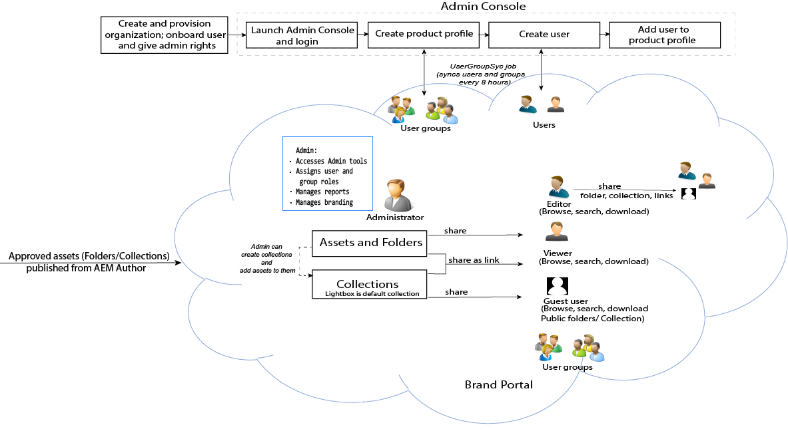

# Guida di Adobe Experience Manager Assets Brand Portal {#aem-brand-portal}

**Adobe Experience Manager Assets Brand Portal** consente alle organizzazioni di soddisfare le proprie esigenze di marketing distribuendo in modo sicuro le risorse approvate relative a prodotti e marchi, che potranno essere scaricate da agenzie esterne, partner, team interni e rivenditori.

La mancanza di una soluzione sicura per la condivisione delle risorse può comportare:

* Condivisione manuale delle risorse tramite e-mail o cloud
* Problemi di conformità del marchio
* Mancanza di controllo sull’utilizzo delle risorse
* Ritardi nelle campagne e nei lanci di prodotti
* Duplicazione dei contenuti tra località geografiche e organizzazioni diverse
* Conservazione non protetta delle risorse prima del rilascio

Con Brand Portal le organizzazioni possono garantire la conformità del marchio: gli addetti al marketing possono infatti collaborare con i partner di canale e gli utenti aziendali interni per creare, gestire e consegnare rapidamente alle parti interessate contenuti sempre aggiornati, quali linee guida di progettazione, logo, campagne e risorse di prodotto.
Brand Portal è un’offerta SaaS basata su cloud. È disponibile come componente aggiuntivo di Adobe Experience Manager Assets (come soluzione locale o servizio gestito).

Il flusso di lavoro della soluzione Brand Portal è illustrato nell’immagine seguente.

## Guida utente di Adobe Experience Manager Brand Portal

Questa guida utente illustra in dettaglio le funzionalità offerte da Brand Portal e ne descrive i principali flussi di lavoro. Utilizza la barra a sinistra per navigare tra le varie funzionalità e approfondisci per ottenere informazioni sull’interazione delle diverse figure con il portale.

### Consulta anche

| Guida utente | Descrizione |
|--- |---|
| [Novità](whats-new.md) | Informazioni sulle modifiche e sulle nuove funzionalità introdotte nelle varie versioni di Brand Portal. |
| [Note sulla versione](brand-portal-release-notes.md) | Miglioramenti, problemi critici risolti e problemi noti presenti nella versione corrente. |
| [Configurare Experience Manager Assets con Brand Portal](../using/configure-aem-assets-with-brand-portal.md) | Come replicare Brand Portal con Experience Manager Assets per pubblicare le risorse. |
| [Risolvere i problemi relativi alla pubblicazione parallela](troubleshoot-parallel-publishing.md) | Risolvere i problemi relativi alla replica tra Brand Portal e Experience Manager Assets. |
| [Formati di file supportati](brand-portal-supported-formats.md) | Formati di file supportati in Brand Portal per l’anteprima e il download. |
| [Pubblicare le risorse in Brand Portal](brand-portal-sharing-folders.md) | Informazioni su come pubblicare cartelle, raccolte, collegamenti, predefiniti, schemi, facet e tag in Brand Portal. |
| [Asset Sourcing in Brand Portal](brand-portal-asset-sourcing.md) | Come configurare Asset Sourcing in AEM Assets, caricare le risorse in Brand Portal e pubblicare nuovamente la cartella Contribution in AEM Assets. |
| [Video sulle funzioni di Brand Portal](https://experienceleague.adobe.com/?lang=en&amp;tag=Brand+Portal#recommended/solutions/experience-manager) | Scopri come utilizzare Experience Manager Assets Brand Portal con l’aiuto di esercitazioni video. |

### Risorse utili

* [Brand Portal con AEM Assets](https://experienceleague.adobe.com/docs/experience-manager-brand-portal/using/home.html)
