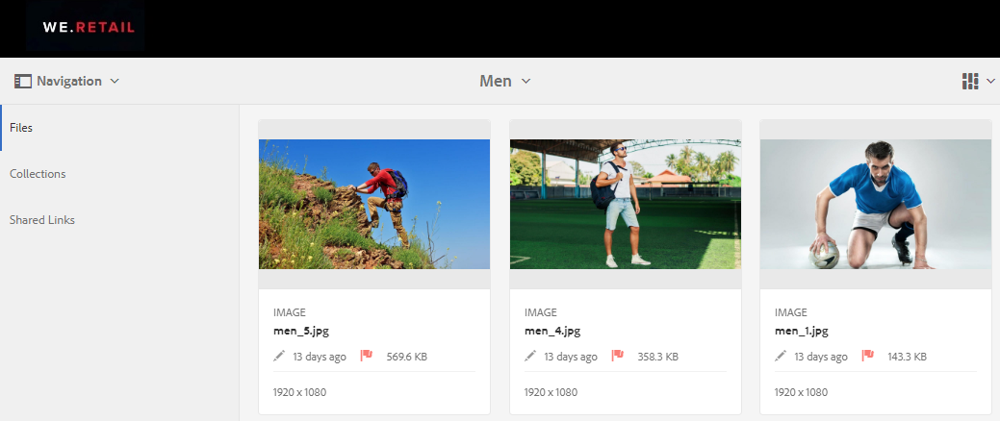
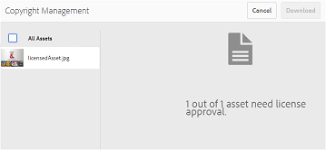
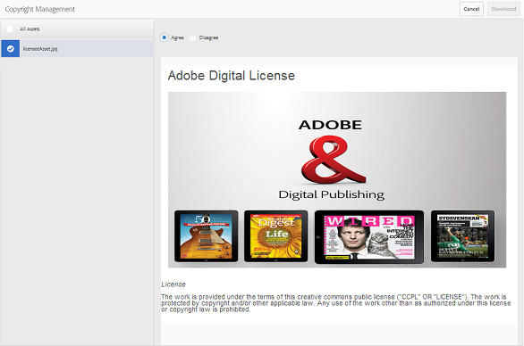
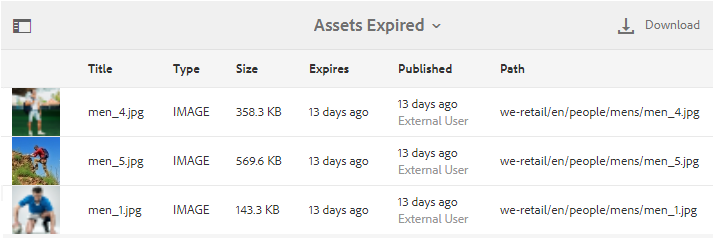

# Gestire i diritti digitali delle risorse {#manage-digital-rights-of-assets}

Per proteggere il marchio è fondamentale garantire la sicurezza della distribuzione e dell&#39;utilizzo delle risorse creative e del materiale del marchio. Questo può essere applicato sia all’interno che all’esterno dell’organizzazione associando una data di scadenza (e un’ora) alle risorse approvate pubblicate dall’AEM a Brand Portal, oppure concedendo in licenza tali risorse per un uso condizionale. Inoltre, Brand Portal consente di specificare una data di scadenza per i collegamenti alle risorse condivise da Brand Portal.

Continua a leggere per sapere come vengono protette le risorse su Brand Portal e per comprendere le relative autorizzazioni di utilizzo.

## Scadenza risorsa {#asset-expiration}

La scadenza delle risorse è un modo efficace per controllare l’utilizzo delle risorse approvate su Brand Portal in un’organizzazione. Tutte le risorse pubblicate da AEM Assets in Brand Portal possono avere una data di scadenza, che limita l’utilizzo di tali risorse da parte di diversi ruoli utente.

### Autorizzazioni di utilizzo relative alle risorse scadute {#usage-permissions-expired-assets}

In Brand Portal, gli amministratori possono visualizzare, scaricare e aggiungere risorse scadute alle raccolte. Mentre, gli editor e i visualizzatori possono solo visualizzare e aggiungere risorse scadute alle raccolte.

Gli amministratori possono pubblicare le risorse scadute da AEM Assets a Brand Portal. Tuttavia, le risorse scadute non possono essere condivise tramite input penna da Brand Portal. Se selezioni una risorsa scaduta da una cartella contenente sia risorse scadute che non scadute, il **[!UICONTROL Condividi collegamento]** azione non disponibile. Tuttavia, se selezioni una cartella contenente risorse scadute e non scadute, il [!UICONTROL Condividi] e **[!UICONTROL Condividi collegamento]** sono disponibili delle azioni.

>[!NOTE]
>
>Una cartella può comunque essere condivisa come collegamento, anche se contiene risorse scadute. In questo caso, il collegamento non elenca le risorse scadute e vengono condivise solo le risorse non scadute.

Nella tabella seguente vengono visualizzate le autorizzazioni di utilizzo delle risorse scadute:

|  | **[!UICONTROL Condivisione collegamento]** | **[!UICONTROL Download]** | **[!UICONTROL Proprietà]** | **[!UICONTROL Aggiungi a raccolta]** | **[!UICONTROL Eliminare]** |
|---|---|---|---|---|---|
| **[!UICONTROL Amministratore]** | Non disponibile | Disponibile | Disponibile | Disponibile | Disponibile |
| **[!UICONTROL Editor]** | Non disponibile | Non disponibile | Disponibile | Disponibile | Non disponibile |
| **[!UICONTROL Visualizzatore]** | Non disponibile | Non disponibile | Disponibile | Disponibile | Non disponibile |
| **[!UICONTROL Utente ospite]** | Non disponibile | Non disponibile | Disponibile | Disponibile | Non disponibile |

>[!NOTE]
>
>Se i visualizzatori e gli editor scaricano una cartella contenente risorse scadute e non scadute, vengono scaricate solo le risorse non scadute. Se una cartella contiene solo risorse scadute, viene scaricata una cartella vuota.

### Stato di scadenza delle risorse {#expiration-status-of-assets}

Puoi visualizzare lo stato di scadenza delle risorse nelle relative **[!UICONTROL Vista a schede]**. Un flag rosso sulla scheda indica che la risorsa è scaduta.

>[!NOTE]
>
>Nelle viste a elenco e a colonna non viene visualizzato lo stato di scadenza delle risorse.

## Scadenza collegamento risorsa {#asset-link-expiration}

Quando si condividono le risorse tramite collegamenti, gli amministratori e gli editor possono impostare una data e un’ora di scadenza utilizzando **[!UICONTROL Scade]** campo in **[!UICONTROL Condivisione collegamenti]** . La scadenza predefinita del collegamento è di sette giorni dalla data in cui il collegamento viene condiviso.

In questo modo, le risorse condivise come collegamenti scadono alla data e all’ora impostate dagli amministratori e dagli editor di Brand Portal e non possono più essere visualizzate e scaricate dopo la data di scadenza. Poiché le risorse condivise tramite i collegamenti possono essere visualizzate anche da utenti esterni che non fanno parte dell’organizzazione, specificando la scadenza puoi assicurarti che le risorse approvate siano protette e non esposte a entità sconosciute oltre un periodo di tempo specificato.

Per ulteriori informazioni sulla condivisione dei collegamenti, consulta [Condividere le risorse come collegamento](../using/brand-portal-link-share.md).

## Risorse concesse in licenza {#licensed-assets}

Le risorse concesse in licenza sono soggette all’accettazione di un contratto di licenza prima del download da Brand Portal. Il presente contratto per le risorse concesse in licenza viene stipulato quando si scarica la risorsa direttamente da Brand Portal o tramite un collegamento condiviso. Che siano scadute o meno, le risorse protette da licenza possono essere visualizzate da tutti gli utenti. Tuttavia, il download e l’utilizzo delle risorse concesse in licenza scadute sono limitati. Per informazioni sul comportamento delle risorse concesse in licenza scadute e sulle attività consentite in base ai ruoli utente, consulta [autorizzazioni di utilizzo delle risorse scadute](../using/manage-digital-rights-of-assets.md#usage-permissions-expired-assets).

Le risorse protette da licenza hanno [contratto di licenza allegato](https://experienceleague.adobe.com/docs/experience-manager-65/assets/administer/drm.html) ad esse, impostando la proprietà dei metadati della risorsa in [!DNL Experience Manager Assets].

Una risorsa è considerata protetta se contiene una delle seguenti proprietà di metadati (o entrambe):

* `xmpRights:WebStatement`: questa proprietà fa riferimento al percorso della pagina che contiene il contratto di licenza per la risorsa. `xmpRights:WebStatement` deve essere un percorso valido nell’archivio.
* `adobe_dam:restrictions`: il valore di questa proprietà è un HTML non elaborato che specifica il contratto di licenza.

Se scegli di scaricare risorse protette da licenza, vieni reindirizzato al **[!UICONTROL Gestione copyright]** a seconda delle proprietà dei metadati.

| `adobe_dam:restrictions` | `xmpRights:WebStatement` | Gestione copyright |
| --- | --- | --- |
| Sì | - | L’interfaccia viene visualizzata sia in Assets che in Brand Portal |
| - | Sì (percorso non valido) | Nessuna interfaccia |
| Sì | Sì (percorso non valido) | Nessuna interfaccia |
| Sì | Sì (percorso valido) | L’interfaccia viene visualizzata in Assets o Brand Portal   A seconda che il percorso sia valido per Assets o Brand Portal (o per entrambi). |

Qui devi selezionare la risorsa da scaricare e accettare il relativo contratto di licenza. Se non si accetta il contratto di licenza, il **[!UICONTROL Scarica]** non è attivato.

Se la selezione contiene più risorse protette, seleziona una risorsa alla volta, accetta il contratto di licenza e procedi al download della risorsa.

## Genera report sulle risorse scadute {#generate-report-about-expired-assets}

Gli amministratori possono generare e scaricare un rapporto in cui sono elencate tutte le risorse scadute entro un intervallo di tempo specifico. Questo rapporto include informazioni dettagliate sulle risorse scadute, ad esempio dimensione, tipo e percorso per specificare la posizione della risorsa nella gerarchia delle risorse, quando è scaduta e quando è stata pubblicata. Le colonne di questo rapporto possono essere personalizzate per visualizzare più dati in base ai requisiti degli utenti.

Per ulteriori informazioni sulla funzione Rapporti, consulta [Utilizzare i rapporti](../using/brand-portal-reports.md#work-with-reports).
