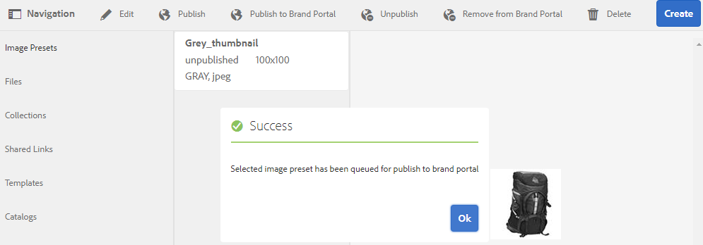
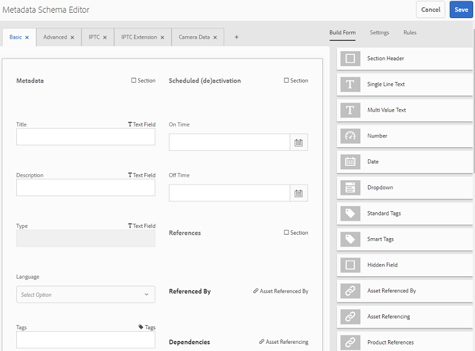
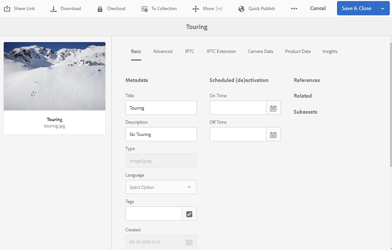
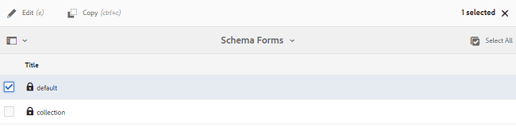
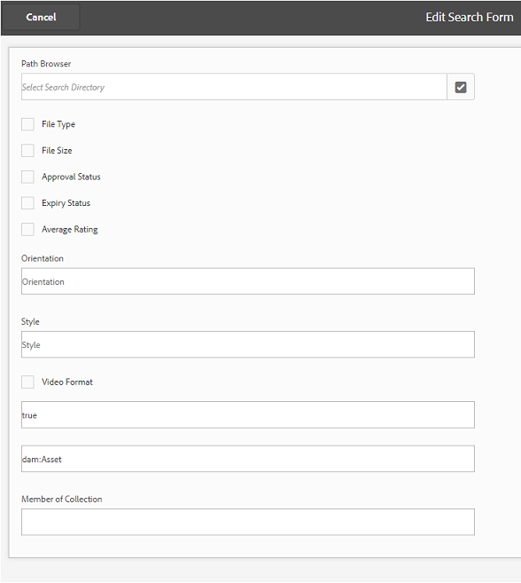
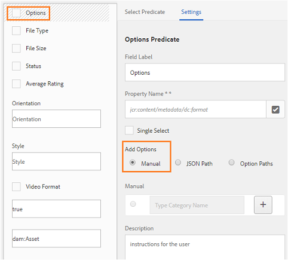

# Pubblicare predefiniti, schemi e facet in Brand Portal {#publish-presets-schema-and-facets-to-brand-portal}

L&#39;articolo descrive come pubblicare i predefiniti per immagini, gli schemi di metadati e i facet di ricerca personalizzati dall&#39;istanza di AEM Author al Brand Portal. La funzione di pubblicazione consente alle organizzazioni di riutilizzare i predefiniti per immagini, gli schemi di metadati e i facet di ricerca creati/modificati nell’istanza di AEM Author, riducendo in tal modo il rischio di duplicazione.

>[!NOTE]
>
>La possibilità di pubblicare predefiniti per immagini, schemi di metadati e facet di ricerca dall’istanza di AEM Author al Portale del marchio è disponibile a partire da AEM 6.2 SP1-CFP7 e AEM 6.3 SP 1-CFP 1 (6.3.1.1).

## Pubblicare i predefiniti per immagini su Brand Portal {#publish-image-presets-to-brand-portal}

I predefiniti per immagini sono una serie di comandi di ridimensionamento e formattazione applicati all’immagine al momento della distribuzione. I predefiniti per immagini possono essere creati e modificati in Brand Portal. In alternativa, se l’istanza di AEM Author è in esecuzione in modalità per contenuti multimediali dinamici, gli utenti possono creare dei predefiniti in AEM Author e pubblicarli nel Portale marchio di AEM Assets, evitando di ricreare gli stessi predefiniti in Brand Portal.\
Una volta creato, il predefinito viene elencato come rappresentazione dinamica nella barra delle rappresentazioni dei dettagli delle risorse e nella finestra di dialogo di download.

>[!NOTE]
>
>Se l’istanza di AEM Author non è in esecuzione in modalità **[!UICONTROL Contenuti multimediali]**dinamici (il cliente non ha acquistato elementi multimediali dinamici), la rappresentazione TIFF**** piramidale delle risorse non viene creata al momento del caricamento. I predefiniti per immagini o le rappresentazioni dinamiche funzionano su TIFF ****piramidale di una risorsa, pertanto se**[!UICONTROL  TIFF]** piramidale non è disponibile sull’istanza di AEM Author, non è disponibile anche sul Portale marchio. Di conseguenza, nella barra delle rappresentazioni della pagina dei dettagli della risorsa e nella finestra di dialogo di download non sono presenti rappresentazioni dinamiche.

Per pubblicare i predefiniti per immagini in Brand Portal:

1. Nell’istanza di AEM Author, tocca o fai clic sul logo AEM per accedere alla console di navigazione globale, quindi tocca o fai clic sull’icona Strumenti e passa a **[!UICONTROL Risorse > Predefiniti]**immagine.
1. Selezionate il predefinito per immagini o più predefiniti per immagini dall’elenco dei predefiniti per immagini e toccate o fate clic su **[!UICONTROL Pubblica sul portale]**del marchio.

>[!NOTE]
>
>Quando gli utenti fanno clic su **[!UICONTROL Pubblica su Brand Portal]**, i predefiniti per immagini vengono messi in coda per la pubblicazione. Agli utenti viene consigliato di monitorare il registro degli agenti di replica per confermare l’esito della pubblicazione.

Per annullare la pubblicazione di un predefinito per immagini da Brand Portal:

1. Nell’istanza di AEM Author, tocca o fai clic sul logo AEM per accedere alla console di navigazione globale, quindi tocca o fai clic sull’icona **[!UICONTROL Strumenti]**e passa a**[!UICONTROL  Risorse > Predefiniti]**immagine.
1. Selezionate un predefinito per immagini, quindi selezionate **[!UICONTROL Rimuovi da Brand Portal]**dalle opzioni disponibili nella parte superiore.

## Pubblicare lo schema di metadati su Brand Portal {#publish-metadata-schema-to-brand-portal}

Lo schema metadati descrive il layout e le proprietà visualizzati nella pagina delle proprietà delle risorse/raccolte.

 

Se gli utenti hanno modificato lo schema predefinito nell&#39;istanza di AEM Author e desiderano utilizzare lo stesso schema dello schema predefinito nel Brand Portal, possono semplicemente pubblicare i moduli dello schema di metadati in Brand Portal. In questo caso, lo schema predefinito in Brand Portal viene sostituito dagli schemi predefiniti pubblicati dall&#39;istanza di AEM Author.

Se gli utenti hanno creato uno schema personalizzato sull&#39;istanza di AEM Author, possono pubblicare lo schema personalizzato su Brand Portal invece di ricreare lo stesso schema personalizzato. Gli utenti possono quindi applicare questo schema personalizzato a qualsiasi cartella/raccolta in Brand Portal.

>[!NOTE]
>
>Gli schemi predefiniti non possono essere pubblicati sul Portale marchio se sono bloccati nell’istanza di AEM (ovvero se non sono stati modificati).

>[!NOTE]
>
>Se a una cartella è applicato uno schema sull’istanza di AEM Author, lo stesso schema deve esistere anche nel Portale marchio per mantenere la coerenza nella pagina delle proprietà delle risorse su AEM Author e Brand Portal.

Per pubblicare uno schema di metadati dall’istanza di AEM Author al Brand Portal:

1. Nell’istanza di AEM Author, tocca o fai clic sul logo AEM per accedere alla console di navigazione globale, quindi tocca o fai clic sull’icona Strumenti e passa a **[!UICONTROL Risorse > Schemi]**di metadati.
1. Selezionate uno schema di metadati, quindi selezionate **[!UICONTROL Pubblica su Brand Portal]**dalle opzioni disponibili nella parte superiore.

>[!NOTE]
>
>Quando gli utenti fanno clic su **[!UICONTROL Pubblica su Brand Portal]**, gli schemi di metadati vengono messi in coda per la pubblicazione. Agli utenti viene consigliato di monitorare il registro degli agenti di replica per confermare l’esito della pubblicazione.

Per annullare la pubblicazione di uno schema di metadati da Brand Portal:

1. Nell’istanza di AEM Author, tocca o fai clic sul logo AEM per accedere alla console di navigazione globale, quindi tocca o fai clic sull’icona Strumenti e passa a **[!UICONTROL Risorse > Schemi]**di metadati.
1. Selezionate uno schema di metadati, quindi selezionate **[!UICONTROL Rimuovi da Brand Portal]**dalle opzioni disponibili nella parte superiore.

## Pubblicare facet di ricerca su Brand Portal {#publish-search-facets-to-brand-portal}

I moduli di ricerca forniscono agli utenti la possibilità di effettuare ricerche  sfaccettate sul Brand Portal. I facet di ricerca conferiscono maggiore granularità alle ricerche sul Portale marchio. Tutti i [predicati aggiunti](https://helpx.adobe.com/experience-manager/6-5/assets/using/search-facets.html#AddingaPredicate) nel modulo di ricerca sono disponibili per gli utenti come facet di ricerca nei filtri di ricerca.

Se sei disposto a utilizzare un modulo di ricerca personalizzato **[!UICONTROL Risorse Admin Search Rail]**dall&#39;istanza di AEM Author, invece di ricreare lo stesso modulo su Brand Portal puoi pubblicare il modulo di ricerca personalizzato dall&#39;istanza di AEM Author al Brand Portal.

>[!NOTE]
>
>Per pubblicare su Brand Portal non è possibile pubblicare risorse per la ricerca nel modulo di ricerca **[!UICONTROL Risorse Admin Search]**su Risorse AEM, a meno che non venga modificato. Una volta modificato e pubblicato in Brand Portal, questo modulo di ricerca sostituisce il modulo di ricerca sul Brand Portal.

Per pubblicare il facet di ricerca modificato dall’istanza di AEM Author al Brand Portal:

1. Toccate/fate clic sul logo AEM, quindi andate a **[!UICONTROL Strumenti > Generale > Cerca moduli]**.
1. Selezionate il modulo di ricerca modificato e selezionate **[!UICONTROL Pubblica su Brand Portal]**.

   >[!NOTE]
   >
   >Quando gli utenti fanno clic su **[!UICONTROL Pubblica su Brand Portal]**, i facet di ricerca vengono messi in coda per la pubblicazione. Agli utenti viene consigliato di monitorare il registro degli agenti di replica per confermare l’esito della pubblicazione.

Per annullare la pubblicazione dei moduli di ricerca da Brand Portal:

1. Nell&#39;istanza di AEM Author, tocca o fai clic sul logo AEM per accedere alla console di navigazione globale, quindi tocca o fai clic sull&#39;icona Strumenti e passa a **[!UICONTROL Generale > Cerca moduli]**.
1. Selezionate il modulo di ricerca, quindi selezionate **[!UICONTROL Rimuovi da Brand Portal]**dalle opzioni disponibili nella parte superiore.

>[!NOTE]
>
>L’azione **[!UICONTROL Annulla pubblicazione da Brand Portal]**lascia il modulo di ricerca predefinito su Brand Portal e non ripristina l’ultimo modulo di ricerca utilizzato prima della pubblicazione.

### Limiti {#limitations}

1. Pochi predicati di ricerca non sono applicabili ai filtri di ricerca nel Brand Portal. Quando questi predicati di ricerca vengono pubblicati come parte del modulo di ricerca dall&#39;istanza di AEM Author al Portale del marchio, vengono esclusi. Di conseguenza, gli utenti possono vedere un numero minore di predicati nel modulo pubblicato sul Brand Portal. Consultate predicati di [ricerca applicabili ai filtri nel Portale](../using/brand-portal-search-facets.md#list-of-search-predicates)marchio.

1. Per Predicato opzioni, se un utente utilizza un percorso personalizzato per le opzioni di lettura nell&#39;istanza di AEM Author, non funzionerà nel Portale marchio. Tali percorsi e opzioni aggiuntivi non vengono pubblicati in Brand Portal con il modulo di ricerca. In questo caso, gli utenti possono selezionare l&#39;opzione **[!UICONTROL Manuale]**in**[!UICONTROL  Aggiungi opzioni]** in Predicato ****opzioni per aggiungere manualmente queste opzioni in Brand Portal.

