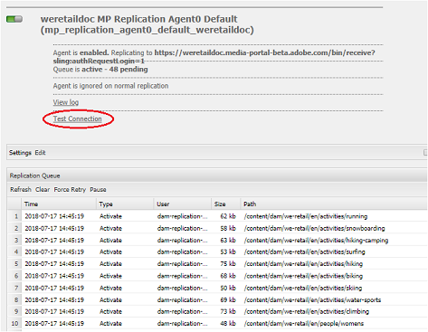

# Risolvere i problemi relativi alla pubblicazione parallela in Brand Portal {#troubleshoot-issues-in-parallel-publishing-to-brand-portal}

Brand Portal è configurato con Experience Manager Assets per disporre di risorse di marchio approvate direttamente assimilate (o pubblicate) dall’istanza di authoring di Experience Manager Assets. Una volta [configurato](../using/configure-aem-assets-with-brand-portal.md), Experience Manager Author utilizza un agente di replica per replicare le risorse selezionate nel servizio cloud Brand Portal per un utilizzo approvato dagli utenti Brand Portal. Gli agenti di replica multipli vengono utilizzati in Experience Manager 6.2 SP1-CFP5, Experience Manager CFP 6.3.0.2 e versioni successive per consentire la pubblicazione parallela ad alta velocità.

>[!NOTE]
>
>Adobe consiglia di eseguire l’aggiornamento ad Experience Manager 6.4.1.0 per garantire che Experience Manager Assets Brand Portal sia configurato correttamente con Experience Manager Assets. Una limitazione in Experience Manager 6.4 genera un errore durante la configurazione di Experience Manager Assets con Brand Portal e la replica non riesce.

Per configurare il servizio cloud per Brand Portal in **[!UICONTROL /etc/cloudservice]**, tutti gli utenti e i token necessari vengono generati automaticamente e salvati nell’archivio. Viene creata la configurazione del servizio cloud, vengono creati anche gli utenti del servizio necessari per gli agenti di replica e replica per replicare il contenuto. Crea quattro agenti di replica. Quindi, quando pubblichi numerose risorse da Experience Manager a Brand Portal, le risorse vengono messe in coda e distribuite tra gli agenti di replica tramite Round Robin.

Tuttavia, la pubblicazione può non riuscire a intermittenza a causa di: lavori sling di grandi dimensioni, aumento della rete e **[!UICONTROL I/O disco]** ad Experience Manager, istanza Author o prestazioni rallentate dell’istanza Author di Experience Manager. È quindi consigliabile verificare la connessione con gli agenti di replica prima di iniziare la pubblicazione.

## Risolvere i problemi relativi agli errori nella prima pubblicazione: convalida della configurazione di pubblicazione {#troubleshoot-failures-in-first-time-publishing-validating-your-publish-configuration}

Per convalidare le configurazioni di pubblicazione:

1. Controlla i registri degli errori
1. Verifica se l’agente di replica è stato creato
1. Prova connessione

**Log di coda durante la creazione di un Cloud Service**

Controlla i log tail. Controlla se l&#39;agente di replica viene creato o meno. Se la creazione dell’agente di replica non riesce, modifica il servizio cloud effettuando modifiche minori nel servizio cloud. Convalida e controlla nuovamente se l&#39;agente di replica è stato creato o meno. In caso contrario, modifica nuovamente il servizio.

Se si modifica ripetutamente il servizio cloud non è configurato correttamente, segnalare un ticket di assistenza clienti.

**Verifica della connessione con gli agenti di replica**

Visualizza registro, se si verificano errori nel registro di replica:

1. Contatta l’Assistenza clienti.

1. Riprova [pulizia](../using/troubleshoot-parallel-publishing.md#clean-up-existing-config) e crea nuovamente la configurazione di pubblicazione.

<!--
Comment Type: remark
Last Modified By: Mini Gulati (mgulati)
Last Modified Date: 2018-06-21T22:56:21.256-0400

?? check and compare public key. At times public key is different

?? another thing to check in /useradmin

-->

## Pulizia delle configurazioni di pubblicazione Brand Portal esistenti {#clean-up-existing-config}

Nella maggior parte dei casi in cui la pubblicazione non funziona, il motivo può essere che l’utente che la pubblica (ad esempio: `mac-<tenantid>-replication` non dispone dell&#39;ultima chiave privata, e quindi la pubblicazione non riesce con l&#39;errore &quot;401 non autorizzato&quot; e nessun altro errore viene segnalato nei log degli agenti di replica. È possibile evitare la risoluzione dei problemi e creare una configurazione. Affinché la nuova configurazione funzioni correttamente, effettua le seguenti operazioni dalla configurazione dell’autore di Experience Manager:

1. Vai a `localhost:4502/crx/de/` (considerando che esegui l&#39;istanza autore su localhost:4502:\
   i. delete `/etc/replication/agents.author/mp_replication`
ii) delete 
`/etc/cloudservices/mediaportal/<config_name>`

1. Vai a localhost:4502/useradmin:\
   i. cerca utente `mac-<tenantid>replication`
ii) elimina questo utente

Ora il sistema è completamente pulito. Ora puoi provare a creare una configurazione del servizio cloud e continuare a utilizzare l’applicazione JWT esistente. Non è necessario creare un&#39;applicazione, ma aggiornare la chiave pubblica dalla configurazione cloud appena creata.

>[!NOTE]
>
>Non modificare le impostazioni generate automaticamente.

## Problema di visibilità tenant dell’applicazione JWT per la connessione sviluppatore {#developer-connection-jwt-application-tenant-visibility-issue}

Se attivato `https://legacy-oauth.cloud.adobe.io/`, vengono elencate tutte le organizzazioni (tenant) per le quali gli utenti correnti detengono l’amministratore di sistema. Se non trovi il nome organizzazione qui o non riesci a creare un&#39;applicazione per un tenant obbligatorio qui, controlla di disporre di diritti sufficienti (amministratore di sistema).

C&#39;è un problema noto in questa interfaccia utente che per ogni tenant sono visibili solo le prime dieci applicazioni. Quando crei l&#39;applicazione, resta su quella pagina e segnalibro l&#39;URL. Non è necessario passare alla pagina di elenco dell&#39;applicazione e trovare l&#39;applicazione creata. Puoi accedere direttamente a questo URL contrassegnato con segnalibro e aggiornare/eliminare l’applicazione ogni volta che necessario.

L&#39;applicazione JWT potrebbe non essere elencata in modo appropriato. Si consiglia quindi di notare/contrassegnare l’URL durante la creazione dell’applicazione JWT.

## L&#39;esecuzione della configurazione smette di funzionare {#running-configuration-stops-working}

<!--
Comment Type: draft

If the running configuration stops working, either of the following two possibilities
<g class="gr_ gr_15 gr-alert gr_gramm gr_inline_cards gr_run_anim Grammar multiReplace" data-gr-id="15" id="15" style="font-size: 12px;">
are
</g> there:

1.
<g class="gr_ gr_14 gr-alert gr_gramm gr_inline_cards gr_run_anim Grammar only-ins doubleReplace replaceWithoutSep" data-gr-id="14" id="14">
Connection
</g> has failed, or

2. Publish has failed with permission to dam-replication-service denied, while connection has passed 

If the connection has failed [1], the
<g class="gr_ gr_10 gr-alert gr_spell gr_inline_cards gr_run_anim ContextualSpelling ins-del multiReplace" data-gr-id="10" id="10">
fail safe
</g> way to fix it is to <a href="../using/troubleshoot-parallel-publishing.md#main-pars-header-1664955658">clean up</a> the existing Brand Portal publish configuration and recreate a publish configuration. 

However, if the
<g class="gr_ gr_18 gr-alert gr_spell gr_inline_cards gr_run_anim ContextualSpelling" data-gr-id="18" id="18">
publish
</g> has failed with
<g class="gr_ gr_16 gr-alert gr_gramm gr_inline_cards gr_run_anim Grammar only-ins doubleReplace replaceWithoutSep" data-gr-id="16" id="16">
permission
</g> denied to dam-replication-service, raise a support ticket.

-->

Se un agente di replica (che pubblicava in Brand Portal semplicemente bene) smette di elaborare i processi di pubblicazione, controlla i registri di replica. Ad Experience Manager, è stato incorporato un nuovo tentativo automatico, quindi se la pubblicazione di una particolare risorsa non riesce, viene ritentata automaticamente. Se si verifica un problema intermittente come l&#39;errore di rete, potrebbe verificarsi durante un nuovo tentativo.

Se ci sono continui errori di pubblicazione e la coda è bloccata, dovresti controllare **[!UICONTROL connessione di prova]** e cercare di risolvere gli errori che vengono segnalati.

In base agli errori, ti consigliamo di registrare un ticket di assistenza, in modo che il team di progettazione Brand Portal possa aiutarti a risolvere i problemi.

## Token di configurazione Brand Portal IMS scaduto {#token-expired}

Se l’ambiente Brand Portal si interrompe improvvisamente, è possibile che le configurazioni IMS non funzionino correttamente. Il sistema mostra una configurazione IMS non valida e visualizza un messaggio di errore (simile al seguente) per cui il token di accesso è scaduto.

`com.adobe.granite.auth.oauth.AccessTokenProvider failed to get access token from authorization server status: 400 response: Unknown macro: {"error"}`

Per risolvere questo problema, è consigliabile salvare e chiudere manualmente la configurazione IMS e controllare di nuovo lo stato di integrità. Se le configurazioni non funzionano, elimina le configurazioni esistenti e creane una nuova.

## Configura gli agenti di replica per evitare l’errore di timeout della connessione {#connection-timeout}

Di solito il processo di pubblicazione non riesce con un errore di timeout se ci sono più richieste in sospeso nella coda di replica. Per risolvere questo problema, assicurati che gli agenti di replica siano configurati per evitare timeout.

Per configurare gli agenti di replica:

1. Accedi alla tua istanza di authoring di AEM Assets.
1. Da **Strumenti** pannello, passa a **[!UICONTROL Distribuzione]** > **[!UICONTROL Replica]**.
1. Nella pagina Replica, fai clic su **[!UICONTROL Agenti sull&#39;autore]**. Puoi visualizzare i quattro agenti di replica del tenant Brand Portal.
1. Fai clic sull’URL dell’agente di replica e fai clic su **[!UICONTROL Modifica]**.
1. In Impostazioni agente , fai clic sul pulsante **[!UICONTROL Esteso]** scheda .
1. Seleziona la **[!UICONTROL Chiudi connessione]** casella di controllo.
1. Ripetere i passaggi da 4 a 7 per configurare tutti e quattro gli agenti di replica.
1. Riavvia il server.
