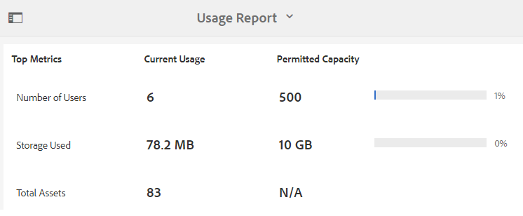
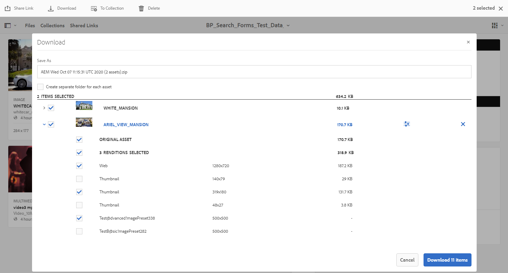
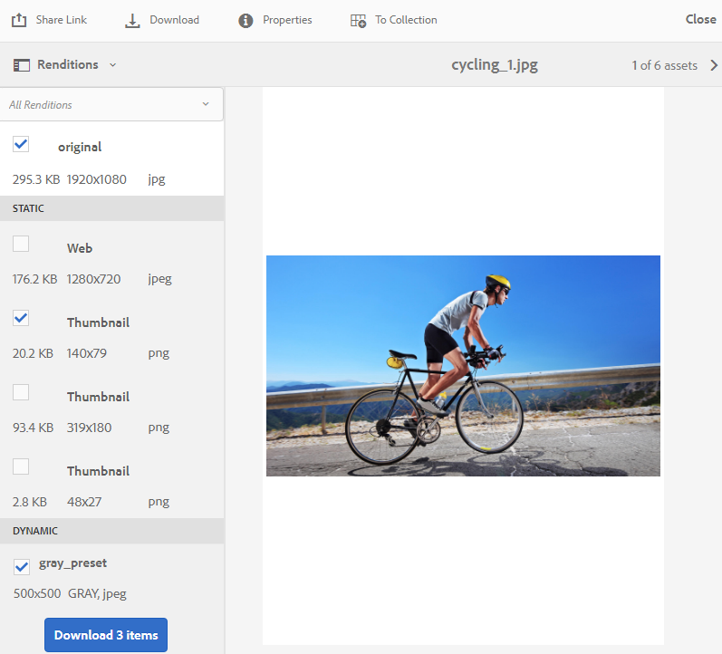

# Novità di AEM Assets Brand Portal {#what-s-new-in-aem-assets-brand-portal}

Adobe Experience Manager (AEM) Assets Brand Portal consente di acquisire, controllare e distribuire in modo sicuro le risorse creative approvate a soggetti esterni e utenti aziendali interni su diversi dispositivi. Consente di migliorare l’efficienza della condivisione delle risorse, di accelerare il time-to-market delle risorse e di ridurre il rischio di non conformità e di accesso non autorizzato. Adobe sta lavorando per migliorare l’esperienza complessiva di Brand Portal. Ecco un&#39;occhiata alle nuove funzioni e ai miglioramenti.

## Cosa è cambiato in 2021.02.0 {#what-changed-in-feb-2021}

Brand Portal 2021.02.0 è una versione ottimizzata che introduce il flusso di lavoro di automazione di Brand Portal su AEM Assets as a Cloud Service, facilita la funzione Asset Sourcing in AEM Assets as a Cloud Service, migliora l’esperienza di download delle risorse e include correzioni critiche. Consente inoltre agli amministratori di configurare il comportamento di download predefinito di cartelle, raccolte e download in massa di risorse a livello di tenant. Anche il Brand Portal **[!UICONTROL Rapporto utilizzo]** è stato modificato per riflettere gli utenti attivi di Brand Portal. Consulta le ultime [Note sulla versione di Brand Portal](brand-portal-release-notes.md).

### Automazione di Brand Portal su AEM Assets as a Cloud Service {#bp-automation-on-cloud-service}

AEM Assets as a Cloud Service viene configurato automaticamente con Brand Portal attivando Brand Portal da Cloud Manager. Un utente di Cloud Manager attiva il flusso di lavoro di attivazione che crea le configurazioni richieste nel backend e attiva Brand Portal sulla stessa organizzazione IMS di AEM Assets come istanza di Cloud Service.

In precedenza, AEM Assets as a Cloud Service era configurato manualmente con Brand Portal utilizzando Adobe Developer Console.

Consulta [attivare Brand Portal su AEM Assets come Cloud Service](https://experienceleague.adobe.com/docs/experience-manager-cloud-service/assets/brand-portal/configure-aem-assets-with-brand-portal.html?lang=en).

### Asset Sourcing in AEM Assets as a Cloud Service {#asset-sourcing-on-cloud-service}

La funzione Origine risorse è ora disponibile in AEM Assets as a Cloud Service. Per impostazione predefinita, la funzione è abilitata per tutti gli utenti del servizio cloud. Gli utenti autorizzati di Brand Portal possono contribuire all’approvvigionamento delle risorse caricando nuove risorse nelle cartelle dei contributi e pubblicando la cartella dei contributi da Brand Portal ad AEM Assets come istanza di Cloud Service. Gli amministratori possono rivedere e approvare il contributo degli utenti di Brand Portal per distribuirli ulteriormente ad altri utenti di Brand Portal.

In precedenza, Asset Sourcing era disponibile solo su AEM Assets (on-premise e servizio gestito).

Consulta [Asset Sourcing in Brand Portal](https://experienceleague.adobe.com/docs/experience-manager-brand-portal/using/asset-sourcing-in-brand-portal/brand-portal-asset-sourcing.html?lang=en).

### Download risorse {#asset-download-setting}

Oltre alle **[!UICONTROL Impostazioni di download]** esistenti, gli amministratori di Brand Portal possono ora configurare l’ impostazione **[!UICONTROL Download delle risorse]** . Questa impostazione consente agli amministratori di gestire il comportamento predefinito di download di cartelle, raccolte e download in blocco di risorse (più di 20 risorse) a livello di tenant.

<!--
Earlier, all the asset renditions were directly downloaded in a zip folder in case of folder, collection, and bulk download of assets. As the **[!UICONTROL Download]** dialog is skipped for folders or collections, there was no mechanism to control the downloading behaviour of the assets. Due to this, the users were finding it difficut to search for a particular asset rendition from a folder containing huge bunch of downloaded renditions. 
-->

In precedenza, tutti i rendering delle risorse venivano scaricati direttamente in una cartella zip. La finestra di dialogo **[!UICONTROL Scarica]** è stata ignorata per le cartelle e le raccolte e non c&#39;era alcun metodo per controllare il comportamento di download delle risorse, rendendo difficile la ricerca di una particolare rappresentazione da un gran numero di download.

**[!UICONTROL L’impostazione]** Download delle risorse ora fornisce un’opzione per creare una cartella separata per ogni risorsa durante il download delle cartelle, delle raccolte o del download in massa delle risorse.

Se l’impostazione **[!UICONTROL Download risorse]** è disabilitata, le cartelle o le raccolte vengono scaricate in una cartella zip contenente tutti i rendering delle risorse nella stessa cartella, ad eccezione del download delle risorse tramite il collegamento di condivisione.

Accedi al tenant di Brand Portal come amministratore e passa a **[!UICONTROL Strumenti]** > **[!UICONTROL Scarica]**. Gli amministratori possono abilitare l’impostazione **[!UICONTROL Download delle risorse]** per creare una cartella separata per ogni risorsa durante il download di cartelle, raccolte e download in massa di risorse.

Consulta [scaricare risorse da Brand Portal](https://experienceleague.adobe.com/docs/experience-manager-brand-portal/using/download/brand-portal-download-assets.html?lang=en).
<!--
### Download using Share link {#download-using-share-link}

The default behavior of downloading the assets using share link is now independent of the **[!UICONTROL Download Settings]**. A separate folder is created for each asset while downloading the assets using share link. 
-->

### Rapporto utilizzo {#usage-report}

Il Brand Portal **[!UICONTROL Rapporto utilizzo]** è stato modificato per riflettere solo gli utenti attivi del Brand Portal. Gli utenti del brand portal che non sono assegnati ad alcun profilo di prodotto nell’Admin Console sono considerati utenti inattivi e non vengono riportati nel **[!UICONTROL Rapporto sull’utilizzo]**.

In precedenza, gli utenti attivi e inattivi venivano visualizzati nel Rapporto utilizzo .

## Modifiche apportate alla versione 2020.10.0 {#what-changed-in-oct-2020}

Brand Portal 2020.10.0 è una versione ottimizzata che si concentra sulla semplificazione dell’esperienza di download delle risorse e include correzioni critiche. Il miglioramento include un flusso di lavoro nuovo e migliorato per il download delle risorse, opzioni aggiuntive per escludere le rappresentazioni, download diretto dal pannello **[!UICONTROL Rappresentazioni]**, configurazione per consentire l’accesso e il download dei diritti per specifici gruppi di utenti e facile navigazione nei file, nelle raccolte e nei collegamenti condivisi da tutte le pagine di Brand Portal. Consulta le ultime [Note sulla versione di Brand Portal](brand-portal-release-notes.md).

### Esperienza di download semplificata {#download-dialog}

In precedenza, la finestra di dialogo **[!UICONTROL Scarica]** era visualizzata con più opzioni, ad esempio crea una cartella separata per ogni risorsa, invia una e-mail, seleziona la risorsa originale, le rappresentazioni personalizzate, le rappresentazioni dinamiche, esclude le rappresentazioni di sistema e abilita l’accelerazione del download, che era ambigua per gli utenti non tecnici o nuovi specialmente quando sono state selezionate più risorse o cartelle per il download. Inoltre, l’utente non poteva visualizzare tutte le rappresentazioni delle risorse o escludere un rendering personalizzato o dinamico specifico.

La nuova finestra di dialogo **[!UICONTROL Scarica]** generalizza il processo di selezione e filtrazione delle risorse, facilitando agli utenti di Brand Portal di prendere decisioni efficaci durante il download delle rappresentazioni delle risorse. Elenca tutte le risorse selezionate e le relative rappresentazioni a seconda della configurazione [**[!UICONTROL Download]**](brand-portal-download-assets.md) e delle impostazioni **[!UICONTROL Download]**.

>[!NOTE]
>
>Tutti gli utenti ora avranno **[!UICONTROL Download rapido]** abilitato per impostazione predefinita e richiede [IBM Aspera Connect 3.9.9](https://www.ibm.com/support/knowledgecenter/SSXMX3_3.9.9/kc/connect_welcome.html) installato nell’estensione del browser prima di scaricare le risorse da Brand Portal.

<!--
If any of the **[!UICONTROL Custom Rendition]** or **[!UICONTROL System Rendition]** is enabled in the [**[!UICONTROL Download]**](brand-portal-download-assets.md) configuration and **[!UICONTROL Download]** settings are enabled for the group users, the new **[!UICONTROL Download]** dialog appears with all the renditions of the selected assets or folders containing assets in a list view. 
-->

Dalla finestra di dialogo **[!UICONTROL Scarica]**, gli utenti possono:

* Visualizza tutti i rendering disponibili di qualsiasi risorsa nell’elenco dei download.
* Escludi le rappresentazioni delle risorse non necessarie per il download.
* Applica con un solo clic lo stesso set di rappresentazioni a tutti i tipi di risorse simili.
* Applicare diversi set di rappresentazioni per diversi tipi di risorse.
* Crea una cartella separata per ogni risorsa.
* Scarica le risorse selezionate e le relative rappresentazioni.

Il flusso di lavoro di download rimane costante per le risorse autonome, per più risorse, per le cartelle contenenti risorse, per le risorse con licenza o senza licenza e per il download delle risorse tramite il collegamento di condivisione. Consulta [passaggi per scaricare risorse da Brand Portal](https://docs.adobe.com/content/help/en/experience-manager-brand-portal/using/download/brand-portal-download-assets.html#download-assets).

### Navigazione rapida {#quick-navigation}

In precedenza, l&#39;opzione per visualizzare **[!UICONTROL File]**, **[!UICONTROL Raccolte]** e **[!UICONTROL Collegamenti condivisi]** era nascosta e richiedeva più clic ogni volta che l&#39;utente voleva passare a un&#39;altra visualizzazione.

In Brand Portal 2020.10.0, gli utenti possono passare a **[!UICONTROL File]**, **[!UICONTROL Raccolte]** e **[!UICONTROL Collegamenti condivisi]** da tutte le pagine di Brand Portal con un solo clic utilizzando i collegamenti di navigazione rapida.

### Pannello di rendering migliorato {#rendition-panel}

In precedenza, gli utenti potevano visualizzare la risorsa originale e le relative rappresentazioni solo nel pannello **[!UICONTROL Rappresentazioni]** se nella configurazione **[!UICONTROL Download]** era abilitato uno qualsiasi dei **[!UICONTROL Rendering personalizzato]** o **[!UICONTROL Rendering di sistema]** . Inoltre, gli utenti dovevano scaricare tutte le rappresentazioni delle risorse in quanto non vi era alcun filtro per escludere rappresentazioni personalizzate o dinamiche specifiche che non erano necessarie.

<!--
Earlier, if any of the custom or system renditions was enabled in the **[!UICONTROL Download]** settings, an additional **[!UICONTROL Download]** dialog appeared on clicking the **[!UICONTROL Download]** button wherein the user had to manually select the set of renditions (original asset, custom renditions, dynamic renditions) to download.
There was no filter to exclude specific custom or dynamic renditions which were not required for download.
-->

In Brand Portal 2020.10.0, gli utenti possono escludere rappresentazioni specifiche e scaricare direttamente [le rappresentazioni selezionate dal pannello Rendering](brand-portal-download-assets.md#download-assets-from-asset-details-page) nella pagina dei dettagli delle risorse senza dover aprire la finestra di dialogo **[!UICONTROL Scarica]** .

<!-- 
In Brand Portal 2020.10.0, direct download and exclude renditions features are introduced in the **[!UICONTROL Renditions]** panel on the asset details page. All the renditions (original asset, custom renditions, dynamic renditions) under the rendition panel are now associated with a check box and are enabled by default. 

The user can clear the check boxes to exclude the renditions which are not required for download. And can click on the **[!UICONTROL Download]** button in the **[!UICONTROL Renditions]** panel to directly download the selected set of renditions in a zip folder without having to open the **[!UICONTROL Download]** dialog.
-->

### Configura le impostazioni di download {#download-permissions}

Oltre alle configurazioni esistenti **[!UICONTROL Download]**, gli amministratori di Brand Portal possono anche configurare le impostazioni per diversi gruppi di utenti per visualizzare e (o) scaricare la risorsa originale e le relative rappresentazioni dalla pagina dei dettagli della risorsa.

Accedi al tenant di Brand Portal come amministratore e passa a **[!UICONTROL Strumenti]** > **[!UICONTROL Utenti]**.

Nella pagina **[!UICONTROL Ruoli utente]** , passa alla scheda **[!UICONTROL Gruppi]** per configurare le impostazioni di visualizzazione e/o di download per i gruppi di utenti.

In precedenza, le impostazioni erano disponibili solo per impedire agli utenti del gruppo di scaricare la risorsa originale.

La scheda **[!UICONTROL Gruppi]** nella pagina **[!UICONTROL Ruoli utente]** consente agli amministratori di configurare le impostazioni di visualizzazione e download:

* Se sono attivate le impostazioni **[!UICONTROL Scarica originale]** e **[!UICONTROL Scarica rappresentazioni]** , gli utenti del gruppo selezionato possono visualizzare e scaricare le risorse originali e le relative rappresentazioni.
* Se entrambe le impostazioni sono disattivate, gli utenti possono visualizzare solo le risorse originali. Le rappresentazioni delle risorse non sono visibili agli utenti nella pagina dei dettagli della risorsa.
* Se è attivata solo l’impostazione **[!UICONTROL Scarica originale]** , gli utenti possono visualizzare e scaricare solo le risorse originali dalla pagina dei dettagli della risorsa.
* Se è attivata solo l’impostazione **[!UICONTROL Scarica rappresentazioni]**, gli utenti possono visualizzare la risorsa originale ma non possono scaricarla. Tuttavia, l’utente può visualizzare e scaricare le rappresentazioni delle risorse.

Consulta [configurare il download delle risorse](https://docs.adobe.com/content/help/en/experience-manager-brand-portal/using/download/brand-portal-download-assets.html#configure-download-permissions).

>[!NOTE]
>
>Se un utente viene aggiunto a più gruppi e se uno di questi gruppi presenta restrizioni, queste verranno applicate all&#39;utente.

<!--
>Restrictions to access the original asset and their renditions do not apply to administrators even if they are members of restricted groups.
 >
 >The users can always download assets and their renditions from the repository using a `curl` request even if the download configurations are turned-off.
 >
-->

## Modifiche apportate alla versione 6.4.7 {#what-changed-in-647}

La versione 6.4.7 di Brand Portal include Document Viewer, migliora l’esperienza per il download delle risorse e include correzioni critiche. Consulta le ultime [Note sulla versione di Brand Portal](brand-portal-release-notes.md).

<!--
Brand Portal 6.4.7 release brings in the Document Viewer, leverages the Brand Portal administrators to configure asset download, and centers top customer requests. See latest [Brand Portal Release Notes](brand-portal-release-notes.md).
-->

### Visualizzatore documenti {#doc-viewer}

Il visualizzatore di documenti migliora l’esperienza di visualizzazione dei PDF. Offre un’esperienza simile a quella di Adobe Document Cloud durante la visualizzazione dei file PDF in Brand Portal.

In precedenza, erano disponibili opzioni limitate per visualizzare i file PDF.

Con Visualizzatore documenti, gli utenti di Brand Portal possono ora visualizzare le pagine, visualizzare i segnalibri, cercare testo nella pagina, ingrandire, ridurre, passare alle pagine precedenti e successive, passare alla pagina, adattarsi alla finestra, adattarsi allo schermo e nascondere o visualizzare la barra degli strumenti.

>[!NOTE]
>
>L&#39;esperienza di visualizzazione per altri formati di documento rimane invariata.

### Scarica l&#39;esperienza {#download-configurations}

Il processo di download delle risorse viene rinnovato, fornendo un’esperienza utente semplificata durante il [download delle risorse da Brand Portal](brand-portal-download-assets.md).

Il flusso di lavoro esistente per il download delle risorse da Brand Portal è inevitabilmente seguito dall’aspetto di una finestra di dialogo **[!UICONTROL Download]** con più opzioni di download tra cui scegliere.

In Brand Portal 6.4.7, gli amministratori di Brand Portal possono configurare le impostazioni **[!UICONTROL Download]** della risorsa. Le configurazioni disponibili sono:
* **[!UICONTROL Download veloce]**
* **[!UICONTROL Rappresentazioni personalizzate]**
* **[!UICONTROL Rappresentazioni di sistema]**

L’amministratore di Brand Portal può abilitare qualsiasi combinazione per configurare il download delle risorse.

<!--In Brand Portal 6.4.7, fast download, custom renditions, and system renditions are the three configurations available.-->

* Se le configurazioni **[!UICONTROL Rendering personalizzati]** e **[!UICONTROL Rendering di sistema]** sono disattivate, le rappresentazioni originali delle risorse vengono scaricate senza alcuna finestra di dialogo aggiuntiva che semplifica l’esperienza di download per gli utenti di Brand Portal.

* Se è abilitata una delle **[!UICONTROL rappresentazioni personalizzate]** o **[!UICONTROL Rendering di sistema]**, viene visualizzata la finestra di dialogo **[!UICONTROL Scarica]** e viene scaricata la risorsa originale insieme alle rappresentazioni delle risorse. L&#39;abilitazione della configurazione **[!UICONTROL Download rapido]** velocizza il processo di download.

In base alla configurazione, il flusso di lavoro di download rimane costante per le risorse autonome, per più risorse, per le cartelle contenenti risorse, risorse con licenza o senza licenza e per il download delle risorse tramite il collegamento di condivisione.

## Modifiche apportate alla versione 6.4.6 {#what-changed-in-646}

In Brand Portal 6.4.6, il canale di autorizzazione tra AEM Assets e Brand Portal viene modificato. Brand Portal è ora supportato da AEM Assets as a Cloud Service, AEM Assets 6.3 e versioni successive. In AEM Assets 6.3 e versioni successive, Brand Portal era precedentemente configurato nell’interfaccia classica tramite la versione precedente di OAuth Gateway, che utilizza lo scambio di token JWT per ottenere un token di accesso IMS per l’autorizzazione. AEM Assets è ora configurato con Brand Portal tramite Adobe Developer Console, che fornisce un token IMS per l’autorizzazione del tenant di Brand Portal.

<!-- The steps to configure integration are different depending on your AEM version, and whether you are configuring for the first-time, or upgrading the existing integration:
-->

<!--
  
   | **AEM Version** |**New Integration** |**Upgrade Integration** |
|---|---|---|
| **AEM 6.5** |[Create new integration](../using/brand-portal-configure-integration-65.md) |[Upgrade existing integration](../using/brand-portal-configure-integration-65.md#upgrade-integration-65) | 
| **AEM 6.4** |[Create new integration](../using/brand-portal-configure-integration-64.md) |[Upgrade existing integration](../using/brand-portal-configure-integration-64.md#upgrade-integration-64) | 
| **AEM 6.3** |[Create new integration](../using/brand-portal-configure-integration-63.md) |[Upgrade existing integration](../using/brand-portal-configure-integration-63.md#upgrade-integration-63) | 
| **AEM 6.2** |Contact Support |Contact Support | 

   -->

I passaggi per configurare AEM Assets con Brand Portal sono diversi a seconda della versione AEM e se si sta configurando per la prima volta o se si stanno aggiornando le configurazioni esistenti:

<!--| **AEM Version** |**New Configuration** |**Upgrade Configuration** |
|---|---|---|
| **AEM 6.5 (6.5.4.0 and above)** |[Create configuration](../using/brand-portal-configure-integration-65.md) |[Upgrade configuration](../using/brand-portal-configure-integration-65.md#upgrade-integration-65) | 
| **AEM 6.4 (6.4.8.0 and above)** |[Create configuration](../using/brand-portal-configure-integration-64.md) |[Upgrade configuration](../using/brand-portal-configure-integration-64.md#upgrade-integration-64) | 
| **AEM 6.3 (6.3.3.8 and above)** |[Create configuration](../using/brand-portal-configure-integration-63.md) |[Upgrade configuration](../using/brand-portal-configure-integration-63.md#upgrade-integration-63) | 
| **AEM 6.2** |Contact Support |Contact Support | 
-->

<!-- AEM Assets configuration with Brand Portal on Adobe I/O is supported on:
* AEM 6.5.4.0 and above
* AEM 6.4.8.0 and above
* AEM 6.3.3.8 and above -->

| **Versione di AEM** | **Nuova configurazione** | **Configurazione dell&#39;aggiornamento** |
|---|---|---|
| **AEM Assets as a Cloud Service** | [Creare la configurazione](https://docs.adobe.com/content/help/it-IT/experience-manager-cloud-service/assets/brand-portal/configure-aem-assets-with-brand-portal.html) | - |
| **AEM 6.5 (6.5.4.0 e versioni successive)** | [Creare la configurazione](https://docs.adobe.com/content/help/it-IT/experience-manager-65/assets/brandportal/configure-aem-assets-with-brand-portal.html) | [Configurazione dell&#39;aggiornamento](https://docs.adobe.com/content/help/it-IT/experience-manager-65/assets/brandportal/configure-aem-assets-with-brand-portal.html#upgrade-integration-65) |
| **AEM 6.4 (6.4.8.0 e versioni successive)** | [Creare la configurazione](https://docs.adobe.com/content/help/it/experience-manager-64/assets/brandportal/configure-aem-assets-with-brand-portal.html) | [Configurazione dell&#39;aggiornamento](https://docs.adobe.com/content/help/it-IT/experience-manager-64/assets/brandportal/configure-aem-assets-with-brand-portal.html#upgrade-integration-64) |
| **AEM 6.3 (6.3.3.8 e versioni successive)** | [Creare la configurazione](https://helpx.adobe.com/it/experience-manager/6-3/assets/using/brand-portal-configuring-integration.html) | [Configurazione dell&#39;aggiornamento](https://helpx.adobe.com/it/experience-manager/6-3/assets/using/brand-portal-configuring-integration.html#Upgradeconfiguration) |
| **AEM 6.2** | Contatta il supporto | Contatta il supporto |

>[!NOTE]
>
>Si consiglia di aggiornare l&#39;istanza AEM all&#39;ultimo service pack.

Consulta le ultime [Note sulla versione di Brand Portal](brand-portal-release-notes.md).

Consulta [Domande frequenti su Brand Portal](brand-portal-faqs.md).

## Modifiche apportate alla versione 6.4.5 {#what-changed-in-645}

Brand Portal 6.4.5 è una feature release che si propone di fornire agli utenti di Brand Portal (agenzie/team esterni) la possibilità di caricare contenuti in Brand Portal e pubblicarli in AEM Assets, senza necessità di accedere all’ambiente di authoring. Questa funzione si chiama **[Origine risorse in Brand Portal](brand-portal-asset-sourcing.md)** e migliorerà le esperienze dei clienti grazie a un meccanismo bidirezionale che consente agli utenti di contribuire e condividere risorse con altri utenti di Brand Portal distribuiti a livello globale.

### Asset Sourcing in Brand Portal {#asset-sourcing-in-bp}

Asset Sourcing consente agli utenti AEM (amministratori/utenti non amministratori) di creare nuove cartelle con una proprietà **Contributo risorse** aggiuntiva, garantendo che la nuova cartella creata sia aperta all’invio delle risorse da parte degli utenti di Brand Portal. Questo attiva automaticamente un flusso di lavoro che crea due sottocartelle aggiuntive, denominate NEW e SHARED, all’interno della cartella **Contribution** appena creata.

L’utente AEM definisce quindi il requisito caricando una breve descrizione dei tipi di risorse da aggiungere alla cartella dei contributi, nonché caricando le risorse della linea di base, nella cartella **SHARED** per garantire che gli utenti BP dispongano delle informazioni di riferimento necessarie. L’amministratore può quindi concedere agli utenti attivi di Brand Portal l’accesso alla cartella dei contributi prima di pubblicare su Brand Portal la cartella **Contribution** appena creata.

Al termine dell’aggiunta del contenuto nella cartella **NEW** , l’utente può pubblicare nuovamente la cartella Contributo nell’ambiente di authoring AEM. Tieni presente che potrebbero essere necessari alcuni minuti per completare l’importazione e riflettere il contenuto appena pubblicato in AEM Assets.

Inoltre, tutte le funzionalità esistenti rimangono invariate. Gli utenti di Brand Portal possono visualizzare, cercare e scaricare risorse dalla cartella dei contributi e dalle altre cartelle consentite. Inoltre, gli amministratori possono condividere ulteriormente la cartella dei contributi, modificare le proprietà e aggiungere risorse alle raccolte.

>[!NOTE]
>
>Asset Sourcing in Brand Portal è supportato in AEM 6.5.2.0 e versioni successive.
>
>La funzione non è supportata nelle versioni precedenti - AEM 6.3 e AEM 6.4.

### Caricare risorse nella cartella dei contributi {#upload-assets-in-bp}

Gli utenti di Brand Portal con le autorizzazioni appropriate possono scaricare i requisiti delle risorse per comprendere la necessità di contribuire e caricare più risorse o cartelle contenenti più risorse nella cartella dei contributi. Tuttavia, gli utenti di Brand Portal possono caricare solo le risorse nella sottocartella **NEW** . La cartella **SHARED** è destinata alla distribuzione di requisiti e risorse della linea di base.

### Pubblicare la cartella dei contributi in AEM Assets {#publish-assets-to-aem}

Una volta completato il caricamento nella cartella **NEW** , gli utenti di Brand Portal possono quindi pubblicare nuovamente la cartella dei contributi in AEM. Potrebbero essere necessari alcuni minuti per importare e riflettere il contenuto/le risorse pubblicate in AEM Assets. Consulta [Pubblicare la cartella dei contributi in AEM Assets](brand-portal-publish-contribution-folder-to-aem-assets.md)

## Modifiche apportate alla versione 6.4.4 {#what-changed-in-644}

Brand Portal 6.4.4 è caratterizzato da miglioramenti apportati alla ricerca di testo e in risposta alle richieste principali dei clienti. Consulta le ultime [Note sulla versione di Brand Portal](brand-portal-release-notes.md).

### Miglioramenti alla ricerca

Brand Portal 6.4.4 in avanti supporta la ricerca parziale di testo sul predicato delle proprietà nel riquadro di filtraggio. Per consentire la ricerca parziale del testo è necessario abilitare **Ricerca parziale** nel predicato Proprietà nel modulo di ricerca.

Continua a leggere per ulteriori informazioni sulla ricerca parziale del testo e sui caratteri jolly.

#### Ricerca di frasi parziali {#partial-phrase-search}

È ora possibile cercare le risorse specificando solo una parte, ovvero una parola o due, della frase cercata nel riquadro di filtro.

**Utilizzare la ricerca di frasi**
casePartial è utile quando non si è sicuri della combinazione esatta di parole che si verificano nella frase cercata.

Ad esempio, se il modulo di ricerca in Brand Portal utilizza il predicato Proprietà per la ricerca parziale sul titolo delle risorse, specificando il termine **camp** verranno restituite tutte le risorse con il campo parola nella frase titolo.

#### Ricerca con caratteri jolly {#wildcard-search}

Brand Portal consente di utilizzare l’asterisco (*) nella query di ricerca insieme a una parte della parola nella frase cercata.

**Utilizza**
casoSe non sei sicuro delle parole esatte che si verificano nella frase cercata, puoi utilizzare una ricerca con caratteri jolly per riempire le lacune nella query di ricerca.

Ad esempio, specificando **climb*** tutte le risorse che hanno parole che iniziano con i caratteri **climb** nella frase del titolo se il modulo di ricerca in Brand Portal utilizza il predicato Proprietà per la ricerca parziale nel titolo delle risorse.

Analogamente, specificando:

* ***** climbrestituisce tutte le risorse con parole che terminano con caratteri che  **** salgono la frase del titolo.

* ***climb*** restituisce tutte le risorse con parole che comprendono i caratteri che  **** salgono la frase del titolo.

>[!NOTE]
>
>Selezionando la casella di controllo **Ricerca parziale**, per impostazione predefinita viene selezionato **Ignora maiuscole/minuscole**.

## Modifiche apportate alla versione 6.4.3 {#what-changed-in}

Brand Portal 6.4.3 è incentrato su: fornisce alle organizzazioni un alias alternativo oltre al relativo ID tenant nell’URL di accesso a Brand Portal, nuova configurazione della gerarchia delle cartelle, miglioramenti al supporto video, pubblicazione pianificata dall’istanza di AEM Author a Brand Portal, miglioramenti operativi e soddisfa le richieste dei clienti.

### Navigazione nella gerarchia delle cartelle per non amministratori

Gli amministratori possono ora configurare il modo in cui le cartelle vengono visualizzate agli utenti non amministratori (editor, visualizzatori e utenti ospiti) al momento dell’accesso. [Abilita configurazione ](../using/brand-portal-general-configuration.md) gerarchia cartelle viene aggiunto in Impostazioni  **generali**, nel pannello strumenti di amministrazione. Se la configurazione è:

* **abilitato**, la struttura delle cartelle che inizia dalla cartella principale è visibile agli utenti non amministratori. Pertanto, concedendo loro un’esperienza di navigazione simile agli amministratori.
* **disabilitata**, nella pagina di destinazione vengono visualizzate solo le cartelle condivise.

La funzionalità [Abilita gerarchia cartelle](../using/brand-portal-general-configuration.md) (se abilitata) consente di distinguere le cartelle con gli stessi nomi condivisi da gerarchie diverse. Al momento dell&#39;accesso, gli utenti non amministratori ora visualizzano le cartelle padre (e predecessori) virtuali delle cartelle condivise.

Le cartelle condivise sono organizzate all&#39;interno delle rispettive directory in cartelle virtuali. È possibile riconoscere queste cartelle virtuali con un&#39;icona di blocco.

La miniatura predefinita delle cartelle virtuali è l&#39;immagine in miniatura della prima cartella condivisa.

### Cerca in una gerarchia o un percorso di cartelle specifici

**Il predicato** di percorso è introdotto in Modulo di ricerca per consentire la ricerca di risorse in una directory specifica. Il percorso di ricerca predefinito del predicato di ricerca per il browser del percorso è `/content/dam/mac/<tenant-id>/`, che può essere configurato modificando il modulo di ricerca predefinito.

* Gli utenti amministratori possono utilizzare il browser del percorso per accedere a qualsiasi directory di cartelle su Brand Portal.
* Gli utenti non amministratori possono utilizzare il browser percorsi per navigare solo alle cartelle (e tornare alle cartelle principali) condivise con loro.

   Ad esempio, `/content/dam/mac/<tenant-id>/folderA/folderB/folderC` viene condiviso con un utente non amministratore. L&#39;utente può cercare risorse all&#39;interno della cartella C utilizzando il browser Percorsi. Questo utente può anche passare a folderB e folderA (poiché sono predecessori della cartellaC condivisa con l&#39;utente).

È ora possibile limitare la ricerca delle risorse all’interno di una cartella specifica a cui è stato effettuato il passaggio, anziché iniziare dalla cartella principale.

Tieni presente che la ricerca in queste cartelle restituisce solo i risultati delle risorse condivise con l’utente.

### Supporto delle rappresentazioni video Dynamic Media

Gli utenti la cui istanza AEM Author è in modalità ibrida di Dynamic Media possono visualizzare in anteprima e scaricare le rappresentazioni degli elementi multimediali dinamici, oltre ai file video originali.

Per consentire l’anteprima e il download dei rendering di contenuti multimediali dinamici su account tenant specifici, gli amministratori devono specificare **Configurazione Dynamic Media** (URL del servizio video (URL DM-Gateway) e ID di registrazione per recuperare il video dinamico) nella configurazione **Video** dal pannello strumenti di amministrazione.

I video Dynamic Media possono essere visualizzati in anteprima su:

* Pagina dei dettagli della risorsa
* Vista a schede della risorsa
* Pagina di anteprima della condivisione dei collegamenti

Le codifiche video Dynamic Media possono essere scaricate da:

* Brand Portal
* Collegamento condiviso

### Pubblicazione pianificata su Brand Portal

Il flusso di lavoro di pubblicazione delle risorse (e delle cartelle) da [AEM (6.4.2.0)](https://helpx.adobe.com/experience-manager/6-4/release-notes/sp-release-notes.html#main-pars_header_9658011) Author instance a Brand Portal può essere pianificato per una data e un’ora successive.

Analogamente, le risorse pubblicate possono essere rimosse dal portale in una data (ora) successiva, pianificando il flusso di lavoro Annulla pubblicazione su Brand Portal.

### Alias tenant configurabile nell&#39;URL

Le organizzazioni possono personalizzare l’URL del portale utilizzando un prefisso alternativo nell’URL. Per ottenere un alias per il nome del tenant nell’URL del portale esistente, le organizzazioni devono contattare il supporto Adobe.

Tieni presente che solo il prefisso dell’URL di Brand Portal può essere personalizzato e non l’intero URL.\
Ad esempio, un&#39;organizzazione con un dominio esistente **geomettrix.brand-portal.adobe.com** può ottenere **geomettrixinc.brand-portal.adobe.com** creato su richiesta.

Tuttavia, l’istanza di authoring AEM può essere [configurata](https://helpx.adobe.com/it/experience-manager/6-5/assets/using/brand-portal-configuring-integration.html) solo con l’URL dell’ID tenant e non con l’URL dell’alias del tenant (alternativo).

Le organizzazioni possono soddisfare le proprie esigenze di branding personalizzando l’URL del portale, anziché attenersi all’URL fornito dall’Adobe.

### Miglioramenti all’esperienza di download

La versione offre un’esperienza di download semplificata con un numero ridotto di clic e avvisi, in:

* Si sceglie di scaricare solo i rendering (e non le risorse originali).
* Download delle risorse quando l&#39;accesso ai rendering originali è limitato.

## Modifiche apportate alla versione 6.4.2 {#what-changed-in-1}

Brand Portal 6.4.2 introduce una serie di funzionalità per soddisfare le esigenze di distribuzione delle risorse delle organizzazioni e aiutarle a raggiungere un gran numero di utenti distribuiti a livello globale tramite l’accesso degli ospiti e l’esperienza ottimale con download accelerati. Brand Portal offre inoltre un maggiore controllo alle organizzazioni tramite nuove configurazioni per gli amministratori, nuovi report aggiunti e risponde alle richieste dei clienti.

### Accesso come ospite

AEM Brand Portal consente l’accesso al portale agli utenti ospiti. Un utente guest non richiede le credenziali per accedere al portale e può accedere e scaricare tutte le cartelle e le raccolte pubbliche. Gli utenti ospiti possono aggiungere risorse alla loro Lightbox (raccolta privata) e scaricare lo stesso. Possono anche visualizzare i predicati di ricerca e ricerca per tag avanzati impostati dagli amministratori. La sessione guest non consente agli utenti di creare raccolte e ricerche salvate o condividerle ulteriormente, di accedere alle impostazioni delle cartelle e delle raccolte e di condividere le risorse come collegamenti.

In un&#39;organizzazione sono consentite più sessioni guest simultanee, che è limitato al 10% della quota utente totale per organizzazione.

Una sessione guest rimane attiva per due ore. Pertanto, lo stato della Lightbox viene mantenuto fino a due ore dall&#39;inizio della sessione. Dopo due ore, la sessione guest deve essere riavviata, in modo che lo stato della Lightbox venga perso.

### Download accelerati

Gli utenti di Brand Portal possono sfruttare i download veloci basati su IBM Aspera Connect per ottenere velocità fino a 25 volte più veloci e godere di un&#39;esperienza di download senza soluzione di continuità indipendentemente dalla loro posizione in tutto il mondo. Per scaricare più rapidamente le risorse da Brand Portal o dal collegamento condiviso, gli utenti devono selezionare l’opzione **Abilita accelerazione download** nella finestra di dialogo di download, purché l’accelerazione di download sia abilitata nell’organizzazione.

Per abilitare il download accelerato basato su IBM Aspera per l&#39;organizzazione, l&#39;opzione **Abilita accelerazione download** (disabilitata per impostazione predefinita) da [Impostazioni generali](brand-portal-general-configuration.md#allow-download-acceleration) nel pannello strumenti amministrativi. Per ulteriori informazioni sui prerequisiti e sui passaggi per la risoluzione dei problemi relativi al download più rapido dei file di risorse da Brand Portal e dai collegamenti condivisi, consulta la [Guida per accelerare i download da Brand Portal](../using/accelerated-download.md#main-pars-header).

### Rapporto sugli accessi utente

È stato introdotto un nuovo rapporto per tenere traccia degli accessi utente. Il rapporto **User Logins** può essere utile per consentire alle organizzazioni di eseguire il controllo e mantenere un controllo sugli amministratori delegati e sugli altri utenti di Brand Portal.

I registri dei rapporti mostrano nomi, ID e-mail, utenti tipo (amministratore, visualizzatore, editor, ospite), gruppi, ultimo accesso, stato dell’attività e conteggio di accesso di ogni utente dalla distribuzione di Brand Portal 6.4.2 fino al momento della generazione del rapporto. Gli amministratori possono esportare il rapporto come .csv. Insieme ad altri rapporti, il rapporto Registri utente consente alle organizzazioni di monitorare più da vicino le interazioni degli utenti con le risorse del marchio approvate, garantendo in tal modo la conformità agli uffici di conformità aziendali.

### Accesso alle rappresentazioni originali

Gli amministratori possono limitare l&#39;accesso dell&#39;utente ai file di immagine originali (.jpeg, .tiff, .png, .bmp, .gif, .pjpeg, x-portatile-anymap, x-portatile-bitmap, x-portatile-griaymap, x-portatile-pixmap, x-rgb, x-xpixmap, x-icon, image/photoshop, image/x-photoshop, .pspsx d, image/vnd.adobe.photoshop) e consente di accedere a rappresentazioni a bassa risoluzione scaricate da Brand Portal o da collegamenti condivisi. Questo accesso può essere controllato a livello di gruppo di utenti dalla scheda Gruppi della pagina Ruoli utente nel pannello Strumenti di amministrazione.

* Per impostazione predefinita, tutti gli utenti possono scaricare rappresentazioni originali, in quanto l’accesso all’originale è abilitato per tutti.
* Per impedire a un gruppo di utenti di accedere ai rendering originali, gli amministratori devono deselezionare le rispettive caselle di controllo.
* Se un utente è membro di più gruppi, ma solo uno di essi dispone di restrizioni, tali restrizioni si applicano a tale utente.
* Le restrizioni non si applicano agli amministratori, anche se sono membri di gruppi ristretti.
* Le autorizzazioni dell’utente che condivide le risorse come collegamento si applicano agli utenti che scaricano le risorse utilizzando i collegamenti condivisi.

### Percorso gerarchia cartelle nelle viste a schede e a elenco

Le schede delle cartelle nella Vista a schede ora mostrano informazioni sulla gerarchia delle cartelle agli utenti non amministratori (Editor, Visualizzatore e Utente ospite). Questa funzionalità consente agli utenti di conoscere la posizione delle cartelle a cui accedono rispetto alla gerarchia padre.

Le informazioni sulla gerarchia delle cartelle sono particolarmente utili per differenziare le cartelle con nomi simili ad altre cartelle condivise da una gerarchia di cartelle diversa. Se gli utenti non amministratori non sono a conoscenza della struttura di cartelle delle risorse condivise con loro, le risorse/cartelle con nomi simili sembrano confuse.

* I percorsi mostrati sulle rispettive schede vengono troncati per adattarsi alle dimensioni delle schede. Tuttavia, gli utenti possono vedere il percorso completo come una descrizione comandi quando si passa il mouse sul percorso troncato.

Vista a elenco mostra la cartella Percorso delle risorse in una colonna per tutti gli utenti di Brand Portal.

### Opzione Panoramica per visualizzare le proprietà della risorsa

Brand Portal fornisce un’opzione Panoramica agli utenti non amministratori (editor, visualizzatori, utenti ospiti) per visualizzare le proprietà delle risorse o delle cartelle selezionate. L’opzione Panoramica è visibile:

1. Nella barra degli strumenti in alto, seleziona una risorsa o una cartella.
2. Nell’elenco a discesa selezionando il selettore della barra.

Quando selezioni l’opzione Panoramica mentre selezioni una risorsa o una cartella, gli utenti possono vedere il titolo, il percorso e l’ora della creazione della risorsa. Nella pagina dei dettagli della risorsa, invece, l’opzione Panoramica consente agli utenti di visualizzare i metadati della risorsa.

## Nuove configurazioni

Sono state aggiunte sei nuove configurazioni per consentire agli amministratori di abilitare/disabilitare le seguenti funzionalità per tenant specifici:

* Consenti accesso come ospite
* Consenti agli utenti di richiedere l’accesso a Brand Portal
* Consenti agli amministratori di eliminare le risorse da Brand Portal
* Consentire la creazione di collezioni pubbliche
* Consenti creazione di raccolte avanzate pubbliche
* Consenti accelerazione download

Le configurazioni di cui sopra sono disponibili nelle impostazioni Accesso e Generale nel pannello Strumenti amministrativi.

### Interfaccia utente di Adobe I/O per configurare le integrazioni oAuth

Brand Portal 6.4.2 e versioni successive utilizza l’interfaccia Adobe.io [https://legacy-oauth.cloud.adobe.io/](https://legacy-oauth.cloud.adobe.io/) per creare un’applicazione JWT, che consente di configurare integrazioni oAuth per consentire l’integrazione di AEM Assets con Brand Portal. In precedenza, l’interfaccia utente per la configurazione delle integrazioni OAuth era ospitata in `https://marketing.adobe.com/developer/`. Per ulteriori informazioni sull’integrazione di AEM Assets con Brand Portal per la pubblicazione di risorse e raccolte su Brand Portal, consulta [Configurare l’integrazione di AEM Assets con Brand Portal](https://docs.adobe.com/content/help/en/experience-manager-64/assets/brandportal/configure-aem-assets-with-brand-portal.html).

## Miglioramenti alla ricerca

Gli amministratori possono fare in modo che la proprietà faccia distinzione tra maiuscole e minuscole utilizzando il predicato di proprietà aggiornato, che dispone di un controllo per Ignora maiuscole e minuscole. Questa opzione è disponibile per il predicato proprietà e il predicato proprietà multivalore.\
Tuttavia, la ricerca con distinzione tra maiuscole e minuscole è relativamente più lenta della ricerca predefinita per il predicato delle proprietà. Se nel filtro di ricerca sono presenti troppi predicati senza distinzione tra maiuscole e minuscole, la ricerca può rallentare. Si consiglia pertanto di utilizzare in modo giudizioso la ricerca non sensibile alle cause.

## Modifiche apportate alla versione 6.4.1 {#what-changed-in-2}

Brand Portal 6.4.1 è una versione di aggiornamento della piattaforma che introduce diverse nuove funzioni e miglioramenti fondamentali, come navigazione, ricerca e prestazioni, per fornire esperienze cliente soddisfacenti.

### Miglioramenti della navigazione

* Nuova barra Struttura contenuto per navigare rapidamente in una gerarchia di risorse.

* Sono state introdotte nuove scelte rapide da tastiera, ad esempio _(p)_ per la navigazione alla pagina delle proprietà, _(e)_ per Edit e _(ctrl+c)_ per le operazioni di copia.
* È stata migliorata l’esperienza di scorrimento e caricamento lento nella vista a schede e a elenco per la navigazione in un gran numero di risorse.
* Vista a schede migliorata con supporto per schede di diverse dimensioni in base alle impostazioni di visualizzazione.

* Nella vista a schede ora viene visualizzata l’indicazione di data/ora al passaggio del mouse sopra l’etichetta della data.

* Vista a colonne migliorata con **Maggiori dettagli** nello snapshot della risorsa, che consente di passare alla pagina dei dettagli di una risorsa.

* La vista a elenco ora visualizza i nomi dei file delle risorse nella prima colonna per impostazione predefinita, oltre alle informazioni relative a impostazioni internazionali, tipo di risorsa, dimensioni, dimensione, valutazione e pubblicazione. Per configurare la quantità di dettagli da visualizzare nella vista Elenco, è possibile utilizzare la nuova funzione **Visualizza impostazioni**.

* È stata migliorata l’esperienza di dettaglio delle risorse, con la possibilità di navigare avanti e indietro tra le risorse utilizzando nuovi pulsanti di navigazione e di visualizzare il conteggio delle risorse.

* Nuova funzionalità per visualizzare in anteprima i file audio caricati da AEM nella pagina dei dettagli della risorsa.
* Nuova funzionalità Risorse correlate fornita nelle proprietà delle risorse. Le risorse correlate con altre risorse di origine/derivata su AEM e pubblicate su Brand Portal ora hanno la loro relazione intatta in Brand Portal, con i collegamenti alle relative risorse nella pagina delle proprietà.
* È stata introdotta una nuova configurazione per impedire agli utenti non amministratori di creare raccolte pubbliche. Le organizzazioni possono lavorare con il team di supporto Adobe per configurare questa funzionalità su account specifici.

### Miglioramenti alla ricerca

* È stata introdotta la possibilità di tornare alla stessa posizione nei risultati della ricerca, dopo aver navigato su un elemento di ricerca, senza eseguire nuovamente la query di ricerca.
* Nuovo conteggio dei risultati di ricerca per visualizzare il numero di risultati di ricerca forniti.
* È stato migliorato il filtro di ricerca per i tipi di file con la possibilità di filtrare i risultati di ricerca in base a tipi MIME a grana fine, come .jpg, .png e .psd, rispetto alle precedenti opzioni Immagini, Documenti e Multimedia.
* Filtri di ricerca ottimizzati per le raccolte, con marche temporali precise invece della funzionalità precedente del cursore temporale.
* Sono stati introdotti nuovi filtri di tipo Accesso per cercare le raccolte pubbliche o non pubbliche.

### Ottimizzazioni del download

* Un singolo file di grandi dimensioni viene scaricato direttamente, senza la creazione di file zip, migliorando così la velocità e il throughput.
* Il limite di download ZIP per la funzionalità di condivisione dei collegamenti è aumentato a 5 GB, da 1 GB.

* Gli utenti possono ora scegliere di scaricare solo i file personalizzati e originali ed evitare rappresentazioni predefinite durante il download delle risorse da Brand Portal o tramite la funzione di collegamenti condivisi.

### Miglioramenti delle prestazioni

* Miglioramento fino al 100% della velocità di download delle risorse.
* Miglioramento fino al 40% della risposta alla ricerca delle risorse.
* Miglioramento delle prestazioni di navigazione fino al 40%.

**Nota**: I miglioramenti citati sono conformi ai test condotti in laboratorio.

### Funzionalità di reporting migliorate

**È stato introdotto il**
rapporto Condivisione collegamentiÈ stato introdotto un nuovo rapporto per fornire informazioni sui collegamenti condivisi. Il rapporto Condivisione collegamenti elenca tutti gli URL, alle risorse, condivisi con utenti interni ed esterni dell’organizzazione nell’intervallo di tempo specificato. Indica inoltre quando il collegamento è stato condiviso, da chi e quando scade.

**È stato modificato il punto di ingresso per accedere al rapporto Utilizzo**
reportIl rapporto Utilizzo è ora consolidato con altri rapporti e può essere visualizzato dalla console Rapporti risorse . Per raggiungere la console Rapporti su risorse , passa a **Crea/Gestisci rapporti** dal pannello strumenti amministrativi.

**L’esperienza utente migliorata con l’interfaccia**
reporting su Brand Portal è diventata più intuitiva e offre un maggiore controllo alle organizzazioni. Oltre a creare vari rapporti, gli amministratori possono ora rivisitare i rapporti generati e scaricarli o eliminarli, in quanto questi vengono salvati in Brand Portal.

È possibile personalizzare ciascuno dei rapporti creati aggiungendo o rimuovendo colonne predefinite. Inoltre, è possibile aggiungere colonne personalizzate ai rapporti Download, Scadenza e Pubblicazione per controllarne il grado di granularità.

### Strumenti di amministrazione migliorati

È stato migliorato il selettore delle proprietà negli strumenti di amministrazione per metadati, ricerche e rapporti con funzionalità di tipo precedente e navigazione per semplificare l’esperienza di amministrazione.

### Altri miglioramenti

* Le risorse pubblicate su Brand Portal da AEM 6.3.2.1 e 6.4 possono ora essere rese disponibili al pubblico per gli utenti generali di Brand Portal, contrassegnando la casella di controllo Pubblica cartella pubblica nella finestra di dialogo Replica di AEM Assets Brand Portal.

* Gli amministratori ricevono notifiche tramite e-mail di richiesta di accesso, oltre alle notifiche nell’area di notifica di Brand Portal, se qualcuno ha richiesto l’accesso a Brand Portal.

## Modifiche apportate alla versione 6.3.2 {#what-changed-in-3}

Brand Portal 6.3.2 include funzionalità nuove e migliorate orientate alle richieste più frequenti dei clienti e miglioramenti delle prestazioni generali.

### Richiedere l’accesso a Brand Portal {#request-access-to-brand-portal}

Gli utenti possono ora richiedere l’accesso a Brand Portal utilizzando la nuova funzionalità **need access** disponibile nella schermata di accesso di Brand Portal.

A seconda che gli utenti abbiano un Adobe ID o debbano creare un Adobe ID, possono seguire il flusso di lavoro appropriato per inviare una richiesta. Gli amministratori di prodotto di Brand Portal ricevono tali richieste nella propria area di notifica e concedono l’accesso tramite Adobe Admin Console.

Per ulteriori informazioni, consulta [Richiedere l’accesso a Brand Portal](../using/brand-portal.md#requestaccesstobrandportal).

### Miglioramento nel rapporto sulle risorse scaricate {#enhancement-in-the-assets-downloaded-report}

Il rapporto sulle risorse scaricate include ora il conteggio dei download delle risorse per utente entro l’intervallo di date e ore specificato. Gli utenti possono scaricare il rapporto in formato .csv e compilare dati, ad esempio il numero totale di download per una risorsa con licenza.

Per ulteriori informazioni, consulta i passaggi 3 e 6 in [Creare e gestire rapporti aggiuntivi](../using/brand-portal-reports.md#createandmanageadditionalreports).

### Notifica di manutenzione di Brand Portal {#brand-portal-maintenance-notification}

Brand Portal ora visualizza un banner di notifica pochi giorni prima di un’attività di manutenzione imminente. Notifica di esempio:

Per ulteriori informazioni, consulta [Notifica di manutenzione di Brand Portal](https://helpx.adobe.com/experience-manager/brand-portal/using/brand-portal.html#BrandPortalmaintenancenotification).

### Miglioramento delle risorse con licenza condivise utilizzando la funzione di condivisione dei collegamenti {#enhancement-for-licensed-assets-shared-using-the-link-share-feature}

Durante il download delle risorse concesse in licenza utilizzando la funzionalità di condivisione dei collegamenti, ora viene richiesto di accettare il contratto di licenza per tali risorse.

Per ulteriori informazioni, consulta il Passaggio 12 in [Condividere le risorse come collegamento](../using/brand-portal-link-share.md#shareassetsasalink).

### Miglioramento del selettore utente {#user-picker-enhancement}

Le prestazioni del selettore utente sono ora migliorate per soddisfare le esigenze dei clienti con una base di utenti estesa.

### Modifiche al branding di Experience Cloud {#experience-cloud-branding-changes}

Brand Portal è ora conforme al nuovo branding Adobe Experience Cloud.

## Modifiche apportate alla versione 6.3.1 {#what-changed-in-4}

Brand Portal 6.3.1 include funzionalità nuove e migliorate per allineare Brand Portal con AEM.

### Interfaccia utente aggiornata {#upgraded-user-interface}

Per allineare l’esperienza utente di Brand Portal a AEM, Adobe sta passando all’interfaccia utente di Coral 3. Questa modifica migliora l’usabilità complessiva, inclusa la navigazione e l’aspetto.

#### Esperienza di navigazione migliorata {#enhanced-navigational-experience}

* Accesso rapido agli strumenti amministrativi attraverso il nuovo logo di Adobe:

* Navigazione del prodotto attraverso una sovrapposizione:

* Navigazione rapida alle cartelle principali:

* Ricerca rapida e navigazione al contenuto e agli strumenti richiesti:

### Esperienza di navigazione migliorata {#enhanced-browsing-experience}

* Nuova vista a colonne per sfogliare le cartelle nidificate:

 

* Nell’elenco delle risorse di una cartella, la risorsa più recente caricata viene visualizzata nella parte superiore.

### Esperienza di ricerca migliorata {#enhanced-search-experience}

* La nuova funzione di ricerca Omni facilita l’accesso rapido ai contenuti, alle funzionalità o ai tag pertinenti attraverso suggerimenti automatici durante la digitazione delle parole chiave di ricerca. La ricerca Omni è disponibile in tutte le funzioni di ricerca.

* Puoi anche aggiungere filtri di ricerca alla ricerca Omni per restringere ulteriormente la ricerca e velocizzarla.

* La nuova ricerca basata sulla valutazione delle risorse consente di cercare le risorse con valutazioni, se pubblicata da AEM Assets.
* La nuova funzione di ricerca multivalore accetta più parole chiave con l’operatore AND per individuare più rapidamente le risorse.
* La nuova funzionalità di incremento della ricerca consente di migliorare la pertinenza della ricerca in modo che risorse specifiche vengano visualizzate nella parte superiore dei risultati di ricerca.
* La nuova funzione di ricerca basata sui percorsi consente di fornire il percorso di una cartella nidificata per cercare le risorse presenti nella cartella.

#### Nuova ricerca basata su tag avanzati {#new-smart-tags-based-search}

Se le immagini con tag avanzati vengono pubblicate da AEM Assets a Brand Portal, puoi cercarle in Brand Portal utilizzando i nomi degli smart tag come parole chiave di ricerca. Questa funzione è disponibile solo per i file.

### Esperienza di download migliorata {#enhanced-downloading-experience}

Dopo aver scaricato una cartella nidificata, puoi mantenere la gerarchia delle cartelle originale. Le risorse all’interno di una cartella nidificata possono essere scaricate in una singola cartella anziché in cartelle separate.

### Prestazioni migliorate {#improved-performance}

I miglioramenti nelle funzionalità di ricerca, ricerca e download migliorano notevolmente le prestazioni di Brand Portal.

### Nuova gestione dei diritti digitali per le risorse {#new-digital-rights-management-for-assets}

Gli amministratori possono impostare la data e l’ora di scadenza delle risorse prima di condividerle. Una volta scaduta, la risorsa sarà visibile a visualizzatori ed editor, ma non scaricabile. Quando una risorsa scade, gli amministratori ricevono una notifica.

### Ordinamento delle risorse migliorato {#enhanced-asset-sorting}

L’ordinamento delle risorse in una cartella nella vista a elenco non è più limitato al numero di risorse visualizzate nella prima pagina. Tutte le risorse presenti in una cartella vengono ordinate, indipendentemente dal fatto che siano elencate nella prima pagina.

### Reporting migliorato {#reporting-capabilities}

Gli amministratori possono creare e gestire tre tipi di rapporti: le risorse scaricate, scadute e pubblicate. È inoltre disponibile la possibilità di configurare le colonne in un rapporto ed esportare i rapporti in formato CSV.

### Metadati aggiuntivi {#additional-metadata}

Brand Portal 6.3.1 introduce metadati aggiuntivi, simili a quelli di AEM Assets 6.3. Puoi utilizzare il modulo Editor schema per controllare i metadati che devono essere visibili nella pagina Proprietà delle risorse. I metadati delle risorse non sono visibili agli utenti esterni che condividono i collegamenti, che possono solo visualizzare in anteprima e scaricare le risorse utilizzando l’URL di condivisione dei collegamenti.

### Funzionalità aggiuntive per gli amministratori {#additional-capabilities-for-administrators}

* Prima di finalizzare le personalizzazioni dello sfondo della schermata di accesso, gli amministratori possono visualizzare in anteprima le modifiche.

* Dopo che un amministratore aggiunge nuovi utenti, non deve accettare inviti per essere aggiunto a Brand Portal, ma viene aggiunto automaticamente.

### Nuove funzionalità di pubblicazione in AEM Assets 6.3 {#new-publishing-capabilities-in-aem-assets}

* AEM amministratori possono pubblicare lo schema dei metadati da AEM Assets a Brand Portal utilizzando AEM 6.3 SP 1-CFP 1 (6.3.1.1), che sarà disponibile nel quarto trimestre del 2017.

* AEM amministratori possono pubblicare tutti i tag da AEM Assets a Brand Portal utilizzando AEM 6.2 SP1-CFP7 e AEM 6.3 SP 1-CFP 1 (6.3.1.1).

* Da AEM Assets puoi pubblicare risorse e raccolte con tag, inclusi tag avanzati. Puoi quindi cercare queste risorse o raccolte utilizzando questi tag come parole chiave di ricerca in Brand Portal.
