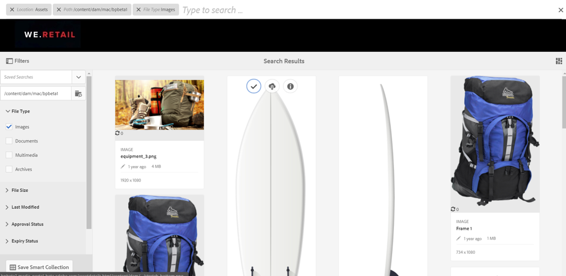

# Novità di AEM Assets Brand Portal {#what-s-new-in-aem-assets-brand-portal}

 Portale del marchio Risorse per Adobi Experience Manager (AEM) consente di acquisire, controllare e distribuire in modo sicuro le risorse creative approvate a soggetti esterni e utenti aziendali interni attraverso dispositivi diversi. Consente di migliorare l&#39;efficienza della condivisione delle risorse, di accelerare il time-to-market delle risorse e di ridurre il rischio di non conformità e di accesso non autorizzato. Adobe sta lavorando per migliorare l&#39;esperienza complessiva del Brand Portal. Di seguito viene fornita una panoramica delle nuove funzioni e dei miglioramenti.

## Novità in 6.4.6 {#what-changed-in-646}

In Brand Portal 6.4.6, il canale di autorizzazione tra AEM Assets e Brand Portal viene modificato. Brand Portal ora è supportato sul servizio cloud AEM Assets, AEM Assets 6.3 e versioni successive. Negli AEM Assets 6.3 e versioni successive, Brand Portal era stato precedentemente configurato nell’interfaccia classica tramite il gateway OAuth legacy, che utilizza lo scambio di token JWT per ottenere un token di accesso IMS per l’autorizzazione. I AEM Assets sono ora configurati con Brand Portal tramite Adobe Developer Console, che fornisce un token IMS per l&#39;autorizzazione del tenant del Brand Portal.

<!-- The steps to configure integration are different depending on your AEM version, and whether you are configuring for the first-time, or upgrading the existing integration:
-->

<!--
  
   | **AEM Version** |**New Integration** |**Upgrade Integration** |
|---|---|---|
| **AEM 6.5** |[Create new integration](../using/brand-portal-configure-integration-65.md) |[Upgrade existing integration](../using/brand-portal-configure-integration-65.md#upgrade-integration-65) | 
| **AEM 6.4** |[Create new integration](../using/brand-portal-configure-integration-64.md) |[Upgrade existing integration](../using/brand-portal-configure-integration-64.md#upgrade-integration-64) | 
| **AEM 6.3** |[Create new integration](../using/brand-portal-configure-integration-63.md) |[Upgrade existing integration](../using/brand-portal-configure-integration-63.md#upgrade-integration-63) | 
| **AEM 6.2** |Contact Support |Contact Support | 

   -->

I passaggi per configurare i AEM Assets con Brand Portal sono diversi a seconda della versione di AEM in uso e se si sta configurando per la prima volta oppure se si stanno aggiornando le configurazioni esistenti:

<!--| **AEM Version** |**New Configuration** |**Upgrade Configuration** |
|---|---|---|
| **AEM 6.5 (6.5.4.0 and above)** |[Create configuration](../using/brand-portal-configure-integration-65.md) |[Upgrade configuration](../using/brand-portal-configure-integration-65.md#upgrade-integration-65) | 
| **AEM 6.4 (6.4.8.0 and above)** |[Create configuration](../using/brand-portal-configure-integration-64.md) |[Upgrade configuration](../using/brand-portal-configure-integration-64.md#upgrade-integration-64) | 
| **AEM 6.3 (6.3.3.8 and above)** |[Create configuration](../using/brand-portal-configure-integration-63.md) |[Upgrade configuration](../using/brand-portal-configure-integration-63.md#upgrade-integration-63) | 
| **AEM 6.2** |Contact Support |Contact Support | 
-->

<!-- AEM Assets configuration with Brand Portal on Adobe I/O is supported on:
* AEM 6.5.4.0 and above
* AEM 6.4.8.0 and above
* AEM 6.3.3.8 and above -->

| **Versione di AEM** | **Nuova configurazione** | **Configurazione aggiornamento** |
|---|---|---|
| **AEM Assets as a Cloud Service** | [Creare la configurazione](https://docs.adobe.com/content/help/en/experience-manager-cloud-service/assets/brand-portal/configure-aem-assets-with-brand-portal.html) | - |
| **AEM 6.5 (6.5.4.0 e versioni successive)** | [Creare la configurazione](https://docs.adobe.com/content/help/en/experience-manager-65/assets/brandportal/configure-aem-assets-with-brand-portal.html) | [Aggiornamento della configurazione](https://docs.adobe.com/content/help/en/experience-manager-65/assets/brandportal/configure-aem-assets-with-brand-portal.html#upgrade-integration-65) |
| **AEM 6.4 (6.4.8.0 e versioni successive)** | [Creare la configurazione](https://docs.adobe.com/content/help/en/experience-manager-64/assets/brandportal/configure-aem-assets-with-brand-portal.html) | [Aggiornamento della configurazione](https://docs.adobe.com/content/help/en/experience-manager-64/assets/brandportal/configure-aem-assets-with-brand-portal.html#upgrade-integration-64) |
| **AEM 6.3 (6.3.3.8 e versioni successive)** | [Creare la configurazione](https://helpx.adobe.com/experience-manager/6-3/assets/using/brand-portal-configuring-integration.html) | [Aggiornamento della configurazione](https://helpx.adobe.com/experience-manager/6-3/assets/using/brand-portal-configuring-integration.html#Upgradeconfiguration) |
| **AEM 6.2** | Contattare il supporto | Contattare il supporto |

>[!NOTE]
>
>È consigliabile aggiornare l&#39;istanza di AEM all&#39;ultimo service pack.

Consultate le note [sulla versione più recenti del Portale](brand-portal-release-notes.md)marchio.

Consultate Domande frequenti sul [Brand Portal](brand-portal-faqs.md).

## Novità in 6.4.5 {#what-changed-in-645}

Brand Portal 6.4.5 è una feature release che si propone di fornire agli utenti di Brand Portal (agenzie/team esterni) la possibilità di caricare contenuti in Brand Portal e pubblicarli in AEM Assets, senza necessità di accedere all’ambiente di authoring. Questa funzione è denominata **[Asset Sourcing in Brand Portal](brand-portal-asset-sourcing.md)**e migliorerà l’esperienza dei clienti fornendo agli utenti un meccanismo bidirezionale per contribuire e condividere le risorse con altri utenti del Brand Portal distribuiti a livello globale.

### Origine risorsa in Brand Portal {#asset-sourcing-in-bp}

Asset Sourcing consente agli utenti di AEM (amministratori/utenti non amministratori) di creare nuove cartelle con un’ulteriore proprietà **Asset Contribution** , in modo che la nuova cartella creata sia aperta all’invio delle risorse da parte degli utenti del Brand Portal. Questo attiva automaticamente un flusso di lavoro che crea due sottocartelle aggiuntive, denominate NEW e SHARED, all’interno della cartella **Contribution** appena creata.

L’utente di AEM definisce quindi il requisito [caricando un breve](brand-portal-configure-contribution-folder-properties.md) sui tipi di risorse da aggiungere alla cartella dei contributi, nonché [caricando le risorse](brand-portal-upload-baseline-assets.md)di base nella cartella **CONDIVISA** , per garantire che gli utenti BP dispongano delle informazioni di riferimento necessarie. L’amministratore può quindi concedere agli utenti attivi di Brand Portal l’accesso alla cartella dei contributi prima di pubblicare la nuova cartella **Contribution** nel Brand Portal.

Dopo aver aggiunto il contenuto nella cartella **NEW** , l’utente può pubblicare nuovamente la cartella dei contributi nell’ambiente di authoring di AEM. L&#39;importazione potrebbe richiedere alcuni minuti e riflettere il contenuto appena pubblicato all&#39;interno dei AEM Assets.

Inoltre, tutte le funzionalità esistenti rimangono invariate. Gli utenti di Brand Portal possono visualizzare, cercare e scaricare risorse dalla cartella dei contributi e dalle altre cartelle consentite. Inoltre, gli amministratori possono condividere ulteriormente la cartella dei contributi, modificare le proprietà e aggiungere risorse alle raccolte.

>[!NOTE]
>
>La sorgente delle risorse in Brand Portal è supportata in AEM 6.5.2.0 e versioni successive.
>
>Questa funzione non è supportata nelle versioni precedenti - AEM 6.3 e AEM 6.4.

### Caricare le risorse nella cartella Contribution {#upload-assets-in-bp}

Gli utenti di Brand Portal con le autorizzazioni appropriate possono [scaricare i requisiti](brand-portal-download-asset-requirements.md) delle risorse per comprendere la necessità di un contributo e caricare più risorse o cartelle contenenti più risorse nella cartella dei contributi. Tuttavia, tenete presente che gli utenti di Brand Portal possono caricare solo le risorse nella sottocartella **NEW** . La cartella **CONDIVISA** è destinata alla distribuzione di requisiti e risorse di base. Consultate, [Caricare le risorse nella cartella dei contributi](brand-portal-upload-assets-to-contribution-folder.md)

### Pubblica cartella dei contributi in AEM Assets {#publish-assets-to-aem}

Una volta completato il caricamento nella cartella **NEW** , gli utenti del Brand Portal possono pubblicare nuovamente la cartella dei contributi in AEM. Potrebbero essere necessari alcuni minuti per importare e riflettere il contenuto/le risorse pubblicate in AEM Assets. Consultate [Pubblicare la cartella dei contributi sui AEM Assets](brand-portal-publish-contribution-folder-to-aem-assets.md)

## Novità in 6.4.4 {#what-changed-in-644}

Brand Portal 6.4.4 è caratterizzato da miglioramenti apportati alla ricerca di testo e in risposta alle richieste principali dei clienti. Consultate le note [sulla versione più recenti del Portale](brand-portal-release-notes.md)marchio.

### Miglioramenti della ricerca {#search-enhancements}

A partire da Brand Portal 6.4.4 è supportata la ricerca parziale del testo nel predicato delle proprietà nel riquadro di filtraggio. Per consentire la ricerca parziale del testo, è necessario abilitare la ricerca **** parziale nel Predicato proprietà nel modulo di ricerca.

Continua a leggere per saperne di più sulla ricerca parziale di testo e caratteri jolly.

#### Ricerca di frasi parziali {#partial-phrase-search}

È ora possibile cercare le risorse specificando solo una parte, ovvero una parola o due, della frase ricercata nel riquadro di filtraggio.

**La ricerca di parole** parziali caso d&#39;uso è utile quando non si è sicuri della combinazione esatta di parole che si verificano nella frase cercata.

Ad esempio, se il modulo di ricerca in Brand Portal utilizza Property Predicate per la ricerca parziale sul titolo delle risorse, specificando il termine **camp** vengono restituite tutte le risorse con la parola camp nella frase del titolo.

#### Ricerca con caratteri jolly {#wildcard-search}

Il Portale marchio consente di utilizzare l&#39;asterisco (*) nella query di ricerca insieme a una parte della parola nella frase cercata.

**Caso** di utilizzo Se non si è certi delle parole esatte che si trovano nella frase ricercata, è possibile utilizzare una ricerca con caratteri jolly per riempire gli spazi vuoti nella query di ricerca.

Ad esempio, se specificate **climb*** , tutte le risorse con parole che iniziano con i caratteri che **salgono** nella frase del titolo se nel modulo di ricerca in Brand Portal viene utilizzato Predicato proprietà per la ricerca parziale sul titolo delle risorse.

Analogamente, specificando:

* ***climb** restituisce tutte le risorse con parole che terminano con caratteri che **salgono** nella frase del titolo.

* ***climb*** restituisce tutte le risorse con parole che includono i caratteri che **salgono** nella frase del titolo.

>[!NOTE]
>
>Selezionando la casella di controllo **Ricerca** parziale, per impostazione predefinita viene selezionato **Ignora maiuscole/minuscole** .

## Novità in 6.4.3 {#what-changed-in}

La versione di Brand Portal 6.4.3 è incentrata su — fornendo alle organizzazioni un alias alternativo oltre al relativo ID tenant nell’URL di accesso a Brand Portal, nuova configurazione della gerarchia delle cartelle, miglioramenti del supporto video, pubblicazione pianificata dall’istanza AEM Author al Portale del marchio, miglioramenti operativi — e catering alle richieste dei clienti.

### Navigazione gerarchica delle cartelle per utenti non amministratori

Gli amministratori possono ora configurare il modo in cui le cartelle vengono visualizzate agli utenti non amministratori (editor, visualizzatori e utenti ospiti) al momento dell&#39;accesso. [Abilita configurazione gerarchia](../using/brand-portal-general-configuration.md) cartelle viene aggiunta in Impostazioni **** generali, nel pannello degli strumenti di amministrazione. Se la configurazione è:

* **attivato**, la struttura delle cartelle che inizia dalla cartella principale è visibile agli utenti non amministratori. Pertanto, gli viene concessa un&#39;esperienza di navigazione simile agli amministratori.
* **disattivato**, solo le cartelle condivise vengono visualizzate sulla pagina di destinazione.

**Il caso d’uso**

La funzionalità [Abilita gerarchia](../using/brand-portal-general-configuration.md) cartelle (se abilitata) consente di distinguere le cartelle con gli stessi nomi condivisi da gerarchie diverse. Al momento dell&#39;accesso, gli utenti non amministratori ora visualizzano le cartelle padre (e antenati) virtuali delle cartelle condivise.
 

Le cartelle condivise sono organizzate nelle rispettive directory nelle cartelle virtuali. È possibile riconoscere queste cartelle virtuali con un&#39;icona a forma di lucchetto.

La miniatura predefinita delle cartelle virtuali è la miniatura della prima cartella condivisa.

### Ricerca in una gerarchia o percorso di cartelle specifici

**Il predicato del browser** percorso è stato introdotto in Modulo di ricerca per consentire la ricerca di risorse in una directory specifica. Il percorso di ricerca predefinito del predicato di ricerca per il browser percorso è `/content/dam/mac/<tenant-id>/`, che può essere configurato modificando il modulo di ricerca predefinito.

* Gli utenti amministratori possono utilizzare il browser Percorsi per accedere a qualsiasi directory di cartelle nel Brand Portal.
* Gli utenti non amministratori possono utilizzare il browser Percorsi per navigare solo verso le cartelle (e tornare alle cartelle principali) condivise con loro.
Ad esempio, `/content/dam/mac/<tenant-id>/folderA/folderB/folderC` viene condiviso con un utente non amministratore. L’utente può cercare risorse all’interno di folderC utilizzando il browser Percorso. Questo utente può anche passare a folderB e folderA (poiché sono antenati della cartellaC che viene condivisa con l&#39;utente).

**Il caso d’uso**

Ora è possibile limitare la ricerca delle risorse all’interno di una cartella specifica selezionata, anziché iniziare dalla cartella principale.

Tenete presente che la ricerca in queste cartelle restituisce solo i risultati delle risorse condivise con l’utente.

### Supporto delle rappresentazioni video Dynamic Media

Gli utenti la cui istanza AEM Author è in modalità ibrida Dynamic Media possono visualizzare in anteprima e scaricare le rappresentazioni per contenuti multimediali dinamici, oltre ai file video originali.

Per consentire l’anteprima e il download delle rappresentazioni multimediali dinamiche su account tenant specifici, gli amministratori devono specificare la configurazione **** Dynamic Media (URL del servizio video (URL DM-Gateway) e l’ID di registrazione per recuperare il video dinamico) nella configurazione **Video** dal pannello degli strumenti di amministrazione.

**Per visualizzare l’anteprima dei video** Dynamic Media relativi al caso d’uso, effettuate le seguenti operazioni:

* Pagina dei dettagli della risorsa
* Vista a schede della risorsa
* Pagina di anteprima della condivisione dei collegamenti

Le codifiche video Dynamic Media possono essere scaricate da:

* Brand Portal
* Collegamento condiviso

### Pubblicazione pianificata su Brand Portal

Il flusso di lavoro di pubblicazione delle risorse (e delle cartelle) da [AEM (6.4.2.0)](https://helpx.adobe.com/experience-manager/6-4/release-notes/sp-release-notes.html#main-pars_header_9658011) Istanza Author a Brand Portal può essere pianificato per una data e un’ora successive.

Allo stesso modo, le risorse pubblicate possono essere rimosse dal portale in una data (ora) successiva, pianificando il flusso di lavoro Annulla pubblicazione da Brand Portal.

### Alias tenant configurabile nell&#39;URL

Le organizzazioni possono personalizzare l’URL del proprio portale utilizzando un prefisso alternativo nell’URL. Per ottenere un alias per il nome del tenant nell&#39;URL del portale esistente, le organizzazioni devono contattare il supporto Adobe.

Tenete presente che è possibile personalizzare solo il prefisso dell’URL del Portale marchio e non l’intero URL.\
Ad esempio, un’organizzazione con un dominio esistente **geomettrix.brand-Portal.adobe.com** può creare su richiesta **geomettrixinc.brand-Portal.adobe.com** .

Tuttavia, l&#39;istanza AEM Author può essere [configurata](https://helpx.adobe.com/experience-manager/6-5/assets/using/brand-portal-configuring-integration.html) solo con l&#39;URL dell&#39;ID tenant e non con l&#39;alias tenant (alternativo).

**Le** organizzazioni di casi d’uso possono soddisfare le proprie esigenze di branding personalizzando l’URL del portale, invece di attingere all’URL fornito da Adobe.

### Miglioramenti relativi all&#39;esperienza di download

La versione offre un’esperienza di download semplificata con un numero ridotto di clic e avvisi, su:

* optando per scaricare solo le rappresentazioni (e non le risorse originali).
* il download delle risorse quando l&#39;accesso alle rappresentazioni originali è limitato.

## Novità in 6.4.2 {#what-changed-in-1}

La versione di Brand Portal 6.4.2 offre una serie di funzionalità per rispondere alle esigenze di distribuzione delle risorse delle organizzazioni e aiutarle a raggiungere un gran numero di utenti distribuiti a livello globale tramite l’accesso degli ospiti e un’esperienza ottimale con download accelerati. Brand Portal offre inoltre maggiore controllo alle organizzazioni attraverso nuove configurazioni per gli amministratori, nuovi rapporti aggiunti e per soddisfare le richieste dei clienti.

### Accesso come ospite

Il portale AEM Brand consente agli ospiti di accedere al portale. Un utente ospite non richiede le credenziali per entrare nel portale e può accedere e scaricare tutte le cartelle e le raccolte pubbliche. Gli utenti ospiti possono aggiungere risorse alla propria lightbox (raccolta privata) e scaricare la stessa. Inoltre, possono visualizzare i predicati di ricerca e smart tag impostati dagli amministratori. La sessione guest non consente agli utenti di creare raccolte e ricerche salvate né di condividerle ulteriormente, accedere alle impostazioni delle cartelle e delle raccolte e condividere le risorse come collegamenti.

In un&#39;organizzazione, sono consentite più sessioni guest simultanee, che è limitata al 10% della quota utente totale per organizzazione.

Una sessione ospite rimane attiva per due ore. Pertanto, lo stato della scatola luminosa viene mantenuto anche fino a due ore dall’inizio della sessione. Dopo due ore, la sessione ospite deve essere riavviata, in modo che lo stato lightbox sia perso.

### Download accelerati

Gli utenti di Brand Portal possono sfruttare i download veloci basati su IBM Aspera Connect per ottenere velocità fino a 25 volte più veloci e usufruire di un&#39;esperienza di download senza soluzione di continuità indipendentemente dalla loro posizione in tutto il mondo. Per scaricare più rapidamente le risorse dal Brand Portal o dal collegamento condiviso, gli utenti devono selezionare l’opzione **Abilita accelerazione** download nella finestra di dialogo di download, purché l’accelerazione del download sia abilitata nell’organizzazione.

Per abilitare il download accelerato basato su IBM Aspera per l’organizzazione, gli amministratori **Abilitano l’opzione Accelerazione** download (disabilitata per impostazione predefinita) da Impostazioni  generali nel pannello degli strumenti di amministrazione. Per ulteriori informazioni sui prerequisiti e sui passaggi per la risoluzione dei problemi relativi al download più rapido dei file di risorse dal Brand Portal e dai collegamenti condivisi, consulta [Guida per accelerare i download dal Brand Portal](../using/accelerated-download.md#main-pars-header).

### Report login utente

È stato introdotto un nuovo rapporto per tenere traccia degli accessi utente. Il rapporto **Accesso** utente può essere utile per consentire alle organizzazioni di eseguire il controllo e controllare gli amministratori delegati e gli altri utenti di Brand Portal.

I registri dei rapporti contengono nomi visualizzati, ID e-mail, personalità (amministratore, visualizzatore, editor, ospite), gruppi, ultimo login, stato dell&#39;attività e conteggio di login di ciascun utente dalla distribuzione di Brand Portal 6.4.2 fino al momento della generazione del rapporto. Gli amministratori possono esportare il rapporto come .csv. Insieme ad altri rapporti, il rapporto User Logins (Accesso utente) consente alle organizzazioni di monitorare più da vicino le interazioni degli utenti con le risorse del marchio approvate, garantendo in tal modo la conformità agli uffici aziendali per la conformità.

### Accesso alle rappresentazioni originali

Gli amministratori possono limitare l&#39;accesso degli utenti ai file di immagine originali (.jpeg, .tiff, .png, .bmp, .gif, .pjpeg, x-portabile-anymap, x-portatile-bitmap, x-portabile-grigio, x-portabile-pixmap, x-rgb, x-xpixmap, x-icon, image/photoshop, image/x-photoshop, .pspsx d, image/vnd.adobe.photoshop) e date accesso alle rappresentazioni a bassa risoluzione che scaricano dal Portale marchio o dal collegamento condiviso. Questo accesso può essere controllato a livello di gruppo di utenti dalla scheda Gruppi della pagina Ruoli utente nel pannello degli strumenti di amministrazione.

* Per impostazione predefinita, tutti gli utenti possono scaricare le rappresentazioni originali, poiché l’accesso all’originale è abilitato per tutti.
* Gli amministratori devono deselezionare le rispettive caselle di controllo per impedire a un gruppo di utenti di accedere alle rappresentazioni originali.
* Se un utente è membro di più gruppi, ma solo uno di essi dispone di restrizioni, tali restrizioni si applicano a tale utente.
* Le restrizioni non si applicano agli amministratori, anche se sono membri di gruppi limitati.
* Le autorizzazioni dell’utente che condivide le risorse come collegamento si applicano agli utenti che scaricano le risorse tramite collegamenti condivisi.

### Percorso della gerarchia delle cartelle nelle viste scheda ed elenco

Schede di cartelle, nella vista a schede, ora visualizzano le informazioni sulla gerarchia delle cartelle per utenti non amministratori (Editor, Visualizzatore e Utente ospite). Questa funzionalità consente agli utenti di conoscere la posizione delle cartelle a cui accedono, rispetto alla gerarchia padre.

Le informazioni sulla gerarchia delle cartelle sono particolarmente utili per distinguere le cartelle con nomi simili ad altre cartelle condivise da una gerarchia di cartelle diversa. Se gli utenti non amministratori non sono a conoscenza della struttura di cartelle delle risorse condivise con loro, le risorse e le cartelle con nomi simili potrebbero confondersi.

* I percorsi visualizzati sulle rispettive schede vengono troncati per adattarsi alle dimensioni delle schede. Tuttavia, gli utenti possono visualizzare il percorso completo come una descrizione comandi quando passano il puntatore del mouse sul percorso troncato.

Visualizzazione elenco mostra la cartella Percorso delle risorse in una colonna per tutti gli utenti di Brand Portal.

### Opzione Panoramica per visualizzare le proprietà della risorsa

Il Brand Portal offre l’opzione Panoramica agli utenti non amministratori (editor, visualizzatori e utenti ospiti) per visualizzare le proprietà delle risorse o delle cartelle selezionate. L&#39;opzione Panoramica è visibile:

1. Nella barra degli strumenti nella parte superiore, quando si seleziona una risorsa o una cartella.
2. Nell&#39;elenco a discesa quando si seleziona il selettore della barra.

Selezionando l’opzione Panoramica mentre è selezionata una risorsa o una cartella, gli utenti possono visualizzare il titolo, il percorso e l’ora della creazione della risorsa. Nella pagina dei dettagli della risorsa, invece, l’opzione Panoramica permette agli utenti di visualizzare i metadati della risorsa.

## Nuove configurazioni

Sono state aggiunte sei nuove configurazioni per consentire agli amministratori di abilitare/disabilitare le seguenti funzionalità per tenant specifici:

* Consenti accesso come ospite
* Consentire agli utenti di richiedere l&#39;accesso a Brand Portal
* Consenti agli amministratori di eliminare le risorse dal portale dei marchi
* Consenti creazione di raccolte pubbliche
* Consenti creazione di raccolte pubbliche intelligenti
* Consenti accelerazione download

Le configurazioni di cui sopra sono disponibili nelle impostazioni Accesso e Generale nel pannello degli strumenti amministrativi.

### Interfaccia utente di Adobe I/O per configurare le integrazioni di autenticazione

A partire da Brand Portal 6.4.2, per creare un’applicazione JWT è utilizzata l’interfaccia Adobe.io [https://legacy-oauth.cloud.adobe.io/](https://legacy-oauth.cloud.adobe.io/) , che consente di configurare integrazioni Auth per consentire l’integrazione degli AEM Assets con Brand Portal. In precedenza, l&#39;interfaccia utente per la configurazione delle integrazioni OAuth era in hosting in [https://marketing.adobe.com/developer/](https://marketing.adobe.com/developer/). Per ulteriori informazioni sull’integrazione di AEM Assets con Brand Portal per la pubblicazione di risorse e raccolte in Brand Portal, consultate Integrazione dei AEM Assets con [i Portale](https://docs.adobe.com/content/help/en/experience-manager-64/assets/brandportal/configure-aem-assets-with-brand-portal.html)marchio.

## Miglioramenti della ricerca

Gli amministratori possono fare in modo che i predicati delle proprietà non facciano distinzione tra maiuscole e minuscole utilizzando il predicato delle proprietà aggiornato, che dispone di un controllo per Ignore Case. Questa opzione è disponibile per il predicato delle proprietà e il predicato delle proprietà multivalore.\
Tuttavia, la ricerca senza distinzione tra maiuscole e minuscole è relativamente più lenta della ricerca predefinita per il predicato delle proprietà. Se nel filtro di ricerca sono presenti troppi predicati senza distinzione tra maiuscole e minuscole, la ricerca può rallentare. Si consiglia pertanto di utilizzare con cautela la ricerca non sensibile ai casi.

## Novità in 6.4.1 {#what-changed-in-2}

Brand Portal 6.4.1 è una versione di aggiornamento della piattaforma che offre diverse nuove funzioni e miglioramenti vitali come navigazione, ricerca e prestazioni migliorate per offrire esperienze cliente soddisfacenti.

### Miglioramenti a livello di ricerca

* Nuova barra ad albero del contenuto per navigare rapidamente in una gerarchia di risorse.

* Sono state introdotte nuove scelte rapide da tastiera, ad esempio _(p)_ per la navigazione alla pagina delle proprietà, _(e)_ per la modifica e _(ctrl+c)_ per le operazioni di copia.
* È stata migliorata l&#39;esperienza di scorrimento e caricamento lento nelle viste a schede e a elenco per la navigazione in un gran numero di risorse.
* Vista a schede migliorata con supporto per schede di diverse dimensioni in base all&#39;impostazione della vista.

* La vista a schede ora mostra la data/ora al passaggio del mouse sopra l&#39;etichetta della data.

* Vista a colonne avanzata con **ulteriori dettagli** sotto lo snapshot della risorsa, che consente di passare alla pagina dei dettagli di una risorsa.

* La vista Elenco ora visualizza i nomi dei file delle risorse nella prima colonna per impostazione predefinita, oltre alle informazioni relative a impostazioni internazionali, tipo di risorsa, dimensioni, dimensione, valutazione e pubblicazione. Per configurare la quantità di dettagli da visualizzare nella vista Elenco è possibile utilizzare le nuove impostazioni **di** visualizzazione.

* È stata migliorata l’esperienza con i dettagli delle risorse, con la possibilità di spostarsi avanti e indietro tra le risorse mediante i nuovi pulsanti di navigazione e di visualizzare il conteggio delle risorse.

* Nuova funzionalità per visualizzare in anteprima i file audio, caricati da AEM, nella pagina dei dettagli della risorsa.
* Nuova funzionalità Risorse correlate disponibile nelle proprietà delle risorse. Le risorse correlate ad altre risorse sorgente/derivate su AEM e pubblicate sul Portale marchio ora presentano una relazione intatta in Brand Portal, con i collegamenti alle relative risorse nella pagina delle proprietà.
* È stata introdotta una nuova configurazione per impedire agli utenti non amministratori di creare raccolte pubbliche. Le organizzazioni possono collaborare con il team di assistenza Adobe per configurare questa funzionalità su account specifici.

### Miglioramenti della ricerca

* È stata introdotta la possibilità di tornare alla stessa posizione nei risultati della ricerca, dopo aver navigato fino a un elemento di ricerca, senza eseguire di nuovo la query di ricerca.
* È stato fornito un nuovo conteggio dei risultati della ricerca per visualizzare il numero di risultati della ricerca.
* È stato migliorato il filtro di ricerca per i tipi di file con la possibilità di filtrare i risultati di ricerca in base a tipi MIME con granulometria fine come .jpg, .png e .psd rispetto alle precedenti opzioni Immagini, Documenti e Multimedia.
* Filtri di ricerca migliorati per le raccolte, con marche temporali precise invece della funzionalità del cursore tempo precedente.
* Sono stati introdotti nuovi filtri di tipo Accesso per la ricerca delle raccolte pubbliche o non pubbliche.

### Ottimizzazioni del download

* Un singolo file di grandi dimensioni viene scaricato direttamente, senza la creazione di file zip, migliorando così la velocità e il throughput.
* Il limite di download ZIP per la funzionalità di condivisione dei collegamenti è aumentato da 1 GB a 5 GB.

* Adesso, gli utenti possono scegliere di scaricare solo i file personalizzati e originali e di impedire le rappresentazioni pronte all’uso, mentre scaricano le risorse dal Brand Portal o dalla funzione dei collegamenti condivisi.

### Miglioramenti delle prestazioni

* Miglioramento fino al 100% della velocità di download delle risorse.
* Miglioramento fino al 40% nella risposta alla ricerca di risorse.
* Miglioramento fino al 40% delle prestazioni di navigazione.

**Nota**: I miglioramenti citati sono come per i test condotti in laboratorio.

### Funzionalità di reporting migliorate

**È stato introdotto il Rapporto** sulla condivisione dei collegamenti È stato introdotto un nuovo rapporto per fornire informazioni sui collegamenti condivisi. Il rapporto Condivisione collegamenti elenca tutti gli URL, per le risorse, condivisi con utenti interni ed esterni nell’organizzazione nell’intervallo di tempo specificato. Indica inoltre quando il collegamento è stato condiviso, da chi e quando scade.

**Modificato il punto di ingresso per accedere al rapporto Utilizzo del rapporto** Utilizzo ora è consolidato con altri rapporti e ora può essere visualizzato dalla console Rapporti risorse. Per accedere alla console Rapporti risorse, andate a **creare/gestire rapporti** dal pannello degli strumenti amministrativi.

**L&#39;esperienza utente migliorata con l&#39;interfaccia di reporting** Reporting nel Portale marchio è diventata più intuitiva e offre maggiore controllo alle organizzazioni. Oltre a creare vari rapporti, gli amministratori possono ora rivisitare i rapporti generati e scaricarli o eliminarli, dal momento che questi vengono salvati in Brand Portal.

È possibile personalizzare ciascuno dei rapporti creati aggiungendo o rimuovendo colonne predefinite. È inoltre possibile aggiungere colonne personalizzate ai rapporti Download, Scadenza e Pubblica per controllarne il grado di granularità.

### Strumenti di amministrazione migliorati

È stato migliorato il selettore delle proprietà negli strumenti di amministrazione per metadati, ricerche e rapporti, con funzionalità di navigazione e navigazione per semplificare l&#39;esperienza di amministrazione.

### Altri miglioramenti

* Le risorse pubblicate su Brand Portal da AEM 6.3.2.1 e 6.4 ora possono essere rese disponibili al pubblico per gli utenti generali di Brand Portal, contrassegnando la casella di controllo Pubblica cartella pubblica nella finestra di dialogo Replica del portale dei marchi AEM Assets.

* Gli amministratori ricevono una notifica tramite e-mail di richiesta di accesso, a parte le notifiche presenti nell’area di notifica del Portale marchio, se qualcuno ha richiesto l’accesso al Portale marchio.

## Novità in 6.3.2 {#what-changed-in-3}

Brand Portal 6.3.2 include funzionalità nuove e migliorate, orientate alle richieste più frequenti dei clienti e ai miglioramenti generali delle prestazioni.

### Request access to Brand Portal {#request-access-to-brand-portal}

Adesso, gli utenti possono richiedere l’accesso a Brand Portal utilizzando la nuova funzionalità di accesso **** necessario disponibile nella schermata di accesso di Brand Portal.

A seconda che gli utenti dispongano di un Adobe ID  o debbano creare un Adobe ID , gli utenti possono seguire il flusso di lavoro appropriato per inviare una richiesta. Gli amministratori di prodotti Brand Portal ricevono tali richieste nell’area di notifica e concedono l’accesso tramite Adobe  Admin Console.

Per ulteriori informazioni, consultate [Richiedere l&#39;accesso al Portale](../using/brand-portal.md#requestaccesstobrandportal)marchio.

### Miglioramento nel rapporto sulle risorse scaricate {#enhancement-in-the-assets-downloaded-report}

Il rapporto sulle risorse scaricate ora include il numero di download delle risorse per utente entro l’intervallo di date e ore specificato. Gli utenti possono scaricare questo rapporto in formato .csv e compilare dati quali il numero totale di download per una risorsa con licenza.

Per ulteriori informazioni, vedere i passaggi 3 e 6 in [Creazione e gestione di report](../using/brand-portal-reports.md#createandmanageadditionalreports)aggiuntivi.

### Notifica di manutenzione del Brand Portal {#brand-portal-maintenance-notification}

Brand Portal ora visualizza un banner di notifica alcuni giorni prima di un’attività di manutenzione imminente. Una notifica di esempio:

Per ulteriori informazioni, consultate Notifica di manutenzione di Brand Portal.

### Miglioramento delle risorse con licenza condivise mediante la funzione di condivisione dei collegamenti {#enhancement-for-licensed-assets-shared-using-the-link-share-feature}

Quando scaricate le risorse con licenza tramite la funzione di condivisione dei collegamenti, ora viene richiesto di accettare il contratto di licenza per tali risorse.

Per ulteriori informazioni, consulta il Passaggio 12 in [Condivisione di risorse come collegamento](../using/brand-portal-link-share.md#shareassetsasalink).

### Miglioramento del selettore utente {#user-picker-enhancement}

Le prestazioni del selettore utenti sono ora migliorate per soddisfare le esigenze dei clienti con una base di utenti di grandi dimensioni.

### Modifiche al marchio Experience Cloud {#experience-cloud-branding-changes}

Il Brand Portal ora è conforme al nuovo marchio Adobe Experience Cloud.

## Novità in 6.3.1 {#what-changed-in-4}

Brand Portal 6.3.1 include funzionalità nuove e migliorate, orientate all’allineamento del Brand Portal con AEM.

### Interfaccia utente aggiornata {#upgraded-user-interface}

Per allineare l’esperienza utente del Brand Portal con AEM, Adobe sta passando all’interfaccia utente Coral 3. Questa modifica migliora l&#39;usabilità generale, inclusa la navigazione e l&#39;aspetto.

#### Esperienza di navigazione migliorata {#enhanced-navigational-experience}

* Accesso rapido agli strumenti amministrativi tramite il nuovo logo Adobe:

* Navigazione del prodotto attraverso una sovrapposizione:

* Navigazione rapida alle cartelle principali:

* Ricerca e navigazione rapida ai contenuti e agli strumenti richiesti:

### Esperienza di navigazione migliorata {#enhanced-browsing-experience}

* Nuova vista a colonne per sfogliare le cartelle nidificate:

 

* Nell’elenco delle risorse di una cartella, nella parte superiore viene visualizzata la risorsa più recente caricata.

### Esperienza di ricerca avanzata {#enhanced-search-experience}

* La nuova funzione di ricerca Omni facilita l’accesso rapido ai contenuti, alle funzionalità o ai tag pertinenti attraverso suggerimenti automatici durante la digitazione delle parole chiave di ricerca. La ricerca Omni è disponibile in tutte le funzioni di ricerca.

* Potete anche aggiungere filtri di ricerca alla ricerca Omni per restringere ulteriormente la ricerca e velocizzarla.

* La nuova ricerca basata sulla valutazione delle risorse consente di cercare risorse con valutazioni, se pubblicate da AEM Assets.
* La nuova funzione di ricerca multivalore accetta più parole chiave con l&#39;operatore AND per individuare più rapidamente le risorse.
* La nuova funzione di miglioramento della ricerca consente di migliorare la rilevanza della ricerca in modo che risorse specifiche vengano visualizzate nella parte superiore dei risultati della ricerca.
* La nuova funzione di ricerca basata sui percorsi consente di fornire il percorso a una cartella nidificata in modo da poter eseguire ricerche nelle risorse presenti nella cartella.

#### Nuova ricerca basata su smart tag {#new-smart-tags-based-search}

Se le immagini con smart tag vengono pubblicate da AEM Assets a Brand Portal, potete cercare queste immagini in Brand Portal utilizzando i nomi degli smart tag come parole chiave di ricerca. Questa funzione è disponibile solo per i file.

### Esperienza di download migliorata {#enhanced-downloading-experience}

Dopo aver scaricato una cartella nidificata, potete mantenere la gerarchia delle cartelle originale. Le risorse all’interno di una cartella nidificata possono essere scaricate in una singola cartella anziché in cartelle separate.

### Prestazioni migliorate {#improved-performance}

I miglioramenti nelle funzionalità di ricerca, ricerca e scaricamento migliorano notevolmente le prestazioni del Brand Portal.

### New digital rights management for assets {#new-digital-rights-management-for-assets}

Gli amministratori possono impostare la data e l’ora di scadenza delle risorse prima di condividerle. Una volta scaduta, una risorsa è visibile a visualizzatori ed editor, ma non può essere scaricata. Alla scadenza di una risorsa, gli amministratori ricevono una notifica.

### Ordinamento delle risorse migliorato {#enhanced-asset-sorting}

L’ordinamento delle risorse in una cartella nella visualizzazione a elenco non è più limitato al numero di risorse visualizzate nella prima pagina. Tutte le risorse di una cartella vengono ordinate, indipendentemente dal fatto che siano elencate nella prima pagina.

### Report migliorati {#reporting-capabilities}

Gli amministratori possono creare e gestire tre tipi di rapporti: risorse scaricate, scadute e pubblicate. È inoltre possibile configurare le colonne in un rapporto ed esportare i rapporti in formato CSV.

### Metadati aggiuntivi {#additional-metadata}

Brand Portal 6.3.1 introduce ulteriori metadati, che corrispondono ai AEM Assets 6.3. È possibile utilizzare il modulo Editor schema per controllare i metadati che dovrebbero essere visibili nella pagina Proprietà risorse. I metadati delle risorse non sono visibili agli utenti esterni che condividono i collegamenti, i quali possono solo visualizzare l’anteprima e scaricare le risorse tramite l’URL di condivisione dei collegamenti.

### Funzionalità aggiuntive per gli amministratori {#additional-capabilities-for-administrators}

* Prima di finalizzare le personalizzazioni dello sfondo della schermata di accesso, gli amministratori possono visualizzare l’anteprima delle modifiche.

* Dopo che un amministratore aggiunge nuovi utenti, non deve accettare inviti per essere aggiunto al Portale marchio, vengono aggiunti automaticamente.

### Nuove funzionalità di pubblicazione negli AEM Assets 6.3 {#new-publishing-capabilities-in-aem-assets}

* Gli amministratori di AEM possono pubblicare lo schema di metadati dai AEM Assets al Portale del marchio utilizzando AEM 6.3 SP 1-CFP 1 (6.3.1.1), che sarà disponibile nel 4° trimestre 2017.

* Gli amministratori di AEM possono pubblicare tutti i tag dai AEM Assets al Portale del marchio utilizzando AEM 6.2 SP1-CFP7 e AEM 6.3 SP 1-CFP 1 (6.3.1.1).

* Da AEM Assets, potete pubblicare risorse e raccolte che dispongono di tag, inclusi gli smart tag. Potete quindi cercare queste risorse o raccolte utilizzando questi tag come parole chiave di ricerca in Brand Portal.