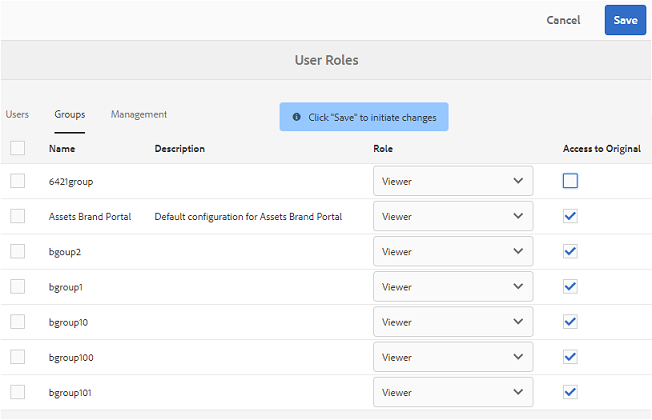

# Novità di AEM Assets Brand Portal {#what-s-new-in-aem-assets-brand-portal}

Il portale di Brand Brand di Adobe Experience Manager (AEM) consente di acquisire, controllare e distribuire in modo sicuro le risorse creative approvate a soggetti esterni e a utenti interni per diversi dispositivi. Consente di migliorare l'efficienza della condivisione delle risorse, accelerare il time-to-market per le risorse e ridurre il rischio di accessi non autorizzati e non autorizzati. Adobe sta lavorando per migliorare l'esperienza generale del portale brand. Ecco un'anteprima delle nuove funzioni e dei miglioramenti.

## Modifiche apportate in 6.4.4 {#what-is-changing-in}

La versione Brand Portal 6.4.4 si concentra su miglioramenti alla ricerca del testo e sulle richieste principali dei clienti. Consultate le ultime [Note sulla versione di Brand Portal](brand-portal-release-notes.md).

### Miglioramenti della ricerca {#search-enhancements}

La versione Brand Portal 6.4.4 supporta la ricerca parziale di testo in predicato di proprietà nel riquadro di filtro. Per consentire la ricerca parziale del testo, è necessario abilitare **la Ricerca** parziale in Predicato proprietà nel modulo di ricerca.

Continuate a leggere per ulteriori informazioni sulla ricerca parziale di testo e caratteri jolly.

#### Ricerca parziale frase {#partial-phrase-search}

Ora potete cercare le risorse specificando solo una parte (o due parole) della frase ricerca nel riquadro di filtro.

**Esempio**di utilizzo La
ricerca parziale della frase è utile quando non sei sicuro della combinazione esatta di parole che si verificano nella frase di ricerca.

Ad esempio, se il modulo di ricerca nel portale marchio utilizza Predicato proprietà per la ricerca parziale sul titolo delle risorse, specificando il termine **campo di ricerca** vengono restituite tutte le risorse con il campo Campo nella propria frase Titolo.

#### Ricerca con caratteri jolly {#wildcard-search}

Il Portale marchio consente di utilizzare l'asterisco (*) nella query di ricerca insieme a una parte della parola nella frase di ricerca.

**Caso d'uso Se**
non siete certi delle parole esatte che si verificano nella frase di ricerca, potete utilizzare una ricerca con caratteri jolly per riempire gli spazi vuoti nella query di ricerca.

Ad esempio, specificando **l'overflow *** vengono restituite tutte le risorse che iniziano con i caratteri **in corrispondenza della** frase del titolo, se nel portale di ricerca sono utilizzate la funzione Predicato proprietà per la ricerca parziale sul titolo delle risorse.

Allo stesso modo, specificando:

* *** restituisce** tutte le risorse che terminano con caratteri che terminano con i caratteri **nella** frase titolo.

* *** height *** restituisce tutte le risorse contenenti parole contenenti i caratteri **nella** frase title.

>[!NOTE]
>
>Selezionando la **casella di** controllo Ricerca parziale, **Ignora caso** è selezionato per impostazione predefinita.

## Modifiche apportate in 6.4.3 {#what-changed-in}

Brand Portal 6.4.3 è incentrato su— fornire alle organizzazioni un alias alternativo oltre al tenant tenant in URL di accesso Brand Portal, configurazione gerarchica di nuova cartelle, miglioramenti per il supporto video, miglioramenti programmati per il supporto per AEM Author al portale brand, miglioramenti operativi— and cateres to customer requests.

### Navigazione gerarchica delle cartelle per non amministratori

Gli amministratori ora possono configurare il modo in cui le cartelle vengono visualizzate agli utenti non amministratori (Editor, Visualizzatori e Utenti ospiti) al momento del login. [Abilita configurazione gerarchia](../using/brand-portal-general-configuration.md) cartelle viene aggiunta in Impostazioni **generali**, nel pannello Strumenti di amministrazione. Se la configurazione è:

* **enabled**, l'albero di cartelle a partire dalla cartella principale è visibile agli utenti non amministratori. Pertanto, assegnando loro un'esperienza di navigazione simile agli amministratori.
* **disabilitate**, nella pagina di destinazione vengono visualizzate solo le cartelle condivise.

**Il caso d'uso**

La [funzionalità Abilita gerarchia](../using/brand-portal-general-configuration.md) cartelle (quando abilitata) consente di distinguere le cartelle con gli stessi nomi condivisi da gerarchie diverse. All'accesso, gli utenti non amministratori ora vedono le cartelle principali (e antenate) delle cartelle condivise.
 

Le cartelle condivise vengono organizzate nelle rispettive directory nelle cartelle virtuali. Potete riconoscere queste cartelle virtuali con un'icona a forma di lucchetto.

La miniatura predefinita delle cartelle virtuali è quella della prima cartella condivisa.

### Ricerca in una gerarchia o in un percorso specifico

**Predicato browser** percorso viene introdotto nel modulo di ricerca per consentire la ricerca delle risorse in una directory specifica. Il percorso di ricerca predefinito per la predicato di ricerca per il Browser Percorsi è */content/dam/mac/ &lt; tenant-id &gt;/*, che può essere configurato modificando il modulo di ricerca predefinito.

* Gli utenti Admin possono utilizzare Browser percorsi per passare a qualsiasi directory di cartella sul portale del brand.
* Gli utenti non amministratori possono usare il Browser percorsi per accedere solo alle cartelle (e tornare alle cartelle principali).
Ad esempio, */content/dam/mac/ &lt; tenant-id &gt;/foldera/folderb/folderc* è condiviso con un utente non amministratore. L'utente può cercare risorse in folderc mediante il browser Percorsi. Questo utente può anche passare a folderb e foldera (poiché sono antenati del folderc condiviso con l'utente).

**Il caso d'uso**

Ora potete limitare la ricerca delle risorse all'interno di una cartella specifica che avete visitato, anziché iniziare dalla cartella principale.

La ricerca in queste cartelle restituisce i risultati solo delle risorse condivise con l'utente.

### Supporto per rappresentazioni video per contenuti multimediali dinamici

Gli utenti la cui istanza AEM Author è in modalità ibrido Dynamic Media possono visualizzare in anteprima e scaricare le rappresentazioni di contenuti multimediali dinamici, oltre ai file video originali.

Per consentire l'anteprima e il download di rappresentazioni di contenuti multimediali dinamici su account tenant specifici, gli amministratori devono specificare **Configurazione multimedia dinamica** (URL del servizio video (URL di DM-Gateway) e ID registrazione per recuperare il video dinamico) nella **configurazione Video** dal pannello Strumenti di amministrazione.

**L'esempio**
di utilizzo dei video Dynamic Media può essere visualizzato in anteprima:

* Pagina dei dettagli della risorsa
* Vista a schede della risorsa
* Pagina di anteprima condivisione collegamento

I codifiche video Dynamic Media possono essere scaricate da:

* Portale marchio
* Collegamento condiviso

### Pubblicazione pianificata su Brand Portal

Il flusso di lavoro di pubblicazione delle risorse (e cartelle) da [AEM (6.4.2.0)](https://helpx.adobe.com/experience-manager/6-4/release-notes/sp-release-notes.html#main-pars_header_9658011) Autore a Brand Portal può essere pianificato per una data e un'ora successive.

Allo stesso modo, le risorse pubblicate possono essere rimosse dal portale in una data (ora) successiva, pianificando il flusso di lavoro Annulla pubblicazione dal portale marchio.

### Alias tenant configurabile nell'URL

Le organizzazioni possono personalizzare l'URL del proprio portale con un prefisso alternativo nell'URL. Per ottenere un alias per il nome tenant nell'URL del portale esistente, le organizzazioni devono contattare il supporto Adobe.

Tenete presente che è possibile personalizzare solo il prefisso dell'URL Brand Portal e non l'intero URL.\
Ad esempio, un'organizzazione con il dominio esistente **geomettrix.brand-portal.adobe.com** può ottenere **geomettrixinc.brand-portal.adobe.com** creato su richiesta.

Tuttavia, l'istanza AEM Author può essere [configurata](https://helpx.adobe.com/experience-manager/6-5/assets/using/brand-portal-configuring-integration.html) solo con l'URL tenant tenant e non con l'URL del tenant (alternativo).

**Le**organizzazioni d'uso possono
soddisfare le esigenze di branding ottenendo l'URL personalizzato e non restando all'URL fornito da Adobe.

### Miglioramenti all'esperienza di download

Il rilascio offre un'esperienza di download semplificata con un numero ridotto di clic e avvisi, su:

* opting to download only the rendering (and not the original assets).
* scaricare le risorse quando l'accesso alle rappresentazioni originali è limitato.

## Modifiche apportate in 6.4.2 {#what-changed-in-1}

La versione di Brand Portal 6.4.2 introduce una serie di capacità per risolvere le esigenze di distribuzione delle risorse delle organizzazioni e consentirgli di rivolgerti a moltissimi utenti distribuiti a livello globale tramite l'accesso degli ospiti e l'esperienza ottimale con i download accelerati. Brand Portal offre un controllo maggiore alle organizzazioni tramite nuove configurazioni per amministratori, report aggiunti di recente e richieste di richieste ai clienti.

### Accesso come ospite

AEM Brand Portal consente agli ospiti di accedere al portale. Un utente ospite non richiede le credenziali per entrare nel portale e può accedere e scaricare tutte le cartelle e raccolte pubbliche. Gli utenti ospiti possono aggiungere risorse alla loro lightbox (raccolta privata) e scaricare lo stesso. Possono inoltre visualizzare i predicati di ricerca smart tag e i predicati di ricerca impostati dagli amministratori. La sessione degli ospiti non consente agli utenti di creare raccolte e ricerche salvate oppure di condividerle ulteriormente, di accedere alle impostazioni cartella e raccolte e di condividere le risorse come collegamenti.

In un'organizzazione, sono consentite più sessioni di ospiti simultanee, limitate al 10% della quota utente totale per organizzazione.

Una sessione ospite rimane attiva per due ore. Pertanto, lo stato della scatola luminosa viene mantenuto fino a due ore dall'ora di inizio della sessione. Dopo due ore, la sessione ospite deve riavviare, per cui lo stato della scatola luminosa viene perso.

### Download accelerati

Gli utenti del portale brand possono sfruttare i download veloci di IBM Aspera Connect per velocizzare l'utilizzo di velocità fino a 25 volte più veloci e usufruire di un'esperienza di download senza soluzione di continuità, indipendentemente dalla posizione in tutto il mondo. Per scaricare le risorse più rapidamente dal portale brand o dal collegamento condiviso, gli utenti devono selezionare **l'opzione Abilita accelerazione** download nella finestra di dialogo di download, l'accelerazione del download è abilitata nella propria organizzazione.

Per abilitare lo scaricamento accelerato basato su IBM Aspera per l'organizzazione, gli amministratori **possono abilitare l'opzione Attivazione** download (disabilitata per impostazione predefinita) da [Impostazioni generali](brand-portal-general-configuration.md#allow-download-acceleration) nel pannello Strumenti di amministrazione. Per ulteriori informazioni su prerequisiti e passaggi di risoluzione dei problemi per il download più rapido dei file di risorse da Brand Portal e collegamenti condivisi, consultate [Guida per accelerare i download da Brand Portal](../using/accelerated-download.md#main-pars-header).

### Rapporto login utente

È stato introdotto un nuovo report, per tenere traccia degli accessi utente. Il **rapporto Login** utente può essere utile per consentire alle organizzazioni di eseguire il controllo e di controllare gli amministratori delegati e altri utenti di Brand Portal.

I registri visualizzati sono nomi, ID e-mail, personalizzazioni (admin, viewer, editor, ospite), gruppi, ultimo login, stato dell'attività e numero di login di ogni utente dalla distribuzione di Brand Portal 6.4.2 fino alla data e all'ora della generazione dei report. Gli amministratori possono esportare il rapporto come. csv. Oltre ad altri rapporti, il rapporto Login utente consente alle organizzazioni di monitorare più da vicino le interazioni degli utenti con le risorse approvate del marchio, garantendo così la conformità agli uffici di conformità aziendali.

### Accesso alle rappresentazioni originali

Gli amministratori possono limitare l'accesso degli utenti ai file immagine originali (.jpeg. tiff. png. bmp. gif. pjpeg, x-portable-anymap, x-portatile-bitmap, x-portable-graymap, x-portable-graymap, x-rgb, x-icon, image/photoshop, x-icon, image/photoshop, image/x-x-x photoshop. psd, image/vnd. adobe. photoshop) e permette di accedere a rappresentazioni a bassa risoluzione che vengono scaricate da Brand Portal o collegamento condiviso. Questo accesso può essere controllato a livello di gruppo di utenti dalla scheda Gruppi della pagina Ruoli utente, nel pannello Strumenti di amministrazione.

* Per impostazione predefinita, tutti gli utenti possono scaricare le rappresentazioni originali come Accesso all'originale.
* Gli amministratori devono deselezionare le rispettive caselle di controllo per impedire a un gruppo di utenti di accedere alle rappresentazioni originali.
* Se un utente è il membro di più gruppi, ma solo uno dei gruppi ha restrizioni, queste vengono applicate a quell'utente.
* Le limitazioni non sono applicabili agli amministratori, anche se sono membri di gruppi limitati.
* Le autorizzazioni dell'utente che condivide le risorse come collegamento si applicano agli utenti che scaricano le risorse utilizzando i collegamenti condivisi.

### Percorso gerarchico delle cartelle nelle viste Scheda e Elenco

Schede di cartelle, nella vista a schede, adesso visualizzate le informazioni sulla gerarchia di cartelle a utenti non amministratori (Editor, Visualizzatore e Utente ospite). Questa funzionalità consente agli utenti di conoscere la posizione delle cartelle, accedendo alla gerarchia principale.

Le informazioni sulla gerarchia delle cartelle sono particolarmente utili per distinguere le cartelle con nomi simili ad altre cartelle condivise da una gerarchia di cartelle diversa. Se gli utenti non amministratori non sono a conoscenza della struttura delle cartelle delle risorse condivise, le risorse /folders con nomi simili sembrano confuse.

* I percorsi visualizzati sulle rispettive schede vengono troncati in base alle dimensioni della scheda. Tuttavia, gli utenti possono vedere il percorso completo come descrizione del passaggio del mouse sul tracciato troncato.

Visualizzazione elenco mostra il percorso delle risorse di una colonna a tutti gli utenti di Brand Portal.

### Opzione Panoramica per visualizzare le proprietà della risorsa

Il portale marchio fornisce l'opzione Panoramica agli utenti non amministratori (Editor, Visualizzatori, Utenti ospiti) per visualizzare le Proprietà risorse delle risorse/delle cartelle selezionate. L'opzione Panoramica è visibile:

1. Nella barra degli strumenti nella parte superiore della selezione di una risorsa o di una cartella.
2. Nel menu a discesa selezionate il selettore della barra.

Selezionando l'opzione Panoramica mentre è selezionata una risorsa o una cartella, gli utenti possono visualizzare il titolo, il percorso e l'ora della creazione delle risorse. Mentre, nella pagina dei dettagli delle risorse che seleziona Panoramica, gli utenti possono vedere i metadati della risorsa.

## Nuove configurazioni

Per gli amministratori sono state aggiunte sei nuove configurazioni che consentono di abilitare/disabilitare le funzionalità seguenti su tenant specifico:

* Consenti accesso come ospite
* Consentire agli utenti di richiedere l'accesso al portale brand
* Consentire agli amministratori di eliminare le risorse da Brand Portal
* Consentire la creazione di raccolte pubbliche
* Consentire la creazione di raccolte smart pubbliche
* Consenti accelerazione download

Le configurazioni riportate di seguito sono disponibili nelle impostazioni Accesso e Generali nel pannello Strumenti di amministrazione.

### Interfaccia utente di Adobe. io per configurare integrazioni oauth

Brand Portal 6.4.2 a partire usa l'interfaccia Adobe. io [https://legacy-oauth.cloud.adobe.io/](https://legacy-oauth.cloud.adobe.io/) per creare applicazioni JWT, che consente di configurare integrazioni oauth per consentire l'integrazione di AEM Assets con Brand Portal. In precedenza, l'interfaccia utente per la configurazione delle integrazioni oauth era disponibile in [https://marketing.adobe.com/developer/](https://marketing.adobe.com/developer/). Per ulteriori informazioni sull'integrazione di AEM Assets con Brand Portal per la pubblicazione di risorse e raccolte in Brand Portal, consultate [Configurare l'integrazione di AEM Assets con Brand Portal](https://helpx.adobe.com/in/experience-manager/6-4/assets/using/brand-portal-configuring-integration.html).

## Miglioramenti della ricerca

Gli amministratori possono prevedere la distinzione tra maiuscole e minuscole senza distinzione tra maiuscole e minuscole utilizzando il predicato di proprietà aggiornato, con un segno di spunta per Ignora caso. Questa opzione è disponibile per predicato proprietà e predicato proprietà multi-valore.\
Tuttavia, la ricerca senza distinzione tra maiuscole e minuscole è paragonabile rispetto alla ricerca predefinita per predicato proprietà. Se nel filtro di ricerca sono presenti troppi predicati senza distinzione tra maiuscole e minuscole, la ricerca può risultare rallentata. Pertanto, è consigliabile utilizzare la ricerca senza distinzione tra maiuscole e minuscole.

## Modifiche apportate in 6.4.1 {#what-changed-in-2}

Brand Portal 6.4.1 è una versione aggiornata dell'aggiornamento della piattaforma che introduce diverse nuove funzioni e miglioramenti fondamentali come la navigazione, la ricerca e i miglioramenti delle prestazioni per distribuire esperienze cliente.

### Miglioramenti a Sfoglia

* Nuova barra ad albero Contenuto per navigare rapidamente in una gerarchia di risorse.

* Sono state introdotte nuove scelte rapide da tastiera, ad esempio _(p)_ per la navigazione alla pagina proprietà, _(e)_ per Edit (Modifica) e _(ctrl + c)_ per le operazioni di copia.
* È stata migliorata l'esperienza di caricamento con scorrimento e lazy nella vista a schede e a elenco per individuare un numero elevato di risorse.
* Visualizzazione a schede migliorata con supporto per schede diverse basate sull'impostazione di visualizzazione.

* La vista a schede ora mostra il timbro data/ora al passaggio del mouse sopra l'etichetta della data.

* Visualizzazione a colonne migliorata con **ulteriori dettagli** sotto l'istantanea delle risorse, che consente di passare alla pagina dei dettagli di una risorsa.

* La visualizzazione Elenco ora mostra i nomi dei file delle risorse nella prima colonna per impostazione predefinita, oltre alle impostazioni internazionali, al tipo di risorsa, alle dimensioni, alle dimensioni, alla valutazione e alle informazioni sulla pubblicazione. Le nuove **impostazioni** di visualizzazione possono essere utilizzate per configurare la quantità di dettagli da visualizzare nella visualizzazione Elenco.

* È stata migliorata l'esperienza dei dettagli delle risorse grazie alla possibilità di navigare tra le risorse utilizzando i nuovi pulsanti di navigazione e visualizzare il conteggio delle risorse.

* Nuova funzionalità per visualizzare in anteprima i file audio, caricati da AEM, nella pagina dei dettagli della risorsa.
* Nuove funzionalità Risorse correlate fornite nelle proprietà della risorsa. Le risorse correlate ad altre risorse sorgente/derivate su AEM e pubblicate su Brand Portal ora hanno la propria relazione intatta nel portale brand, con collegamenti alle risorse correlate nella pagina Proprietà.
* È stata introdotta una nuova configurazione per impedire agli utenti non amministratori di creare raccolte pubbliche. Le organizzazioni possono collaborare con il team di assistenza Adobe per configurare questa funzionalità su account specifici.

### Miglioramenti della ricerca

* Funzionalità introdotta per tornare alla stessa posizione nei risultati della ricerca, dopo la navigazione a un elemento di ricerca, senza eseguire nuovamente la query di ricerca.
* Sono stati corretti i nuovi risultati della ricerca per visualizzare il numero di risultati della ricerca.
* Filtro di ricerca Tipo di file migliorato con la possibilità di filtrare i risultati di ricerca in base a tipi MIME con precisione quali.jpg. png e. psd rispetto alle versioni precedenti di Immagini, Documenti e Multimedia.
* Filtri di ricerca migliorati per le raccolte, con timbri temporali precisi invece della funzionalità precedente del cursore.
* Sono stati introdotti nuovi filtri di tipo Accesso per cercare le raccolte pubbliche o non pubbliche.

### Ottimizzazioni per il download

* Un singolo file di grandi dimensioni viene scaricato direttamente, senza la creazione del file ZIP, migliorando in tal modo la velocità e la velocità.
* Il limite di download ZIP per la funzionalità di condivisione dei collegamenti è stato aumentato a 5 GB da 1 GB.

* Gli utenti ora possono scegliere di scaricare solo i file personalizzati e originali e impedire le rappresentazioni predefinite, durante il download delle risorse dal portale brand o tramite la funzione dei collegamenti condivisi.

### Miglioramenti delle prestazioni

* Fino al 100% del miglioramento della velocità di download delle risorse.
* Un massimo del 40% nella risposta di ricerca per le risorse.
* Fino al 40% delle prestazioni di navigazione.

**Nota**: I miglioramenti citati sono in base ai test condotti nel laboratorio.

### Funzionalità di reporting avanzate

**Shared Link Share:**
è stato introdotto un nuovo report, per fornire informazioni sui collegamenti condivisi. Il rapporto Condividi condivisione elenca tutti gli URL, alle risorse, condivisi con utenti interni e esterni nell'organizzazione nell'intervallo di tempo specificato. Informa anche quando il collegamento è stato condiviso, da chi e quando scade.

**Modificato il punto di ingresso per accedere ai report**Utilizzo del rapporto
Utilizzo ora sono consolidati con altri rapporti e ora può essere visualizzato dalla console Rapporti risorse. Per raggiungere la console Rapporti risorse, passa a **Crea/Gestisci rapporti** dal pannello Strumenti di amministrazione.

**L'esperienza utente migliorata con la creazione di rapporti**
sull'interfaccia di Reporting sul portale brand è diventata più intuitiva e conferisce un maggiore controllo alle organizzazioni. Oltre a creare vari rapporti, gli amministratori possono ora revisionare i rapporti generati e scaricarli o eliminarli, in quanto tali rapporti vengono salvati in Brand Portal.

Ogni rapporto creato può essere personalizzato aggiungendo o rimuovendo le colonne predefinite. Inoltre, potete aggiungere colonne personalizzate ai rapporti Scarica, Scadenza e Pubblica per controllare il grado di granularità.

### Strumenti Amministratore migliorati

Selettore proprietà migliorato negli strumenti di amministrazione per metadati, ricerca e rapporti con funzionalità di tipo tipo-ahead e navigazione per semplificare l'esperienza di amministrazione.

### Altri miglioramenti

* Le risorse pubblicate su Brand Portal da AEM 6.3.2.1 e 6.4 ora possono essere rese disponibili ufficialmente agli utenti generici di Brand Portal, contrassegnando la casella di controllo Pubblica cartella pubblica nella finestra di dialogo Replica brand brand di AEM Assets.

* Gli amministratori ricevono una notifica tramite le e-mail di richiesta di accesso, oltre alle notifiche nell'area di notifica Brand Portal, se qualcuno ha richiesto l'accesso al portale del brand.

## Modifiche apportate in 6.3.2 {#what-changed-in-3}

Brand Portal 6.3.2 include funzionalità nuove e migliorate orientati alle richieste più frequenti dei clienti e ai miglioramenti generali delle prestazioni.

### Richiesta di accesso a Brand Portal {#request-access-to-brand-portal}

Gli utenti possono ora richiedere l'accesso al portale del brand utilizzando la nuova funzionalità****, disponibile nella schermata di accesso di Brand Portal.

A seconda che gli utenti abbiano un ID Adobe o che debbano creare un Adobe ID, gli utenti possono seguire il flusso di lavoro appropriato per inviare una richiesta. Gli amministratori di prodotto Brand Portal ricevono tali richieste nell'area di notifica e concedono l'accesso tramite Adobe Admin Console.

Per ulteriori informazioni, consultate [Richiedere l'accesso a Brand Portal](../using/brand-portal.md#requestaccesstobrandportal).

### Miglioramento nel rapporto scaricato delle risorse {#enhancement-in-the-assets-downloaded-report}

Il rapporto scaricato delle risorse ora include il numero di download delle risorse per utente entro la data e l'intervallo di ora specificati. Gli utenti possono scaricare il rapporto in formato. csv e compilare dati come il totale dei download di una risorsa licenza.

Per ulteriori informazioni, vedi i passaggi 3 e 6 in [Creazione e gestione di rapporti aggiuntivi](../using/brand-portal-reports.md#createandmanageadditionalreports).

### Notifica di manutenzione Brand Portal {#brand-portal-maintenance-notification}

Brand Portal ora visualizza un banner di notifica qualche giorno prima di un'attività di manutenzione imminente. Una notifica di esempio:

Per ulteriori informazioni, consultate [Notifiche di manutenzione di Brand Portal](https://helpx.adobe.com/experience-manager/brand-portal/using/brand-portal.html#BrandPortalmaintenancenotification).

### Miglioramento delle risorse con licenza condivise mediante la funzionalità di condivisione dei collegamenti {#enhancement-for-licensed-assets-shared-using-the-link-share-feature}

Durante il download delle risorse con licenza tramite la funzionalità di condivisione dei collegamenti, ora viene richiesto di accettare il contratto di licenza per tali risorse.

Per ulteriori informazioni, vedi Passaggio 12 in [Condivisione come collegamento](../using/brand-portal-link-share.md#shareassetsasalink).

### Miglioramento del selettore utente {#user-picker-enhancement}

Le prestazioni del selettore utenti sono ora migliorate per soddisfare le esigenze dei clienti con una vasta base utente.

### Modifiche al marchio Experience Cloud {#experience-cloud-branding-changes}

Brand Portal è ora conforme al nuovo marchio di Adobe Experience Cloud.

## Modifiche apportate in 6.3.1 {#what-changed-in-4}

Brand Portal 6.3.1 include funzionalità nuove e migliorate verso l'allineamento del portale brand con AEM.

### Interfaccia utente aggiornata {#upgraded-user-interface}

Per allineare l'esperienza utente Brand Portal con AEM, Adobe passa all'interfaccia utente Coral 3. Questa modifica migliora l'usabilità generale, inclusa la navigazione e l'aspetto.

#### Esperienza di navigazione migliorata {#enhanced-navigational-experience}

* Accesso rapido agli strumenti amministrativi tramite il nuovo logo Adobe:

* Navigazione del prodotto attraverso una sovrapposizione:

* Navigazione rapida alle cartelle principali:

* Ricerca e navigazione rapida al contenuto e agli strumenti richiesti:

### Esperienza di navigazione migliorata {#enhanced-browsing-experience}

* Nuova vista a colonne per sfogliare le cartelle nidificate:

 

* Nell'elenco delle risorse in una cartella, la risorsa più recente caricata viene visualizzata nella parte superiore.

### Esperienza di ricerca avanzata {#enhanced-search-experience}

* La nuova funzione di ricerca Omni semplifica l'accesso rapido ai contenuti, alle funzionalità o ai tag pertinenti durante la digitazione di parole chiave di ricerca. La ricerca Omni è disponibile in tutte le funzionalità di ricerca.

* Potete anche aggiungere filtri di ricerca alla ricerca Omni per ridurre ulteriormente la ricerca.

* La nuova ricerca basata su valutazione risorse consente di cercare risorse con valutazioni, se pubblicate da Risorse AEM.
* La nuova funzione di ricerca con più valori accetta più parole chiave con l'operatore AND per scoprire più rapidamente le risorse.
* La nuova funzionalità di incremento della ricerca consente di migliorare la pertinenza delle ricerche, in modo da visualizzare risorse specifiche nella parte superiore dei risultati della ricerca.
* La nuova funzione di ricerca basata su percorso consente di fornire il percorso di una cartella nidificata in modo da poter cercare le risorse in quella cartella.

#### Nuova ricerca basata sui tag avanzati {#new-smart-tags-based-search}

Se le immagini con tag avanzati vengono pubblicate da AEM Assets to Brand Portal, potete cercare queste immagini nel portale marchio utilizzando i nomi dei tag avanzati come parole chiave di ricerca. Questa funzione è disponibile solo per i file.

### Esperienza di download migliorata {#enhanced-downloading-experience}

Dopo aver scaricato una cartella nidificata, potete mantenere la gerarchia delle cartelle originale. Le risorse all'interno di una cartella nidificata possono essere scaricate in una singola cartella, anziché in cartelle separate.

### Prestazioni migliorate {#improved-performance}

I miglioramenti nelle funzionalità di ricerca, ricerca e scaricamento migliorano notevolmente le prestazioni del portale marchio.

### Nuova gestione dei diritti digitali per le risorse {#new-digital-rights-management-for-assets}

Gli amministratori possono impostare la data e l'ora di scadenza delle risorse prima di condividerle. Dopo la scadenza di una risorsa, è visibile per visualizzatori e editor, ma non per scaricarla. Quando una risorsa scade, gli amministratori ricevono una notifica.

### Ordinamento risorse avanzato {#enhanced-asset-sorting}

L'ordinamento delle risorse in una cartella nella visualizzazione Elenco non è più limitato al numero di risorse visualizzate sulla prima pagina. Tutte le risorse di una cartella vengono ordinate, indipendentemente dal fatto che tutti siano presenti nella prima pagina.

### Reporting migliorato {#reporting-capabilities}

Gli amministratori possono creare e gestire tre tipi di rapporti: risorse scaricate, scadute e pubblicate. È inoltre disponibile la possibilità di configurare le colonne in un rapporto ed esportare i rapporti in formato CSV.

### Metadati aggiuntivi {#additional-metadata}

Brand Portal 6.3.1 introduce metadati aggiuntivi, a parità con AEM Assets 6.3. È possibile utilizzare il modulo Editor schema per controllare i metadati che devono essere visibili nella pagina Proprietà risorse. I metadati della risorsa non sono visibili per utenti esterni condivisi, che possono solo visualizzare in anteprima e scaricare le risorse utilizzando l'URL di condivisione del collegamento.

### Funzionalità aggiuntive per gli amministratori {#additional-capabilities-for-administrators}

* Prima di finalizzare le personalizzazioni allo sfondo dello schermo di accesso, gli amministratori possono visualizzare l'anteprima delle modifiche.

* Dopo che un amministratore aggiunge nuovi utenti, non devono accettare inviti per venire aggiunti al portale brand, vengono aggiunti automaticamente.

### Nuove funzionalità di pubblicazione in AEM Assets 6.3 {#new-publishing-capabilities-in-aem-assets}

* Gli amministratori di AEM possono pubblicare schema di metadati da AEM Assets a Brand Portal tramite AEM 6.3 SP 1-CFP 1 (6.3.1.1), che sarà disponibile nel Q 4 2017.

* Gli amministratori di AEM possono pubblicare tutti i tag da AEM Assets a Brand Portal tramite AEM 6.2 SP 1-CFP 7 e AEM 6.3 SP 1-CFP 1 (6.3.1.1).

* Da Risorse AEM potete pubblicare risorse e raccolte con tag, inclusi tag avanzati. Potete quindi cercare queste risorse o raccolte utilizzando questi tag come parole chiave di ricerca in Brand Portal.

## Frequently asked questions {#frequently-asked-questions}

**Qus. Perderò l'accesso a risorse, funzioni o configurazioni esistenti?****Ans.** Tutte le funzioni e le configurazioni esistenti rimangono intatte. Gli utenti finali non vengono influenzati e il contenuto rimane intatto.

**Persone. Quando passerò alla nuova versione di Brand Portal?****Ans.** Brand Portal 6.4.4 è stato rilasciato alla produzione a febbraio 2019. La versione Brand Portal successiva deve essere rilasciata in Q 3 2019.

>[!NOTE]
>
>La pianificazione della versione è tentativa e soggetta a modifica. Contatta il tuo Adobe Account Manager o l'Assistenza clienti per ottenere la pianificazione aggiornata della versione.

**Persone. I miei utenti saranno interessati?****Ans.** Questa modifica si trova esclusivamente all'interno del portale del brand, quindi non esiste alcun impatto sugli utenti finali.

**Persone. Nella mia parte è richiesta una qualsiasi azione?****Ans.** L'amministratore non richiede alcun intervento. Una volta ottenuto l'accesso al nuovo portale marchio, consultate la documentazione per visualizzare tutte le campane e i fische.

**Persone. A chi contatto con le domande?****Ans.** Contatta il tuo Adobe Account Manager o l'Assistenza clienti.
